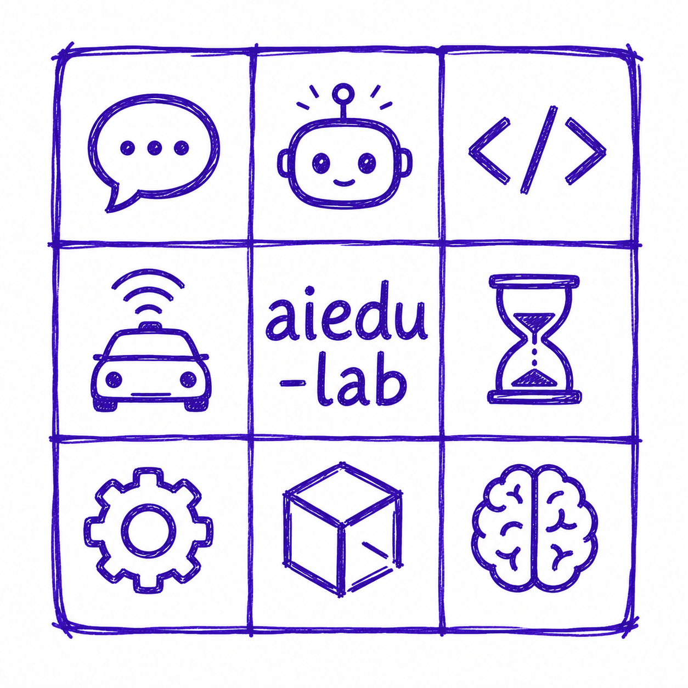

#  AI Workbench

## Objective
A hands-on, community-driven program to learn about generative AI solutions, 
such as agentic AI applications, AI driven workflows and intelligence, 
etc. through exercises. 
The program is structured as a series of sessions, each focusing on a 
specific tool or concept.

> **Companion Repository:** [LA Workbench](https://github.com/aiedu-lab/la_workbench)
> is an independent Linear Algebra curriculum that pairs well with
> this lab. Its NumPy/PyTorch exercises build the math intuition —
> vectors, matrices, transformations — that powers the embeddings,
> inference, and training concepts exercised here.

---

## 📅 Agenda

| Topic of Lesson | Description | Lesson Duration | Tool | Tool Duration |
| :--- | :--- | :---: | :--- | :---: |
| [**Why learn GenAI?**](sessions/motivation.md) | Understand why generative AI matters and what the AI Computer shift means for builders. | 30 mins | [Claude Chat](miscellaneous/tools/claude/desktop.md) | |
| [**Introduction**](sessions/introduction.md) | Orient to the course arc, tools, and the Group Meetup Organizer project thread. | 30 mins | [Claude Chat](miscellaneous/tools/claude/desktop.md) |  |
| [**Development Workbench Setup**](sessions/dev_workbench.md) | Install and verify WSL2/Dev Container, VSCode, and GitHub before lab day. | Before lab | [VM/WSL2/DevContainer](miscellaneous/tools/VM/setup.md), [VSCode](miscellaneous/tools/dev_workbench/vscode.md), [GitHub](miscellaneous/tools/dev_workbench/github_and_git.md), [Claude](miscellaneous/tools/claude/cloud.md), [Claude Code](miscellaneous/tools/dev_workbench/vscode.md) | 30 mins |
| [**Concept: Basic Prompting Techniques**](sessions/prompting_basics.md) | Learn the vocabulary and mental models for directing AI effectively. | 30 mins | [Browser Chat](https://gemini.google.com) |  |
| [**Exercise: Problem Solving**](sessions/problem_solving.md) | Apply prompting to real problems and build a structured AI feedback loop. | 45 mins | [Browser Chat](https://gemini.google.com) |  |
| [**Concept: Planning**](sessions/planning.md) | Draft, critique, and refine plans with AI — the foundation of spec-driven work. | 45 mins | [Claude Desktop (Chat)](miscellaneous/tools/claude/desktop.md) | 15 mins |
| [**Exercise: Presentation & Design**](sessions/presentation_n_design.md) | Generate slide decks and visual designs with AI in minutes. | 60 mins | [Gamma](https://gamma.app/), [Claude Design](https://claude.ai/design) | 15 mins |
| [**Exercise: Create/Run Web Site on Laptop/Lovable**](sessions/web_site.md) | Build and deploy a working web page using AI code generation. | 60 mins | [Lovable.dev](https://lovable.ai), [Claude Code (CLI)](miscellaneous/tools/claude/cli.md) | 15 mins |
| [**Concept: Advanced Prompting Techniques**](sessions/prompting_advanced.md) | Master skills, few-shot examples, chain-of-thought, RAG, and agent patterns. | 90 mins | [Claude Chat](miscellaneous/tools/claude/desktop.md) |  |
| [**Concept: Human Driven Development**](sessions/hdd.md) | Human conceptualizes plan; AI executes detail. High-confidence pattern for high-penalty domains. | 30 mins | [Claude Code (CLI)](miscellaneous/tools/claude/cli.md) | |
| [**Exercise: Embeddings Visualization**](sessions/embedding.md) | Visualize word vectors: map, cluster, concept direction, similarity, and nearest-neighbor context with GloVe. | 40 mins | Python, GloVe | 10 mins |
| [**Concept: Assistants and Agents**](sessions/assistants_agents.md) | See how an AI assistant (Claude Desktop, CLI, Codex) hosts agents that loop with an LLM and its tools to get work done. | 30 mins | [Claude Chat](miscellaneous/tools/claude/desktop.md) |  |
| [**Concept: Spec Driven Development (SDD)**](sessions/sdd_basics.md) | Write a specification first, then let AI generate matching code reliably. | 45 mins | [Claude Code (CLI)](miscellaneous/tools/claude/cli.md) | |
| [**Exercise: Create Group Meetup Organizer using SDD, App runs on Laptop**](sessions/client_application.md) | Implement the Poller → Selector → Notifier pipeline with AI-generated code. | 45 mins | [Claude Code (Pro)](miscellaneous/tools/claude/desktop.md), [VSCode](https://code.visualstudio.com/) | 15 mins |
| [**Concept: Code Review**](sessions/code_review.md) | Use AI to catch bugs, enforce style, and explain unfamiliar code. | 30 mins | [Claude Code (Pro)](miscellaneous/tools/claude/desktop.md), [VSCode](https://code.visualstudio.com/) |  |
| [**Concept: AI Across the SDLC**](sessions/sdlc_ai.md) | See how AI integrates across the entire software development lifecycle. | 45 mins | [Claude Code (CLI)](miscellaneous/tools/claude/cli.md), GitHub Actions |  |
| [**Exercise: Create/Run Agent App on Laptop**](sessions/client_agent.md) | Build a single-agent CoWork workflow that plans and executes file tasks. | 75 mins | [Claude CoWork](miscellaneous/tools/claude/desktop.md) | 15 mins |
| [**Exercise: Create/Run Multi-Agent Workflows on Laptop**](sessions/client_multiagent.md) | Coordinate specialized agents for problems no single agent handles reliably. | 60 mins | [Claude Code (CLI)](miscellaneous/tools/claude/cli.md), [OpenAI Codex (CLI)](miscellaneous/tools/openai/codex_cli.md) | 15 mins |
| [**Exercise: Run Multi-Agent Workflows on Server**](sessions/server_multiagent.md) | Deploy a durable multi-agent system using Temporal on a shared server. | 60 mins | [OpenClaw](miscellaneous/tools/openclaw/cli.md), [Temporal](miscellaneous/tools/temporal/cli.md) | 15 mins |
| [**Concept: Solution Architecture**](sessions/solution.md) | Design full-stack AI solutions using patterns learned across the lab. | 45 mins | [Claude Chat](miscellaneous/tools/claude/desktop.md), Python |  |
| [**Exercise: Personal Knowledge Management (LLM Wiki)**](sessions/llm_wiki.md) | Use an AI agent as librarian for a knowledge base that grows with each ingest. | 60 mins | [Obsidian](https://obsidian.md), [Claude Code (CLI)](miscellaneous/tools/claude/cli.md) | 15 mins |
| [**Exercise: Applications on Pluggable Models**](sessions/pluggable_models.md) | Swap LLM providers without changing code — compare open-weight and closed models side by side. | 45 mins | [Groq](miscellaneous/tools/groq/setup.md), [OpenRouter](miscellaneous/tools/openrouter/openrouter.md), [Cline](miscellaneous/tools/dev_workbench/cline.md) | 15 mins |
| [**Exercise: AI Local**](sessions/ai_local.md) | Run an LLM entirely offline for privacy, custom personas, and zero cloud cost. | 45 mins | [Ollama](miscellaneous/tools/ollama/setup.md) | 15 mins |
| [**Future Advancements**](sessions/future_advancements.md) | Survey the AI frontier and what it means for the tools you just built. | 30 mins |  |  |
| [**Recap**](sessions/recap.md) | Reflect on what was built, what surprised you, and how to keep improving. | 30 mins |  |  |

---

## 🔁 Student Workflow

* Go through the sessions serially — do not jump ahead.
* Complete the [Development Workbench Setup](sessions/dev_workbench.md)
  once, before lab day.
* Join the class Discord channel for live sessions and coordination
  with the instructor and your peers.

For each session:

1. **Branch** — pull and merge the latest `origin/main` into local
   `main`, then create your personal branch off `main` if it does
   not exist yet, or switch to it and merge in the latest `main`.
2. **Grok** the session's Concept section.
3. **Design, develop, and test** the Exercise section's solution
   with the appropriate AI tools, inside the matching
   `projects/<project>/` subfolder.
4. **Commit and tag** the changes on your branch.
5. **Push** the validated branch to `origin`.
6. **Submit a pull request** to merge your branch into `main`.
7. **Notify** the instructor on Discord that you completed the
   session, and ask for PR feedback.

See [GitHub and
Git](miscellaneous/tools/dev_workbench/github_and_git.md) for the
exact commands behind each step.

---

## 🧭 Tools

| Platform | Application | Tools |
| :--- | :---: | :---: |
| Browser | Chat | OpenAI, Gemini, Claude Chat | 
| Browser | SaaS | Lovable.dev, Gamma |
| Client | Desktop Application | Claude Chat, Code, CoWork |
| Server | Server Application | OpenClaw, Claude |

---

## 📁 Repository Structure

```text
ai_workbench/
├── sessions/                    # Lesson exercises & materials
├── projects/                    # Generated apps & automation
└── miscellaneous/
    ├── software_defined_workbench/  # SDW plan + history
    ├── setup/
    │   ├── student/              # Student lab setup scripts
    │   └── instructor/           # Instructor preflight/roster
    ├── tools/                    # Setup guides and guardrails
    ├── plans/                    # plan.md templates + canonical
    ├── learnings/                # Notes, reflections, patterns
    ├── prompts/                  # Prompt library (best/failures)
    ├── docs/                     # Brand assets, archived phases
    ├── experimental/             # Draft sessions not promoted
    └── tests/                    # Repo-level smoke tests
```

---

## 📚 What Goes Where

| Artifact          | Location                                   |
|-------------------|---------------------------------------------|
| Project code      | `/projects/<project>/`                       |
| Session notes     | `/miscellaneous/learnings/session-notes/`    |
| Student setup     | `/miscellaneous/setup/student/`              |
| Instructor setup  | `/miscellaneous/setup/instructor/`           |

---

## 🧑‍🏫 Instructor Guidelines

Execute [**Instructor Preflight**](
miscellaneous/setup/instructor/instructor.md) before starting 
the workbench lab sessions and check off on setting up the student roster, 
discord server, docker server, student laptops, etc.

---

## 🤝 Contribution Guidelines

### 🔧 Specification Driven Workbench (SDW)

This repository is a **Specification Driven Workbench (SDW)**: all
content changes flow from a written specification, never from
direct edits. `SDW_DIR` below means
`miscellaneous/software_defined_workbench`; its `SDW_DIR/plan.md`
is the single source of truth — it is append-only, never
rewritten. AI executes each plan step under
instructor review; the resulting content, plan entries, and
prompt history are committed together, creating a full audit
trail from intent to implementation.

> **In short:** prompt → plan → execute → review → commit.
> No content is created outside the plan.

### Workbench Update Workflow

All content changes must follow this sequence in strict order:

1. **Specify** — append the new prompt to
   `SDW_DIR/prompt_history.md`. The prompt directs AI to extend
   `SDW_DIR/plan.md` with new phases or steps; never edit
   plan.md directly.
2. **Plan** — AI appends the new phase/steps to
   `SDW_DIR/plan.md`. Both files are append-only and serve as
   the system of record.
3. **Execute** — AI executes each plan step one at a time under
   reviewer approval, following `CLAUDE.md` operating protocol.
4. **Commit** — commit `prompt_history.md`, `plan.md`, and the
   generated content together on a feature branch. Annotate every
   AI-generated section:
   ```text
   <!-- AI-GENERATED [provider:model]: Phase X Step Y -->
   ```
5. **PR & Review** — submit a pull request to `main`. The PR
   description must include:
   * `provider:model` used to append changes to
     `SDW_DIR/plan.md`
   * `provider:model` used to execute the plan and generate content
   * Link to the executed section in `SDW_DIR/plan.md`
   Maintainers run AI-assisted style checks (80-col, 2-space
   indent) then review content before approving the merge.

> **No direct content edits.** All changes originate in
> `SDW_DIR/prompt_history.md` and flow through `SDW_DIR/plan.md`.

### SDW Skills

Two project-scoped Claude Code slash-command skills live in
`.claude/commands/` and are available in any Claude Code session
opened in this repo.

| Skill | Invocation | Purpose |
|---|---|---|
| `/replan` | `/replan` or `/replan <section>` | Run the full Specify→Plan→Approve→Execute cycle. Without argument, targets the last `## [ ]` section in `SDW_DIR/prompt_history.md`. With argument, targets the named section. |
| `/plan-step` | `/plan-step [draft]` | Generate or validate a single plan step against the CONTEXT/ACTION/CONSTRAINTS/OUTPUT/TEST template before appending it to `SDW_DIR/plan.md`. |

**Examples:**
```
/replan                  # auto-targets last unprocessed section
/replan Skillify         # targets ## Skillify in prompt_history.md
/plan-step               # interactive — prompts for each field
/plan-step add pristine/ to README layout
```

`/plan-step` is applied internally by `/replan` when generating
each step — no separate invocation needed during a replan cycle.

> Contributors may not commit directly to `main`. Write-access
> contributors (instructors) do **not** need a separate reviewer to
> merge their own PR — a PR is required, but zero additional
> approvals are needed. See
> [repo.md](miscellaneous/setup/instructor/repo.md) for the
> underlying GitHub branch-protection settings.

---

## Agent Conventions

This repo uses a two-layer model so loading it in any AI coding
tool gives consistent, non-duplicated context.

### Layer 1 — Universal (`.agent/`)

Provider-agnostic content that every compliant tool can read:

| Construct | Path | Invocation | Read by |
|---|---|---|---|
| Rule | `.agent/rules/*.md` | Automatic | All (see Layer 2) |
| Skill | `.agent/skills/<n>/SKILL.md` | `/name` or auto | All (see Layer 2) |
| Workflow | `.agent/workflows/*.md` | Explicit trigger | Antigravity native |

**Rules in this repo:**
- `always-line-length.md` — 79-char limit, Python/Markdown
- `git-output-rules.md` — always use `--no-pager --no-ext-diff`

### Layer 2 — Provider loaders (thin wrappers)

Each tool reads its own loader file, which references Layer 1:

| Tool | Loader file | Notes |
|---|---|---|
| Claude Code | `CLAUDE.md` | Full protocol; step 0 reads `.agent/rules/` |
| Codex CLI | `AGENTS.md` | Symlink → `CLAUDE.md` (zero duplication) |
| Antigravity | `AGENTS.md` + `.agent/` | Reads both natively |
| Cursor | `.cursor/rules/*.mdc` | **Not yet wired** |
| Windsurf | `.windsurfrules` | **Not yet wired** |
| GitHub Copilot | `.github/copilot-instructions.md` | **Not yet wired** |

### Claude Code-only skills

Project skills in `.claude/commands/` use Claude Code-specific
tools (plan mode, SDW protocol) and are not portable:

| Skill | Purpose |
|---|---|
| `/replan` | Full Specify→Plan→Approve→Execute cycle |
| `/plan-step` | Generate/validate a single plan.md step |
| `/proc-article` | Knowledge ingestion pipeline |

---

## 🙌 Credits
Inspired by practical AI learning approaches and community collaboration.
