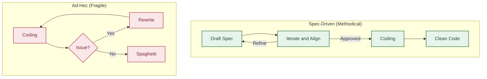
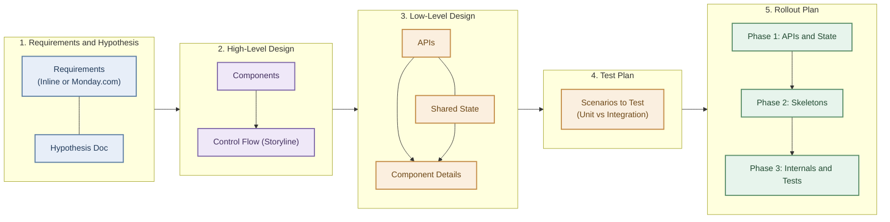
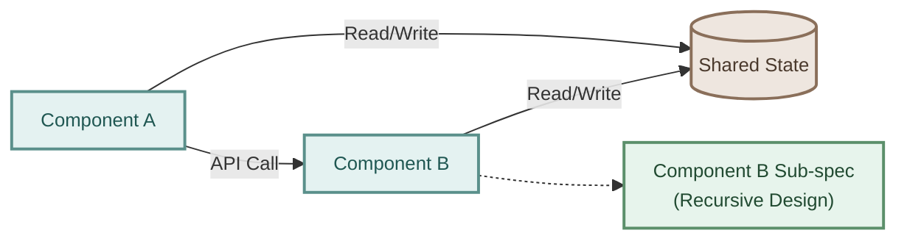
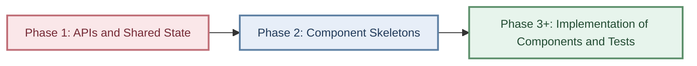
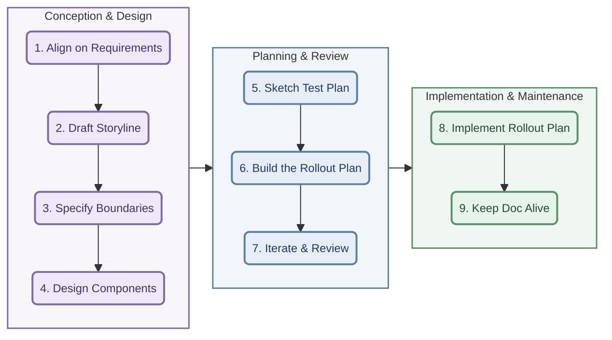

Spec-driven development is a methodology that mandates writing a clear,
structured design document _before_ writing any code. The core premise is that
great code originates from mental clarity about the design — coding is the
execution of a well-defined model.

## The Core Philosophy

When developers skip the design phase and dive straight into code, they find
themselves frequently changing their code - resulting in wasted effort as well
as buggy and spaghetti-like code. While the spec does not need to be 100%
complete before coding begins, a spec-first approach forces clarity upfront.
Before attempting to code, there must be absolute clarity on the high-level
components, the control flow through them (the storyline), and the prefix of
the component where implementation starts.

### Capturing the Spec

It is important to capture the Spec somehow so it is not just sitting in
people's heads. This could be done by recording a video of a meeting where the
spec/design is discussed, or it can be in a written document. Before we had the
help of AI, writing documents was hard work. But with the advancements in AI,
this has become much easier.

### The Movie Analogy

A well-designed software system should be like a great movie — it has a clear
storyline, divided into components (e.g., the plot introduction, climax etc),
and a logical flow from beginning to end. Software should be no different.

Before writing a single line of code, a developer should think about the high
level components of the project, and the control flow through them (analogous
to the storyline as it flows through the components of a movie). If one
cannot describe this control flow, one is not yet ready to code.

## Design Strategy

This section details the design strategy.

### Build the Spec (aka Design Document)

Every project begins with a design document written in **Markdown** format. Use
this [Design Document Template](Design-Document-Template.md) as a
starting point. If using AI, ask it to start with the template as a starting
point. Then keep giving instructions to AI so as to build the spec
incrementally.

Given below is an explanation of the variations sections in the spec.

#### 1. Requirements and Hypothesis

Before outlining any design, the design strategy requires clear
alignment on the "what" and "why":

- **Requirements**: Outlines the specific goals and tasks to be
  accomplished. For small projects, these can be written directly in the
  design doc. For larger efforts, this section can link to the
  Requirements Scorecard in Monday.com.
- **Hypothesis Document**: Replaces the traditional Product
  Requirements Document (PRD), providing the business justification
  and hypothesis for the requirements.

> [!TIP]
> For smaller projects where the Requirements and justification for them
> are already clear, the Requirements section can be written inline and/or
> the Hypothesis
> Document may be skipped.

#### 2. High-level Design (Components and Storyline)

Design is approached in two directions simultaneously:

- **Work Backwards**: Start from the desired final outcome (the "climax")
  and work backwards toward the beginning.
- **Top-Down**: Start with the high-level components and the control flow
  through them (articulating the storyline) before designing the details
  inside these components.

The high-level design must answer the following questions:

- **What are the major components?** Show the various components via an
  architectural diagram, depicting the relationships/interactions between
  them and the overall flow of execution through them. Multi-colored,
  Mermaid-based diagrams are recommended for markdown design documents,
  as they can be easily generated and modified by AI.
- **What is the control flow through the above components?** Describe in
  words the sequence of steps from the entry point of the request to the
  exit point — this is the storyline.

#### 3. Low-level Design

The Low-level Design section contains the following:

- **APIs**: Describe the APIs that act as boundaries between the various
  high-level components.
- **Shared Operational State**: This is the shared state that's used across
  various components.
- **Component Sub-sections**: The design for each of the high level components.
  The same design strategy used for the overall design is now applied
  recursively to each component. Either the design can be inlined or a link to
  the component-specific design doc can be provided.

#### 4. Test Plan

This section should focus on key test scenarios, outlining what will be
covered by unit tests versus integration tests. The goal is not to make
this section heavyweight, but to ensure critical test scenarios are thought
through. Generating tests solely to increase code coverage should be left
to AI. Comprehensively documenting less important tests here is overkill.

#### 5. Rollout Plan (Incremental Steps)

This section defines a phased path to production.

- **Step 1**: Implement APIs and shared operational state.
- **Step 2**: Implement component skeletons.
- **Step 3 and beyond**: Implement the internals of the components and the tests.

### Iterate on the Spec

Iterate on the spec until you're satisfied. Ask AI to critique the design
while simultaneously studying the existing code related to what the spec is
going to touch.

> [!TIP]
> Use the grill-me skill to further refine the spec by uncovering any
> corner cases.

### Design Review

Run the design by others in a design meeting or get the spec reviewed by
creating a github PR. This helps get alignment on the design before time is
invested in the implementation.

> [!WARNING]
> Don't be tempted to have AI produce a spec using the Plan mode that comes
> with the AI assistants in modern IDEs. There's no structured format to
> the Plans so produced, they lack visual diagrams, and they're typically
> not saved or available for others to review.

## Implementation Strategy

We've covered the Design Strategy above. This section covers the implementation
strategy. Some of it was already covered in the
[Rollout Plan](#5-rollout-plan-incremental-steps) above.

### Implement the APIs and the shared operational state first

Before implementing the code for any components, first implement their APIs
and the shared operational state. This has the following benefits:

- **Clear Boundaries**: Forces one to think about the boundaries between
  components first. Thus, the input/output of each component is clearly
  defined. This also facilitates subsequent work that focuses on just one
  component.
- **Simplified Testing**: Facilitates testing by providing the ability to
  mock other components while implementing one component.
- **Parallel Development**: Enables parallelization of effort as different
  components can be implemented in parallel by different teams.

It is possible that all the fields in the APIs and the shared operational
state are not known at this time. That is ok - the APIs and the operational
state can evolve as more of the implementation is done.

### Skeleton components

Once the APIs and shared operational state are established, implement skeleton
(or stubbed) versions of the components. These are minimal implementations
that conform to the defined interfaces and return mock or static responses
without executing any actual business logic.

Creating skeleton components provides key advantages:

- **Early Integration**: Allows you to connect the entire end-to-end flow and
  verify the wiring, configuration, and dependencies early in the project.
- **Unblocking Dependent Work**: Frontend developers or other backend service
  teams can start integrating and testing against these stubs immediately,
  rather than waiting for the complete backend logic to be implemented.
- **Bootstrapping Structure**: Establishes the boilerplate code structure and
  directory layout, making subsequent logic implementation much easier.

### Work Forwards on a Prefix

While the Design is conceived by working backwards from the goal, the
implementation is done by working forwards. Thus, components that come first
in the control flow should be implemented first. And implementation within
a component should follow the same guideline.

The benefits of such an approach are:

- **Early Testing**: A prefix of overall project or even a component within
  it are always working and can be tested as such.
- **Refactoring Resilience**: Since a prefix is always working, the design is
  less susceptible to sudden refactors. Implementing a piece of code in the
  middle first often leads to refactoring later when you find that upstream
  code requires something different from downstream code.

Implementing a prefix should be preferred unless multiple components are being
worked upon in parallel by different teams. Recursively, the same principle
applies for implementation within a single component.

## Summary: The Spec-driven Workflow

1. **Align on Requirements** — Establish the Requirements and optionally the Hypothesis
   to align on the "what" and "why" before designing.
2. **Draft the Storyline** — Define the components and control flow by working
   backwards from the goal.
3. **Specify boundaries** — Define the APIs and shared operational state
   between components.
4. **Design components** — Design each individual component, recursively applying
   the same spec-driven methodology for its internals.
5. **Sketch the Test Plan** — Call out the scenarios that need testing and
   split them between unit-test and integration-test coverage.
6. **Phase the Rollout** — Create an incremental plan (APIs/state → skeleton
   components → internal logic and tests).
7. **Iterate and review** — Refine the spec with AI and review with the team to
   ensure alignment.
8. **Implement based on the Rollout Plan** — Implement the spec following the
   Rollout Plan. Implementing components in prefix order is preferred unless
   the need for parallelism dictates otherwise.
9. **Keep the doc alive** — Keep the design document updated as the
   implementation evolves.

