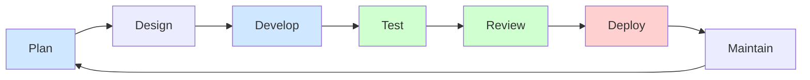

# Plan: Group Meetup Organizer — Progressive Exercise Arc

TL;DR
This plan consolidates the seemingly disparate exercises across sessions 
into **one progressive project** — the `Group Meetup Organizer` — 
that grows in sophistication, features, and deployment scope as 
students advance through the lab. The same project appears
in every session from Planning through Multi-Agent Workflows. Earlier
sessions use deliberately incomplete toy versions so that students
feel the gap — and understand why SDD and agents are needed — before
building the full application. Execute one step at a time.

---

## Project Description (canonical — replaces the draft plan)

### What this is

A **one-shot meetup coordinator** for a fixed group. Given a list of
members, available dates, and venue options, it:

1. Polls each member: "Are you free? What venue do you prefer?"
2. Selects the venue that the most free members prefer
3. Notifies the group via a Discord message

That is the complete application. It runs once per meetup. A human
(the organizer) triggers it when they want to schedule a meetup.

### What this is NOT

* Not a recurring scheduler or cron job
* Not a SaaS product with user registration or authentication
* Not a multi-tenant system with events, subscriptions, or regions
* Not an email sender or calendar invite system
* Not a cancellation or rescheduling workflow

These are real product features that would be built on top of this
architecture. They are not part of the lab.

### Why one-shot is the right scope

The Poller → Selector → Notifier architecture is identical whether
you run the system once or a hundred times. A recurring scheduler
is just a cron job wrapping the same three steps. Teaching the
one-shot version teaches everything architecturally important, and
a student can complete it in a single lab session.

### The complete data model (simple)

**config.yaml** — the only configuration interface. Set by the
instructor before the lab; students receive it ready to use.

```yaml
group: "Thursday Study Squad"
members:
  - name: "Alice"
  - name: "Bob"
  - name: "Carol"
  - name: "David"
options:
  dates:
    - "Thu Apr 24 7pm"
    - "Thu May 1 7pm"
    - "Thu May 8 7pm"
  venues:
    - "Library Room A"
    - "Coffee Lab on Castro"
    - "Online / Video Call"
```

**responses.json** — written by the Poller, read by the Selector.

```json
{
  "Alice":  {"available": true,  "venue": "Library Room A"},
  "Bob":    {"available": true,  "venue": "Coffee Lab on Castro"},
  "Carol":  {"available": false, "venue": null},
  "David":  {"available": true,  "venue": "Library Room A"}
}
```

**decision.json** — written by the Selector, read by the Notifier.

```json
{
  "date": "Thu Apr 24 7pm",
  "venue": "Library Room A",
  "attendees": ["Alice", "Bob", "David"]
}
```

### Selection logic (simple majority, no ties)

The Selector picks:
- Date: the date where the most members are available
- Venue: the venue preferred by the most available members
- Tie-breaking: alphabetical order (deterministic, no randomness)
- Cancelled: if zero members are available, write
  `{"cancelled": true}` to `decision.json` and the Notifier
  sends a cancellation message

### The three scripts (non-agentic version)

```
python poller.py    # reads config.yaml, collects responses,
                    # writes responses.json
python selector.py  # reads responses.json, picks date + venue,
                    # writes decision.json
python notifier.py  # reads decision.json, POSTs to Discord webhook
```

---

## Scope Decisions (locked)

### 1. One fixed group, fixed members

Members are defined in `config.yaml`. The application never adds,
removes, or authenticates members. The instructor sets up
`config.yaml` before the lab; students do not edit it.

### 2. Discord channel pre-provisioned by instructor

The instructor creates the Discord server, channel, and webhook URL
before the lab. Students receive `DISCORD_WEBHOOK_URL` as an
environment variable. The application never creates or manages
channels.

### 3. Shared store is flat files in the non-agentic version

No database until the agentic versions, where persistent state earns
its complexity. In the non-agentic version: two JSON files.

### 4. Stack grows only when complexity earns it

| Version | Stack | Why the stack is this size |
|---|---|---|
| Toy (Gamma) | Slides only | No code needed |
| Toy (Lovable) | HTML form, no backend | UI concept only |
| Non-agentic (SDD) | Python + flat files | Architecture visible, zero framework noise |
| Single-agent (OpenClaw) | Python + FastAPI + MongoDB | Agent needs HTTP interface + persistent state |
| Multi-agent (OpenClaw) | Python + FastAPI + MongoDB | Multiple agents share one store |
| Temporal (laptop) | + Temporal | Durable orchestration requires real persistence |
| Docker (server) | All above in containers | Deployment adds container layer only |

---

## Notification Platform Decision (locked)

**Discord via Webhook. No alternatives.**

| Platform | Setup cost | Auth complexity | Lab-viable? |
|---|---|---|---|
| Email (SMTP) | Medium | App passwords, spam filters, delivery lag | ⚠️ Borderline |
| WhatsApp (Twilio) | High | Meta Business Account, WABA, template approval | ❌ No |
| Discord Bot | Medium | Developer Portal, bot token, Intents, async | ⚠️ Borderline |
| **Discord Webhook** | **Minimal** | **No token, no bot, just a URL** | **✅ Yes** |

The full Notifier in the non-agentic version:

```python
# notifier.py
import requests, json, os

decision = json.load(open("decision.json"))
if decision.get("cancelled"):
  msg = "❌ **Meetup cancelled** — not enough members available."
else:
  attendees = ", ".join(decision["attendees"])
  msg = (
    f"📅 **Meetup confirmed!**\n"
    f"**Date:** {decision['date']}\n"
    f"**Venue:** {decision['venue']}\n"
    f"**Attending:** {attendees}"
  )

requests.post(os.environ["DISCORD_WEBHOOK_URL"], json={"content": msg})
print("Notification sent.")
```

Pluggability note (appears once, in the SDD session):
> The Notifier is a pluggable component. Swapping Discord for email
> (SendGrid), SMS (Twilio), or Slack (Slack webhooks) requires
> changing only `notifier.py`. The Poller and Selector are unaffected.

---

## Architecture Arc

```
Session: Planning
└── Concept only — no code, plan the app in plain language
  └── Output: plan.md for the Group Meetup Organizer

Session: Create Presentation (Gamma)
└── Demo: AI Education Lab pitch deck (5 slides, instructor-led)
└── Exercise: Group Meetup Organizer pitch deck (toy version 0)
  └── No functionality — stakeholder presentation only
  └── Gap: "We have a pitch but no working product."

Session: Create/Run Web Site (Lovable)
└── Demo: Hello World on Lovable (unchanged)
└── Exercise: Group Meetup Organizer poll UI (toy version 1)
  └── Real UI, fake backend — hardcoded result, no webhook call
  └── Gap: "The UI exists but the app is not real yet."

Session: Client Application / SDD
└── Demo: Hello World via SDD plan + Claude Code (unchanged)
└── Exercise: Group Meetup Organizer — non-agentic version
  └── Three Python scripts + two JSON files + config.yaml
  └── Real Discord webhook notification
  └── No web framework, no database

Session: Client Workflow Automation (OpenClaw)
└── Demo: File organization (CoWork + OpenClaw, unchanged)
└── Exercise A: Single-agent (OpenClaw) — one agent, three steps
└── Exercise B: Multi-agent (OpenClaw) — one agent per component
└── Note: CoWork guardrails vs OpenClaw permissions model

Session: Multi-Agent Workflows
└── Exercise A: Three agents + Temporal on laptop
└── Exercise B: Deploy to server via Docker
```

---

## Phase -1: INSTRUCTOR PREFLIGHT

**Target file:** `sessions/instructor.md` (new file)

**Purpose:** Everything an instructor must complete *before* students
arrive. Any CS graduate can run this checklist independently. Each
step includes a validation test so the instructor knows it worked.

**Time required:** approximately 60 minutes total.

> **Class ID convention:** choose a short unique identifier for this
> class run (e.g. `2026-spring`, `2026-fall-hs`). Replace every
> occurrence of `<CLASS_ID>` below with your chosen value. This
> prevents name collisions when the same instructor runs multiple
> cohorts.

- [x] **Step -1.1: Collect the student roster** **COMPLETED**

  The file must contain the following sections, in order:

  **Header:**
  ```
  # Instructor Preflight Checklist
  Complete every step and its validation before students arrive.
  Time required: approximately 60 minutes.
  ```

  **Section 1 — Collect student roster (5 min)**

  Before provisioning anything, collect one row per student in a
  local roster file (never committed — contains personal info):

  | Full name | GitHub username | Discord username | Laptop OS | Admin? | Server acct? |
  |---|---|---|---|---|---|
  | Alice Smith | `alicesmith` | `@alice` | Win11+WSL2 | yes | yes |
  | Bob Jones   | `bobjones42` | `@bob`   | macOS 14   | yes | yes |

  - **GitHub username** — validate each one resolves:
    ```bash
    # Replace USERNAME with each student's handle
    curl -s https://api.github.com/users/USERNAME \
      | python -c "import sys,json; d=json.load(sys.stdin); \
        print('OK:', d['login']) if 'login' in d \
        else print('NOT FOUND')"
    ```
  - **Discord username** — new-format handles are `@username`
    (no discriminator). Old-format: `username#1234`. Confirm
    each student has a Discord account before inviting (Step -1.2).
  - **Laptop OS** — accept only `Win11+WSL2` or `macOS 13+`.
    Students on older OS versions must upgrade before the lab.
  - **Admin/sudo** — required for tool installation (Step -1.4).
    Students without admin access cannot complete the exercises.
  - **Server account** — required for Phase 6 Docker deployment.
    Provision in Step -1.3; mark this column `yes` after that step.

- [x] **Step -1.2: Discord server setup and student invite** **COMPLETED**

  **Section 2 — Discord server setup (15 min)**

  Reference: https://support.discord.com/hc/en-us/articles/204849977

  - Choose your `<CLASS_ID>` (e.g. `2026-spring`)
  - Create a new Discord server named `meetup-lab-<CLASS_ID>`
    - Server Settings → Overview → Server Name
    - Do NOT reuse a previous class server — name collisions
      corrupt webhook URLs from prior runs
  - Create a text channel `#meetup-notifications` inside the server
  - Invite each student by Discord username:
    - Server Settings → Invites → Create Invite (no expiry)
    - Or: right-click `#meetup-notifications` → Invite People
    - Send the invite link to each student via a shared doc or
      class chat before the lab day
  - Confirm every student has joined and can read
    `#meetup-notifications`:
    - Each student posts a test message: "ready: <their name>"
    - Do not proceed until all students appear in the member list
  - Create the webhook (only after all students have joined):
    - Channel Settings → Integrations → Webhooks → New Webhook
    - Name: `Meetup Bot`
    - Copy the webhook URL — this is `DISCORD_WEBHOOK_URL`
  - Validation:
    ```bash
    export DISCORD_WEBHOOK_URL="https://discord.com/api/webhooks/..."
    python -c "
    import requests, os
    r = requests.post(os.environ['DISCORD_WEBHOOK_URL'],
                      json={'content': '✅ Instructor preflight test'})
    print('OK' if r.status_code == 204 else f'FAIL: {r.status_code}')
    "
    ```
    Expected: `OK` and the message appears in `#meetup-notifications`
    and is visible to all students who joined.

- [x] **Step -1.3: Provision the shared server account** **COMPLETED**

  **Section 3 — Shared server provisioning (15 min)**

  The server is used in Phase 6 (Docker deployment). It must be
  provisioned before the lab — students cannot do this themselves.

  **Server requirements:**
  - OS: Ubuntu 22.04 LTS (recommended) or 24.04
  - Reachable from student laptops (public IP or VPN-accessible)
  - Inbound ports open: 22 (SSH), 8080 (Temporal UI), 8088 (app)
  - Outbound internet access (to pull Docker images, reach Discord)

  **Provision the shared account:**
  ```bash
  # On the server (as root or a user with sudo)
  sudo useradd -m -s /bin/bash labuser
  sudo usermod -aG docker labuser   # add to docker group

  # Pre-install required tools
  sudo apt-get update
  sudo apt-get install -y docker.io docker-compose-v2 git python3 pip

  # Pre-clone the lab repo
  sudo -u labuser git clone \
    https://github.com/<ORG>/ai_education_lab \
    /home/labuser/ai_education_lab
  ```

  **Add each student's SSH public key:**
  ```bash
  sudo -u labuser mkdir -p /home/labuser/.ssh
  # Repeat for each student's public key:
  echo "ssh-ed25519 AAAA... alice@laptop" \
    | sudo tee -a /home/labuser/.ssh/authorized_keys
  sudo chmod 700 /home/labuser/.ssh
  sudo chmod 600 /home/labuser/.ssh/authorized_keys
  sudo chown -R labuser:labuser /home/labuser/.ssh
  ```

  **Validation — run from each student laptop:**
  ```bash
  ssh labuser@<SERVER_IP> docker ps
  ```
  Expected: empty table header (no error). If any student gets
  `Permission denied`, re-check their public key was added correctly.

  Mark the `Server acct?` column `yes` in the roster (Step -1.1)
  once every student passes this check.

- [x] **Step -1.4: Student laptop preflight** **COMPLETED**

  **Section 4 — Student laptop preflight (10 min per student)**

  Students run this themselves before the lab. The instructor
  validates by reviewing the output of `preflight_check.py`
  (located at `projects/group_meetup/preflight_check.py`).

  **Win11 + WSL2 setup:**
  - Confirm WSL2 is enabled: `wsl --status` → `Default Version: 2`
  - Confirm Ubuntu 22.04 distro: `wsl -l -v` → `Ubuntu-22.04`
  - If missing: `wsl --install -d Ubuntu-22.04` (requires admin,
    then reboot)

  **macOS setup:**
  - Xcode CLI tools: `xcode-select --install`
  - Homebrew: `/bin/bash -c "$(curl -fsSL
    https://raw.githubusercontent.com/Homebrew/install/HEAD/install.sh)"`
  - Python + Git: `brew install python git`

  **Both platforms — required tools:**
  ```bash
  # Python 3.10+
  python3 --version          # must be >= 3.10

  # Git identity (required for commits)
  git config --global user.name "Your Name"
  git config --global user.email "you@example.com"

  # GitHub CLI (required for code review session)
  # Install: https://cli.github.com
  gh auth login              # authenticate with GitHub account

  # Claude Code CLI (required from SDD session onward)
  npm install -g @anthropic-ai/claude-code
  claude --version

  # Python dependencies for the meetup project
  pip install requests pyyaml
  ```

  **Validation script — run and share output with instructor:**
  ```bash
  python3 projects/group_meetup/preflight_check.py
  ```
  The script checks each dependency and prints `PASS` or `FAIL`
  per item. Every item must show `PASS` before the lab begins.

  > **Note:** `preflight_check.py` is created in Phase 4
  > (Step 4.4) when the project scripts are written. The instructor
  > must run Phase 4 before distributing the preflight script
  > to students.

- [x] **Step -1.5: Create `config.yaml` and `.env.example`** **COMPLETED**

  **Section 5 — Create `config.yaml` for the lab group (5 min)**
  - Replace member names with the actual students (from roster)
  - Replace venue options with locally relevant options
  - Save as `config.yaml` in the project directory
  - Template:
    ```yaml
    group: "Thursday Study Squad"
    members:
      - name: "Alice"    # replace with actual student names
      - name: "Bob"
      - name: "Carol"
      - name: "David"
    options:
      dates:
        - "Thu Apr 24 7pm"   # replace with upcoming Thursdays
        - "Thu May 1 7pm"
        - "Thu May 8 7pm"
      venues:
        - "Library Room A"   # replace with local venues
        - "Coffee Lab"
        - "Online / Video Call"
    ```
  - Validation: `python -c "import yaml;
    print(yaml.safe_load(open('config.yaml')))"` — no errors.

  **Section 6 — Create `.env.example` for students (2 min)**
  - Create `.env.example` in the project root:
    ```
    DISCORD_WEBHOOK_URL=https://discord.com/api/webhooks/REPLACE_ME
    ```
  - Do NOT commit the real URL — `.env` must be in `.gitignore`
  - Share the real `DISCORD_WEBHOOK_URL` with students verbally
    or via a shared doc on lab day

- [x] **Step -1.6: Run the non-agentic version end-to-end** **COMPLETED**

  **Section 7 — Full smoke test (10 min)**

  Run all three scripts in sequence using the `config.yaml` you
  just created:
  ```bash
  python poller.py    # enter responses for each member manually
  python selector.py  # check decision.json output
  python notifier.py  # confirm Discord message arrives
  ```
  Expected: `#meetup-notifications` in `meetup-lab-<CLASS_ID>`
  receives a message like:
  ```
  📅 Meetup confirmed!
  Date: Thu Apr 24 7pm
  Venue: Library Room A
  Attending: Alice, Bob, David
  ```
  If this works, the lab is ready.

- [x] **Step -1.7: Add `sessions/instructor.md` to `README.md` agenda** **COMPLETED**

  Add as the first row, before all session rows:

  ```markdown
  | [**Instructor Preflight**](sessions/instructor.md) | Before lab | Roster, Discord, server, student laptops | 60 mins |
  ```

---

## Phase 0: VALIDATE AND LOCK THE PROJECT SPEC

**Target file:** `plans/specs/event_organizer.md`

- [x] **Step 0.1: Audit current `event_organizer.md`** **COMPLETED**
  - Read the file end to end
  - The current draft describes a full SaaS product (recurring
    events, self-onboarding, region rotation, cancellation flows,
    garbage collection). Flag everything that exceeds the one-shot
    scope defined in the Project Description above.
  - Do NOT edit yet — produce a written audit listing what to
    keep, what to remove, and what to add

- [x] **Step 0.2: Rewrite `event_organizer.md` to correct scope** **COMPLETED**
  - Keep: project description, the three-component model, the data
    model (config.yaml / responses.json / decision.json), the
    session arc mapping
  - Remove: recurring scheduling, self-onboarding, member
    subscription management, region/city rotation, calendar invites,
    cancellation workflow, garbage collection, ConsensusThreshold
    dropdown, DeleteAfterWeeks — all of these
  - Add: the simplified selection logic (simple majority,
    alphabetical tie-breaking, cancellation if zero available)
  - Add: the scope decisions section (verbatim from this plan)
  - Add: instructor setup steps (Discord pre-provisioning)
  - Add: notification platform decision and rationale
  - Constraint: readable in under 5 minutes; answers "what are we
    building and why" — not "how"; no feature that cannot be
    implemented in a 90-minute lab session

- [x] **Step 0.3: Lock the three-component contract** **COMPLETED**
  - Poller: input `config.yaml` → output `responses.json`
  - Selector: input `responses.json` → output `decision.json`
  - Notifier: input `decision.json` + `DISCORD_WEBHOOK_URL` →
    output Discord message
  - Contract must be identical in every session file

---

## Phase 1: PLANNING SESSION — VALIDATE WORDING

**Target file:** `sessions/planning.md`

- [x] **Step 1.1: Audit `sessions/planning.md`** **COMPLETED**
  - Confirm the exercise references the `Group Meetup Organizer`
  - Confirm framing is concept-only (no code, no framework specifics)
  - Confirm it points to `plans/specs/event_organizer.md`
  - Flag any wording from the over-specified draft (recurring events,
    self-onboarding, cancellation) — remove it

- [x] **Step 1.2: Update `sessions/planning.md` if needed** **COMPLETED**
  - Exercise: name the project, describe it as a one-shot coordinator,
    state the three components at concept level, ask students to
    produce a plan (not code)
  - Scope statement to include:
    > "One group. One meetup. Three steps: poll, select, notify.
    > The instructor sets up the group config before the lab.
    > You write the code that runs those three steps."
  - Add the full forward reference arc:
    > "You will return to this project in every remaining session —
    > first as a pitch deck, then as a toy web site, then as three
    > Python scripts, then as an agentic system, then deployed on
    > a server."

---

## Phase 2: SLIDES SESSION — GAMMA PRESENTATIONS

**Target file:** `sessions/slides.md`

- [x] **Step 2.1: Audit `sessions/slides.md`** **COMPLETED**
  - Confirm the session has a demo section and an exercise section
  - Confirm any reference to the organizer is scoped as one-shot
    (not recurring, not SaaS)

- [x] **Step 2.2: Confirm or add Demo (AI Education Lab deck)** **COMPLETED**
  - Create a `projects/slides/demo/plan.md` that will be used 
    a demo by instructor to create a 5-slide deck using `gamma.app` 
    to present an overview of `AI_education_lab`. The five slides are:
    1. Who runs the lab and who attends
    2. Why the lab exists
    3. What the exercises are (the progressive arc)
    4. How to contribute to the lab
    5. Call to action

- [x] **Step 2.3: Add `Group Meetup Organizer` exercise (toy version 0)** **COMPLETED**
  - Frame: "Build a stakeholder pitch deck. Audience: a student
    club committee deciding whether to adopt this system."
  - Slide content: problem, three-component solution at concept
    level (poll → select → Discord notification), what success
    looks like
  - Gap statement:
    > "We have a pitch. We have no working system. In the Web Site
    > session we build a first version of the UI — and see exactly
    > what is still missing."
  - No implementation details of any kind

- [x] **Step 2.4: Confirm Gamma install/start instructions present** **COMPLETED**

---

## Phase 3: WEB SITE SESSION — LOVABLE TOY UI (TOY VERSION 1)

**Target file:** `sessions/web_site.md`

- [x] **Step 3.1: Audit `sessions/web_site.md`** **COMPLETED**
  - Hello World demo and Exercise A must remain intact
  - Confirm `Group Meetup Organizer` exercise does not exist yet
    (or confirm it is scoped as toy version only)

- [x] **Step 3.2: Add `Group Meetup Organizer` toy UI exercise (Exercise B)** **COMPLETED**
  - Position: after Exercise A
  - What to build in Lovable:
    - Poll form: member name, 3 date checkboxes, venue preference
    - Submit button
    - Result page: hardcoded date + venue, "✓ Notification sent
      to Discord" (display only — no webhook call)
  - Explicit omissions (state in the exercise):
    - No Selector algorithm
    - No Discord webhook call
    - No persistence
  - Gap statement:
    > "The Selector has no logic. The Notifier sends nothing.
    > Data disappears on refresh. We have a UI but not an
    > application. In the Client Application session we build
    > the real system."

- [x] **Step 3.3: Confirm session structure:** **COMPLETED**
  1. Demo: Hello World (Lovable vs Claude Code CLI)
  2. Exercise A: Hello World with Claude Code
  3. Exercise B: Group Meetup Organizer toy UI (new)

---

## Phase 4: CLIENT APPLICATION SESSION — NON-AGENTIC VERSION

**Target file:** `sessions/client_application.md`

**Key point:** The non-agentic version is **three Python scripts and
two JSON files**. No web framework, no database. Students run each
script in sequence in the terminal.

- [x] **Step 4.1: Audit `sessions/client_application.md`** **COMPLETED**
  - If the exercise specifies React + FastAPI + MongoDB: update to
    pure Python + flat files for the non-agentic version. The full
    web stack moves to Phase 5 where agents earn it.
  - The Hello World SDD demo must remain intact

- [x] **Step 4.2: Add opening backward reference** **COMPLETED**
  - Open with:
    > "In the Slides session you pitched a one-shot meetup
    > coordinator. In the Web Site session you built a toy UI
    > with a fake Notifier. This session builds the real system:
    > three Python scripts that run, with a Discord message you
    > can see arrive in the channel the instructor provisioned."

- [x] **Step 4.3: Add instructor-provisioned Discord setup block** **COMPLETED**
  - Students do not create the Discord channel — the instructor
    already did this (see `sessions/instructor.md`)
  - Students only need to set the env var and run the test:
    ```bash
    # Your instructor provided this URL
    export DISCORD_WEBHOOK_URL="https://discord.com/api/webhooks/..."

    # One-line validation
    python -c "
    import requests, os
    r = requests.post(os.environ['DISCORD_WEBHOOK_URL'],
                      json={'content': 'student setup test ✓'})
    print('OK' if r.status_code == 204 else f'FAIL: {r.status_code}')
    "
    ```

- [x] **Step 4.4: Write the exercise section** **COMPLETED**
  - SDD workflow for each of the three scripts:
    1. Write spec (Claude Code interviews you via plan.md)
    2. Review spec
    3. Generate: `claude -p "$(cat spec.md)" --allowedTools Write`
    4. Run and validate
    5. Iterate one component at a time
  - Validation sequence:
    1. `python poller.py` → enter responses for each member
    2. Check `responses.json` is correct
    3. `python selector.py` → check `decision.json`
    4. `python notifier.py` → confirm Discord message arrives
  - Pluggability note (appears here only)
  - Reflection: "What would need to change to make this agentic?"

- [x] **Step 4.5: Confirm `sdd_basics.md` link resolves** **COMPLETED**

- [x] **Step 4.6: Create `projects/group_meetup/` and run smoke test** **COMPLETED**

  Create the project directory and populate all five files:

  1. **`config.yaml`** — sample roster using the template from
     `sessions/instructor.md` Section 5. Replace placeholder names
     with the actual class roster before distributing to students.

  2. **`poller.py`** — reads `config.yaml`, prompts for each
     member's availability and venue preference, writes
     `responses.json`.

  3. **`selector.py`** — reads `responses.json`, applies simple
     majority + alphabetical tie-breaking, writes `decision.json`.

  4. **`notifier.py`** — reads `decision.json`, POSTs to
     `DISCORD_WEBHOOK_URL`. Uses the canonical implementation
     from the Project Description section of this plan.

  5. **`preflight_check.py`** — checks each dependency listed in
     `sessions/instructor.md` Section 4 and prints `PASS` or
     `FAIL` per item.

  **Validation (back-reference to instructor.md Section 7):**
  ```bash
  cd projects/group_meetup
  export DISCORD_WEBHOOK_URL="<webhook from Section 2>"
  python poller.py    # enter test responses
  python selector.py  # verify decision.json is correct
  python notifier.py  # confirm Discord message arrives
  python preflight_check.py  # all items must show PASS
  ```
  This is the same smoke test as `sessions/instructor.md`
  Section 7. If all four commands succeed, mark this step
  complete and Section 7 is ready for instructors to run.

---

## Phase 5: CLIENT WORKFLOW SESSION — AGENTIC VERSIONS

**Target file:** `sessions/client_agent.md`

**Stack upgrade note:** FastAPI + MongoDB are introduced here.
Agents need an HTTP interface (async poll responses) and state that
survives between restarts. Add one paragraph explaining this
transition before the exercise.

### Step 5A: Single-Agent Version

- [x] **Step 5.1: Add single-agent exercise** ✅ COMPLETED
  - Opening: "You ran three scripts sequentially. Now one OpenClaw
    agent plans and executes all three steps."
  - Stack upgrade paragraph (as above)
  - Validation: Discord receives the same message as the non-agentic
    version — same output, new execution model
  - Reflection: "What did the agent do that the scripts could not?"

### Step 5B: Multi-Agent Version

- [x] **Step 5.2: Add multi-agent exercise** ✅ COMPLETED
  - Three agents: Poller Agent, Selector Agent, Notifier Agent
  - Shared state via MongoDB
  - Failure injection: stop Selector Agent mid-run; Notifier must
    not fire
  - Reflection: "What coordination problem did we create?" (seeds
    Temporal)

- [x] **Step 5.3: Add forward reference to multi-agent session** ✅ COMPLETED

---

## Phase 6: MULTI-AGENT WORKFLOWS SESSION — TEMPORAL + DOCKER

**Target file:** `sessions/client_multiagent.md`

### Step 6A: Three Agents + Temporal on Laptop

- [x] **Step 6.1: Add Temporal orchestration exercise** ✅ COMPLETED
  - PollActivity → SelectActivity → NotifyActivity
  - NotifyActivity calls same Discord webhook — no change
  - Failure injection: kill SelectActivity, observe Temporal retry
  - Reflection: "What did Temporal give us that OpenClaw alone
    could not?"

### Step 6B: Deploy to Server via Docker

- [x] **Step 6.2: Add Docker deployment exercise** ✅ COMPLETED
  - Five containers: poller, selector, notifier, temporal, mongo
  - `DISCORD_WEBHOOK_URL` injected via docker-compose.yml
  - Claude Code generates all Dockerfiles and docker-compose.yml
  - Validation: `docker compose up`, submit a poll, confirm Discord
    message arrives from the deployed stack

---

## Phase 7: FINAL REVIEW AND CONSISTENCY CHECK

**Target files:** All modified files plus `README.md`.

- [x] **Step 7.1: Verify instructor.md is complete and accurate**
  - All six sections present with working validation commands
  - The smoke test (run all three scripts end-to-end) is the
    last step in the preflight checklist
  - `README.md` lists instructor.md as the first agenda entry

- [x] **Step 7.2: Verify project description is consistent**
  - "One-shot meetup coordinator" appears in every session that
    describes the project — no session calls it recurring, SaaS,
    or multi-tenant
  - No session mentions self-onboarding, recurring scheduling,
    calendar invites, or cancellation flows

- [x] **Step 7.3: Verify the arc is explicit end-to-end**
  - Every session states which version it builds and what was
    missing in the previous one
  - Every session (except the last) ends with a forward reference

- [x] **Step 7.4: Verify notification platform is consistent**
  - Discord webhook in every session from Phase 4 onward
  - Pluggability note appears once only (Phase 4)

- [x] **Step 7.5: Verify `README.md` agenda order:**
  0. Instructor Preflight (new, first row)
  1. Planning
  2. Slides / Gamma
  3. Web Site / Lovable
  4. Client Application / SDD
  5. Client Workflow Automation
  6. Multi-Agent Workflows

- [x] **Step 7.6: Verify `event_organizer.md` is single source**
  - No session redefines the component contracts inline
  - No SaaS features survive in the spec

- [x] **Step 7.7: Confirm all links resolve**
  - `grep -r "\[.*\](.*\.md)" sessions/ plans/` and spot-check

- [x] **Step 7.8: Save completion note**

---

## Verification Criteria

* Any CS graduate can read `sessions/instructor.md` and run the
  preflight checklist without asking for help
* A student receives `config.yaml` and `DISCORD_WEBHOOK_URL` from
  the instructor and can run the non-agentic version in under 10
  minutes
* "One-shot meetup coordinator" — not "recurring SaaS product" —
  is the description every session uses
* The notification channel is the same Discord webhook from Phase 4
  through Phase 6 — no re-onboarding at any level
* Each toy version is visibly incomplete; the gap is named explicitly
* The stack grows exactly once (flat files → MongoDB at Phase 5)
  with a written explanation of why
* `event_organizer.md` answers "what and why"; session files answer
  "how and in what order"
* No session contains implementation details from a different scope

---

## Phase 8: AGENDA REVIEW AND SESSION ENHANCEMENT

**Addresses:** `sdcc/review_agenda.md` — all objectives, tasks,
and constraints.

**Target files:** `README.md`, `sessions/prompting_advanced.md`,
`sessions/solution.md` (new), `sessions/future_advancements.md`,
`sessions/recap.md`, `sessions/sdlc_ai.md`

**What NOT to add:**
- Full Predictive AI course (Linear Regression through Neural
  Networks) — semester-long material; scope drift; not the lab's focus
- SLM/HuggingFace as a dedicated exercise — tool-stack mismatch;
  mention in future_advancements only
- BERT as a standalone session — fold the intuition into
  prompting_advanced (embeddings segment in Step 8.2)
- RAG as a standalone session — fold into Step 8.2 as Part 2 of
  the Embeddings arc; the two topics are one continuous concept

---

### Step 8.1: Reorder README.md Agenda

**Problem:** "Advanced Prompting Techniques" sits at row 13, after
multi-agent deployment. Advanced prompting (templatization, reusable
skills, structured prompting) is the conceptual foundation for
Spec-Driven Development and must precede it.

**Changes:**

Move "Advanced Prompting Techniques" from row 13 to row 7
(after Website session, before SDD). Remove "Software Enhancement"
as a standalone row (fold into `sdlc_ai.md` in Step 8.6). Add
"Solution Architecture" session before "Future Advancements".

**Resulting order (17 sessions, net unchanged):**

| Row | Session |
|-----|---------|
| 0   | Instructor Preflight |
| 1   | Introduction |
| 2   | Concept: Basic Prompting Techniques |
| 3   | Exercise: Problem Solving |
| 4   | Concept: Planning |
| 5   | Exercise: Create Presentation |
| 6   | Exercise: Create/Run Web Site |
| 7   | **Concept: Advanced Prompting Techniques** (moved from row 13) |
| 8   | Concept: Spec Driven Development (SDD) |
| 9   | Exercise: Group Meetup Organizer |
| 10  | Concept: Code Review |
| 11  | Concept: AI Across the SDLC |
| 12  | Exercise: Create/Run Workflows |
| 13  | Exercise: Create/Run Multi-Agent on Laptop |
| 14  | Exercise: Run Multi-Agent on Server |
| 15  | **Concept: Solution Architecture** (new) |
| 16  | Future Advancements |
| 17  | Recap |

- [x] **Step 8.1:** Edit the agenda table in `README.md` to
  reflect this order. Remove the "Software Enhancement" row.
  Add the "Solution Architecture" row with a link to
  `sessions/solution.md`. **COMPLETED**

---

### Step 8.2: Add Embeddings + RAG to prompting_advanced.md

**Why:** Students learn context engineering but have no intuition
for why semantic relevance filtering works. A 20–25 min two-part
block gives the mental model and shows the practical payoff:
embeddings explain the WHY; RAG is the immediate SO WHAT. Both run
in the same Google Colab notebook — no local install required.

**Part 1 — Embeddings & Semantic Similarity (10 min):**

Every word or sentence maps to a vector of numbers. Words with
similar meaning cluster nearby. Classic visualization:
`King − Man + Woman ≈ Queen` — the arithmetic works geometrically.

Why it matters for context engineering: cosine similarity between
query and context embeddings is how relevance filtering works.
High similarity → context stays; low → dropped. This is why
"meeting at 3pm" is relevant to "what time is my next event?"

Exercise:
```python
from sentence_transformers import SentenceTransformer
from sklearn.metrics.pairwise import cosine_similarity

model = SentenceTransformer("all-MiniLM-L6-v2")
sentences = [
  "The meeting is at 3pm",
  "What time is my next event?",
  "I enjoy hiking on weekends",
]
embeddings = model.encode(sentences)
scores = cosine_similarity(embeddings)
for i, s in enumerate(sentences):
  for j, t in enumerate(sentences):
    if i < j:
      print(f"{scores[i][j]:.2f} | {s[:30]} vs {t[:30]}")
```
Expected: sentences 0–1 score ~0.6–0.8; either vs. sentence 2
scores ~0.1–0.2.

**Part 2 — RAG: Retrieval Augmented Generation (15 min):**

Before calling the LLM, retrieve the most relevant chunks from a
document corpus using embedding similarity, then inject them into
the prompt as context. The LLM answers grounded in your documents —
not just its training data.

Exercise (same Colab, same model):
```python
docs = [
  "Meetings are held every Thursday at 7pm.",
  "The venue is Library Room A unless notified.",
  "To RSVP, reply to the Discord notification.",
  "Bring a laptop — exercises require Claude Code.",
]
query = "What time do meetings start?"

doc_embeddings = model.encode(docs)
query_embedding = model.encode([query])
scores = cosine_similarity(query_embedding, doc_embeddings)[0]
top_chunk = docs[scores.argmax()]

# Inject into Claude prompt
prompt = f"Context: {top_chunk}\n\nQuestion: {query}"
print(f"Retrieved: {top_chunk}")
# → call Claude API with `prompt`
```

Reflection: "What happens if the corpus has 10,000 documents? What
changes?" (Answer: need a vector database — Pinecone, pgvector,
ChromaDB. Same concept, scaled.)

- [x] **Step 8.2:** Add the two-part Embeddings + RAG section to ✅ COMPLETED
  `sessions/prompting_advanced.md` at the end of the concepts block,
  before existing exercises. Use a single Colab notebook. Do NOT
  add a standalone RAG session — the two topics are one arc.

---

### Step 8.3: Create sessions/solution.md

**Why:** No session shows how a real AI solution combines multiple
disciplines. Students finish the lab knowing how to build agents
but not how those agents fit into a complete system. This is the
capstone "how it all fits together" session.

**Session structure (45 mins):**

**Concept (15 min):** Modern AI Solution Architecture

| Layer | Role | Example |
|-------|------|---------|
| Predictive AI | Classify, rank, score | Spam classifier, intent detector |
| Generative AI | Draft, reason, decide | LLM writes the reply |
| Non-AI algorithms | Route, filter, enforce | Priority queue, regex guard |
| Systems engineering | Persist, deliver, scale | Database, API, containers |

None of these layers is optional in a real solution. Remove any one
and the system either fails or becomes brittle.

**Visual anchor — MNIST demo (5 min):** Pre-trained digit classifier
predicts handwritten digits. This is Predictive AI at its simplest —
pattern → label. Contrast with an LLM describing what it sees.
Classifier: fast, cheap, narrow. LLM: slow, expensive, general.
A real system uses both.

**Toy Exercise (25 min): Email Triage System**

```
Email arrives
     |
     v
[Predictive: spam classifier] ── spam? → discard
     |
     v (not spam)
[Generative: LLM drafts reply]
     |
     v
[Non-AI: rule-based priority router]
  urgent? → send immediately
  normal? → queue for digest
  unclear? → flag for human
     |
     v
[Systems: Discord webhook — same one from Group Meetup project]
```

Students call a pre-trained classifier via HuggingFace Inference
API (one line, free tier). LLM draft uses Claude API. Router is
plain Python conditionals. Delivery reuses the Group Meetup Discord
webhook — no new infrastructure.

Reflection: "Which part would you replace with a generative model?
Which should stay algorithmic, and why?"

- [x] **Step 8.3:** Create `sessions/solution.md` with the above ✅ COMPLETED
  structure. Reuse the Group Meetup Discord webhook — no new infra.
  Test the HuggingFace classifier call end-to-end before publishing.

---

### Step 8.4: Update future_advancements.md

Add four sections after the existing World Models section.

**Reasoning / Thinking Models:** Some models (OpenAI o1, o3; Claude
Extended Thinking) perform chain-of-thought at inference time —
they "think" silently before answering. Dramatically more accurate
on complex multi-step problems at the cost of higher latency.
When to use: the problem requires deliberate step-by-step reasoning,
not just recall.

**Multimodal AI:** Modern models accept images, audio, and video
alongside text (Claude Vision, GPT-4o, Gemini). CoWork agents
reading the screen already use multimodal capabilities. Trend:
models that perceive the full digital environment, not just text.

**Small Language Models (SLMs):** Open-source models (Llama, Mistral,
Phi) run locally via Ollama or LM Studio. Smaller, cheaper, private,
zero latency — at the cost of capability. When to use: private data
that cannot leave the device, offline scenarios, high-volume
classification. HuggingFace Model Hub: thousands of fine-tuned
task-specific models.

**Autonomous AI Agents:** Today's agents respond to a prompt and
stop. The next generation monitors, watches, responds to events,
learns from feedback — without a human trigger per action. Claude
Managed Agents (Apr 2026) is an early example. Trajectory: from
"agent you invoke" to "agent that works alongside you."

- [x] **Step 8.4:** Add all four sections to ✅ COMPLETED
  `sessions/future_advancements.md` after the World Models section.
  Each: 3–5 sentences, one concrete example, one "when to use" line.

---

### Step 8.5: Update recap.md

**Problem:** recap.md omits the Group Meetup Organizer arc, SDD,
code review, and multi-agent patterns — the practical content
students spent 80% of the lab on.

**Add "What We Built" section** (before existing Summary):

| Session | Version | What it could do | What was missing |
|---------|---------|------------------|-----------------|
| Slides | Pitch deck | Describe the system | Everything else |
| Web Site | Toy UI | Show a form + result | Real logic, real data |
| Client App | 3 Python scripts | Poll → Select → Notify | Concurrency, failure recovery |
| Client Workflow | Single agent | One agent, all 3 steps | Parallel execution |
| Multi-Agent | 3 agents + Temporal | Durable, retryable pipeline | Cloud deployment |
| Server Deploy | Docker stack | Runs on a real server | You decide what's next |

**Add "Key Patterns" section** (after existing Summary):

1. **SDD loop:** Spec → plan.md → Generate → Run → Reflect.
   If the code breaks, the plan is wrong. Fix the plan.
2. **Code Review pipeline:** Local CLI → GitHub Actions →
   Multi-agent (5 specialized agents). Each level catches what
   the previous missed.
3. **Agent architecture:** Use multiple agents when tasks are
   independent and failures must be isolated. Use one agent when
   steps are sequential and shared state is cheap.
4. **Embeddings + RAG:** Similar meaning → similar vectors → high
   cosine similarity → retrieved context. This is why context
   relevance filtering works and how RAG grounds LLM answers in
   your data.

- [x] **Step 8.5:** Add both sections to `sessions/recap.md`. ✅ COMPLETED
  Place "What We Built" before the existing Summary section;
  place "Key Patterns" after it.

---

### Step 8.6: Fold Software Enhancement into sdlc_ai.md

"Software Enhancement" covers the Strangler Fig pattern and AI-
assisted hybrid enhancement. These belong in the SDLC session.
Keep `sessions/software_enhancement.md` as supplemental reading;
remove from main agenda only.

- [x] **Step 8.6:** Add a "Legacy and Hybrid Enhancement" subsection ✅ COMPLETED
  to `sessions/sdlc_ai.md`: Strangler Fig pattern, when to enhance
  vs. rewrite, CLAUDE.md guardrails for fencing AI access to legacy
  code. ~10 lines. No new exercises.

---

### Step 8.7: Consistency Check for Phase 8

- [x] **Step 8.7.1:** `README.md` — Advanced Prompting at row 7,
  Solution Architecture at row 15, Software Enhancement absent,
  all 17 rows link to existing files.
- [x] **Step 8.7.2:** `prompting_advanced.md` — Embeddings + RAG
  section present, both Colab snippets runnable, King-Queen analogy
  cited, RAG reflection question included.
- [x] **Step 8.7.3:** `solution.md` — all four layers in the toy
  exercise, MNIST demo present, Discord webhook reused (no new
  infra).
- [x] **Step 8.7.4:** `future_advancements.md` — four new sections
  present (Reasoning, Multimodal, SLMs, Autonomous Agents).
- [x] **Step 8.7.5:** `recap.md` — "What We Built" arc table and
  "Key Patterns" present, referencing all major sessions.
- [x] **Step 8.7.6:** `sdlc_ai.md` — Strangler Fig subsection
  present; `software_enhancement.md` cross-referenced as
  supplemental reading only.

---

## Phase 9: LAB ENVIRONMENT SETUP AND SDLC TESTING ENHANCEMENT

**Addresses:** `sdcc/sdlc_env.md` — all four tasks.

**Target files:** `sessions/instructor.md`,
`projects/group_meetup/labenv.yaml` (new),
`projects/group_meetup/labsetup.py` (new),
`sessions/sdlc_ai.md`

---

### Step 9.1: Security audit — instructor.md DISCORD_WEBHOOK_URL

The Section 2 validation `POST` now sends the webhook URL as
the message body. Students who have joined `#meetup-notifications`
retrieve it from there; the channel membership is the access
control. Section 6 updated to back-reference Section 2 and
include the exact student export + `labsetup.py` command.

Changes:
- Section 2 webhook bullet: add SECRET callout; forward-ref
  to Section 6.
- Section 2 validation block: change message content from
  `'✅ Instructor preflight test'` to the URL itself with
  student retrieval instructions.
- Section 6: replace "share verbally / shared doc" with
  "retrieve from pinned message in #meetup-notifications".

- [x] **Step 9.1:** Edit `sessions/instructor.md` — add SECRET ✅ COMPLETED
  callout in Section 2; validation `POST` distributes URL via
  the channel message; Section 6 back-references Section 2.

---

### Step 9.2: Create `projects/group_meetup/labenv.yaml`

Non-confidential environment variables for the lab. Safe to
commit — contains only server names and Discord server names,
no credentials.

```yaml
# Non-confidential lab environment variables.
# Load with: python3 projects/group_meetup/labsetup.py
#
# NEVER add DISCORD_WEBHOOK_URL here — share it via the
# #meetup-notifications channel message (see instructor.md
# Section 2 validation step).

DISCORD_SERVER: "meetup-lab-<CLASS_ID>"
DOCKER_SERVER: "<hostname>"
```

Instructor replaces `<CLASS_ID>` and `<hostname>` before lab.

- [x] **Step 9.2:** Create `projects/group_meetup/labenv.yaml` ✅ COMPLETED
  with the above content and comments.

---

### Step 9.3: Create `projects/group_meetup/labsetup.py`

Parses `labenv.yaml`; sets each key as an environment variable;
validates that `DISCORD_WEBHOOK_URL` is already set
out-of-band; exits with a clear error if absent.

```python
#!/usr/bin/env python3
"""Parse labenv.yaml and export non-confidential env vars.

Validates that DISCORD_WEBHOOK_URL is set out-of-band;
exits non-zero with a clear message if it is absent.
"""
import os
import sys
import yaml
from pathlib import Path

LABENV = Path(__file__).parent / "labenv.yaml"
SECRET_KEY = "DISCORD_WEBHOOK_URL"

def main() -> None:
  with LABENV.open() as f:
    env = yaml.safe_load(f)

  for key, value in env.items():
    os.environ[key] = str(value)
    print(f"  SET  {key}={value}")

  if not os.environ.get(SECRET_KEY):
    print(
      f"\nERROR: {SECRET_KEY} is not set.\n"
      "Retrieve it from #meetup-notifications and run:\n"
      f"  export {SECRET_KEY}=<webhook-url>\n"
      "Never add this value to any committed file.",
      file=sys.stderr,
    )
    sys.exit(1)

  print(f"\n  OK   {SECRET_KEY} is set (value hidden)")
  print("\nEnvironment ready.")

if __name__ == "__main__":
  main()
```

- [x] **Step 9.3:** Create `projects/group_meetup/labsetup.py` ✅ COMPLETED
  with the above content.

---

### Step 9.4: Update `sessions/instructor.md` — labenv.yaml ref

Add a reference to `labenv.yaml` in Section 3 (Server
Provisioning) noting that `DOCKER_SERVER` there matches the
hostname in `labenv.yaml`. Add a note to Section 5 (config.yaml)
cross-referencing `DISCORD_SERVER` in `labenv.yaml`.

- [x] **Step 9.4:** Insert cross-references to `labenv.yaml` ✅ COMPLETED
  into `sessions/instructor.md` Sections 3 and 5.

---

### Step 9.5: Add SDLC phases diagram to `sessions/sdlc_ai.md`

Mermaid flowchart placed after the Objective section. Shows
the full SDLC cycle and marks where AI agents operate.



Caption: *AI agents operate across all phases — not just Develop.*

- [x] **Step 9.5:** Add Mermaid diagram + caption to ✅ COMPLETED
  `sessions/sdlc_ai.md` after the Objective section.

---

### Step 9.6: Add data-dependent testing to `sessions/sdlc_ai.md`

Extend "Advanced Testing Strategies" with a third bullet:
**Data-Dependent Tests**.

**Concept:** Real apps read databases. Tests that copy prod data
create staleness and privacy problems. Solution: two read-only
namespaces with tests parameterized by `DATA_ENV`.

| Namespace | Access | IAM control |
|-----------|--------|-------------|
| Production | Prod jobs only | Strict — no dev read |
| Dev / Test | Developer laptops + CI | Read-only from anywhere |

**Techniques:**
- BigQuery: Authorized View grants the view to the dev project;
  no copy of the underlying table.
- S3: Bucket policy with read-only role for dev ARN.
- Local / CI: Public fixture dataset with identical schema.

**Exercise prompt:**
```
Extend test_monitor.py. Add a fixture that reads from a public
URL (use the raw GitHub URL for config.yaml in this repo).
Parameterize with DATA_ENV:
- DATA_ENV=dev  → read the fixture URL
- DATA_ENV=prod → skip with pytest.mark.skip("prod only")
Run with DATA_ENV=dev. Confirm fixture test passes and
prod test is skipped.
```

Reflection: "What would you use instead of a URL for a real
database? Why does skipping rather than failing for prod keep
the dev test suite green?"

- [x] **Step 9.6:** Add data-dependent testing concept block, ✅ COMPLETED
  technique table, and exercise prompt to `sessions/sdlc_ai.md`
  as bullet 3 under "Advanced Testing Strategies".

---

### Step 9.7: Consistency check for Phase 9

- [x] **Step 9.7.1:** `instructor.md` — SECRET callout present; ✅ COMPLETED
  validation `POST` sends URL as message body; Section 6
  references Section 2 retrieval; no real URL committed.
- [x] **Step 9.7.2:** `labenv.yaml` — exists; `DISCORD_SERVER` ✅ COMPLETED
  and `DOCKER_SERVER` present; no `DISCORD_WEBHOOK_URL` key.
- [x] **Step 9.7.3:** `labsetup.py` — parses YAML, sets env ✅ COMPLETED
  vars, exits non-zero with clear message if secret absent.
- [x] **Step 9.7.4:** `sdlc_ai.md` — Mermaid diagram renders; ✅ COMPLETED
  data-dependent testing section present with exercise.

---

## Phase 10: RENAME sdcc → sdw AND AI Education Lab → AI Workbench

**Purpose:** Two cosmetic renames that update the project identity:

1. Directory `sdcc/` (Spec Driven Content Creation) → `sdw/`
   (Specification Driven Workbench)
2. `AI Education Lab` → `AI Workbench` everywhere in content;
   `ai_education_lab` → `ai_workbench` in paths and URLs

**Note — instructor.md Section 3 already updated:** The git clone
command in `sessions/instructor.md` Section 3 already uses the
correct values:
```bash
sudo -u labuser git clone \
  https://github.com/aiedu-lab/ai_workbench \
  /home/labuser/ai_workbench
```
Step 10.5 validates this is correct and searches for any remaining
`ai_education_lab` occurrences elsewhere.

**Target files (primary):** `CLAUDE.md`, `README.md`,
`sessions/instructor.md`, `sessions/slides.md`,
`sessions/recap.md`, `sessions/future_advancements.md`,
`sessions/solution.md`, `projects/slides/demo/plan.md`,
`sdcc/plan.md` (this file — updated last)

---

### Step 10.1: Audit all occurrences

- [x] **Step 10.1:** Search the entire repository for every string that ✅ COMPLETED
  will change. Produce a table (file | line | old text | proposed new
  text). Do NOT edit anything yet.

  ```bash
  # Occurrences of the directory name
  grep -rn "sdcc" . \
    --include="*.md" --include="*.py" \
    --include="*.yaml" --include="*.sh" \
    | grep -v "^Binary"

  # Occurrences of the lab name (both forms)
  grep -rn "AI Education Lab\|ai_education_lab" . \
    --include="*.md" --include="*.py" \
    --include="*.yaml" --include="*.sh"
  ```

  Expected findings (at minimum):

  | File | String | New value |
  |------|--------|-----------|
  | `CLAUDE.md` | `sdcc/plan.md` | `sdw/plan.md` |
  | `CLAUDE.md` | `sdcc/` (layout block) | `sdw/` |
  | `CLAUDE.md` | `AI Education Lab` | `AI Workbench` |
  | `sdcc/plan.md` | `AI Education Lab` (×2, steps 2.2 arc) | `AI Workbench` |
  | `sessions/slides.md` | `AI Education Lab` | `AI Workbench` |
  | `README.md` | `AI Education Lab` | `AI Workbench` |
  | `projects/slides/demo/plan.md` | `AI_education_lab` | `AI Workbench` |

  Flag any additional occurrences found during the audit.

---

### Step 10.2: Rename sdcc/ directory to sdw/

- [x] **Step 10.2:** Rename the directory with `git mv` so history is ✅ COMPLETED
  preserved, then update `CLAUDE.md`.

  ```bash
  git mv sdcc/ sdw/
  ```

  In `CLAUDE.md`, replace every occurrence of `sdcc`:

  | Old | New |
  |-----|-----|
  | `sdcc/          # Spec Driven Content Creation` | `sdw/           # Specification Driven Workbench` |
  | `sdcc/plan.md` | `sdw/plan.md` |

  Validation:
  ```bash
  ls sdw/plan.md          # must exist
  test -d sdcc && echo FAIL || echo PASS   # sdcc/ must not exist
  grep -n "sdcc" CLAUDE.md                 # must return no results
  ```

---

### Step 10.3: Update remaining sdcc references

- [ ] **Step 10.3:** Replace any surviving `sdcc/` reference in all
  other Markdown, Python, YAML, and shell files with `sdw/`.

  Validation:
  ```bash
  grep -rn "sdcc" . \
    --include="*.md" --include="*.py" \
    --include="*.yaml" --include="*.sh"
  # Must return zero results
  ```

---

### Step 10.4: Rename AI Education Lab → AI Workbench

- [ ] **Step 10.4:** Replace `AI Education Lab` (and variant
  `AI_education_lab`) with `AI Workbench` in all content files.

  Locations confirmed by Step 10.1 audit (plus any additional):
  - `CLAUDE.md` — project overview heading
  - `sdw/plan.md` — architecture arc (Step 2.2 line) and
    step 2.2 description body
  - `README.md` — title and any intro paragraph
  - `sessions/slides.md` — demo description referencing the deck
  - `projects/slides/demo/plan.md` — deck title and slide 3 body
  - `sessions/recap.md` — any summary reference
  - `sessions/future_advancements.md` — any lab reference
  - `sessions/solution.md` — any lab reference

  Validation:
  ```bash
  grep -rn "AI Education Lab\|AI_education_lab\|AI_Education_Lab" . \
    --include="*.md" --include="*.py"
  # Must return zero results
  ```

---

### Step 10.5: Confirm ai_education_lab is fully retired

- [ ] **Step 10.5:** Verify no remaining occurrences of
  `ai_education_lab` exist in any file. The primary location
  (`sessions/instructor.md` Section 3) is already correct:
  ```bash
  sudo -u labuser git clone \
    https://github.com/aiedu-lab/ai_workbench \
    /home/labuser/ai_workbench
  ```
  Fix any additional occurrences found by the audit in Step 10.1.

  Validation:
  ```bash
  grep -rn "ai_education_lab" . \
    --include="*.md" --include="*.py" \
    --include="*.yaml" --include="*.sh"
  # Must return zero results
  ```

---

### Step 10.6: Consistency check for Phase 10

- [ ] **Step 10.6.1:** `sdw/` directory exists; `sdcc/` directory absent.
- [ ] **Step 10.6.2:** `CLAUDE.md` references `sdw/plan.md` in the
  Session Rehydration section and `sdw/` in the layout block;
  no occurrence of `sdcc` or `AI Education Lab`.
- [ ] **Step 10.6.3:** `README.md` title and all agenda rows reference
  `AI Workbench`; no row links to a path containing `sdcc`.
- [ ] **Step 10.6.4:** `sessions/instructor.md` Section 3 git clone
  uses `https://github.com/aiedu-lab/ai_workbench` and
  `/home/labuser/ai_workbench`.
- [ ] **Step 10.6.5:** `sdw/plan.md` (this file) contains no
  occurrences of `sdcc`, `AI Education Lab`, or `ai_education_lab`.
- [ ] **Step 10.6.6:** Full-repo grep confirms zero remaining
  occurrences of all three deprecated strings:
  ```bash
  grep -rn "sdcc\|AI Education Lab\|ai_education_lab" . \
    --include="*.md" --include="*.py" \
    --include="*.yaml" --include="*.sh"
  # Must return zero results
  ```
