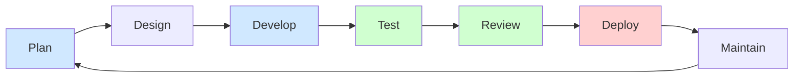

# Software Driven Specification Plan for creation of AI Workbench

TL;DR
This document captures the specification plan used to craft the course 
content delivered by an expert computer science educator. It builds a 
hands-on AI lab for high schoolers and non-CS undergraduates, teaching 
them to build AI-powered applications from basic prompting to multi-agent 
server workflows using sophisticated specification-driven techniques.

---

## Phase 0: Initial Workbench Foundation [Historical]

*Note: This phase covers the initial unrecorded activities that established the workbench structure.*

### Phase 0.1: Project Inception
- [x] Define the vision for a Specification Driven Workbench (SDW).
- [x] Establish the project structure with `sdw/`, `sessions/`, and `projects/` directories.
- [x] Create the initial `plan.md` and `README.md` to guide development.
- [x] Set up the basic technical stack requirements (Python, Markdown, Git).

### Phase 0.2: Core Specification Establishment
- [x] Draft the initial component contracts for the Group Meetup Organizer.
- [x] Define the session arc from Planning through Multi-Agent Workflows.

---

## Phase 1: Spec Driven Content Creation (SDCC) [Historical]

*Note: This phase consolidates the historical plan originally stored in `sdw/sdd_server_workflow_plan.md`.*

TL;DR
This plan breaks the SDCC effort into discrete phases for the slide 
session, client workflow session, server workflow session, SDD 
refactor, agenda update, and final review. Each phase contains
concrete steps for the specific session file targets, and we will 
execute one step at a time.

### Phase 1.1: SLIDES
- [x] Review and expand `slides.md` to add:
  * Gamma install and start instructions 
  * student/team discount guidance
  * guardrails for safe content generation
  * tokenomics guidance for cost control
  * validation exercises that prove students understand prompting and structure
- [x] Confirm any supporting references in `introduction.md` and 
`README.md` if needed.
  * Login verification moved into slides.md Setup > Install/Start.
  * README.md agenda entry already correct — no changes needed.
  * Mark the slide session content ready for review.

### Phase 1.2: CLIENT WORKFLOW
- [x] Review `client_work_automation.md` and add:
  * Claude CoWork install and try instructions
  * student/team discount guidance
  * guardrails for safe CoWork automation and file handling
  * tokenomics guidance for cost-conscious use
  * validation exercises that ensure students grok safe workflow execution
- [x] Ensure `client_application.md` incorporates the SDD exercise narrative and clearly connects with the client workflow practice.
  * SDD framing blockquote added; stack (React+TS+FastAPI+MongoDB) from sdd_basics.md adopted.
  * event_organizer.md generalized for any meetup (study groups, social clubs).
  * README.md agenda rows updated for consistency.
- [x] Mark the client workflow session content ready for review.

### Phase 1.3: SERVER WORKFLOW
- [x] Review `server_multiagent.md` and add:
  * OpenClaw install and try instructions
  * student/team discount guidance
  * guardrails for safe server-side workflow execution
  * tokenomics guidance for multi-agent server workflows
  * validation exercises that ensure students understand orchestration and failure handling
- [x] Confirm the server workflow content aligns with `server_application.md` and `sdlc_ai.md`.
  * server_application.md removed — content consolidated into server_multiagent.md
    (Phase 1: single agent; Phase 4: server/Docker deployment).
  * Flight Tracker preserved as alternative project note in server_multiagent.md.
  * tools/temporal/cli.md created and linked. sdlc_ai.md confirmed aligned.
  * README.md two server rows merged into one with OpenClaw + Temporal tool links.
- [x] Mark the server workflow session content ready for review.

### Phase 1.4: SDD REFACTOR
- [x] Review `sdd_basics.md` and refactor it to emphasize concept and methodology only.
- [x] Consolidate the concrete SDD exercise narrative into client_application.md or a dedicated exercise file if needed.
- [x] Ensure the SDD concept file links clearly to the client application exercise.
- [x] Mark the SDD refactor ready for review.
  * Absorbed into Phase 2 Step 3 (inseparable from client_application.md update).

### Phase 1.5: AGENDA UPDATE
- [x] Update `README.md` Agenda to place:
  * `code_review.md` immediately after the client application development exercise
  * `sdlc_ai.md` next, before server and advanced workflow sessions
- [x] Clarify tool labels and session timings for the updated flow.
  * Tool labels and timings were already consistent — no changes needed.
- [x] Mark the agenda update ready for review.

### Phase 1.6: FINAL REVIEW
- [x] Review all revised files for consistency and correct references.
  * slides.md: fixed broken session-notes path, trailing whitespace, missing newline.
  * sdd_basics.md: updated exercise link text to match README agenda label.
  * client_application.md: added blank line after ## Tools.
  * event_organizer.md: fixed 'Thursady' typo; 'chosen restaurant' → 'chosen venue'.
  * All Output section plan.md links confirmed as intentional forward references.
  * Orphaned learnings/session_notes/server_application.md noted (pre-existing).
- [x] Confirm the updated agenda, SDD refactor, and exercise content support the intended learning progression.
  * Progression: build app → review code → understand SDLC → automate workflows → scale to server.
  * SDD concept (sdd_basics.md) cleanly separated from exercise (client_application.md).
  * All Tools/Setup sections consistent across session files.
- [x] Save a final completion note in plan.md and prepare to execute the next approved step.
  * All 6 phases complete. Branch feat/sdlc ready for PR and review.

---


## Project Description (canonical — replaces the draft plan)

### What this is

A **one-shot meetup coordinator** for a fixed group. Given a list of
members, available dates, and venue options, it:

1. Polls each member: "Are you free? What venue do you prefer?"
2. Selects the venue that the most free members prefer
3. Notifies the group via a Discord message

That is the complete application. It runs once per meetup. A human
(the organizer) triggers it when they want to schedule a meetup.

### What this is NOT

* Not a recurring scheduler or cron job
* Not a SaaS product with user registration or authentication
* Not a multi-tenant system with events, subscriptions, or regions
* Not an email sender or calendar invite system
* Not a cancellation or rescheduling workflow

These are real product features that would be built on top of this
architecture. They are not part of the lab.

### Why one-shot is the right scope

The Poller → Selector → Notifier architecture is identical whether
you run the system once or a hundred times. A recurring scheduler
is just a cron job wrapping the same three steps. Teaching the
one-shot version teaches everything architecturally important, and
a student can complete it in a single lab session.

### The complete data model (simple)

**config.yaml** — the only configuration interface. Set by the
instructor before the lab; students receive it ready to use.

```yaml
group: "Thursday Study Squad"
members:
  - name: "Alice"
  - name: "Bob"
  - name: "Carol"
  - name: "David"
options:
  dates:
    - "Thu Apr 24 7pm"
    - "Thu May 1 7pm"
    - "Thu May 8 7pm"
  venues:
    - "Library Room A"
    - "Coffee Lab on Castro"
    - "Online / Video Call"
```

**responses.json** — written by the Poller, read by the Selector.

```json
{
  "Alice":  {"available": true,  "venue": "Library Room A"},
  "Bob":    {"available": true,  "venue": "Coffee Lab on Castro"},
  "Carol":  {"available": false, "venue": null},
  "David":  {"available": true,  "venue": "Library Room A"}
}
```

**decision.json** — written by the Selector, read by the Notifier.

```json
{
  "date": "Thu Apr 24 7pm",
  "venue": "Library Room A",
  "attendees": ["Alice", "Bob", "David"]
}
```

### Selection logic (simple majority, no ties)

The Selector picks:
- Date: the date where the most members are available
- Venue: the venue preferred by the most available members
- Tie-breaking: alphabetical order (deterministic, no randomness)
- Cancelled: if zero members are available, write
  `{"cancelled": true}` to `decision.json` and the Notifier
  sends a cancellation message

### The three scripts (non-agentic version)

```
python poller.py    # reads config.yaml, collects responses,
                    # writes responses.json
python selector.py  # reads responses.json, picks date + venue,
                    # writes decision.json
python notifier.py  # reads decision.json, POSTs to Discord webhook
```

---

## Scope Decisions (locked)

### 1. One fixed group, fixed members

Members are defined in `config.yaml`. The application never adds,
removes, or authenticates members. The instructor sets up
`config.yaml` before the lab; students do not edit it.

### 2. Discord channel pre-provisioned by instructor

The instructor creates the Discord server, channel, and webhook URL
before the lab. Students receive `DISCORD_WEBHOOK_URL` as an
environment variable. The application never creates or manages
channels.

### 3. Shared store is flat files in the non-agentic version

No database until the agentic versions, where persistent state earns
its complexity. In the non-agentic version: two JSON files.

### 4. Stack grows only when complexity earns it

| Version | Stack | Why the stack is this size |
|---|---|---|
| Toy (Gamma) | Slides only | No code needed |
| Toy (Lovable) | HTML form, no backend | UI concept only |
| Non-agentic (SDD) | Python + flat files | Architecture visible, zero framework noise |
| Single-agent (OpenClaw) | Python + FastAPI + MongoDB | Agent needs HTTP interface + persistent state |
| Multi-agent (OpenClaw) | Python + FastAPI + MongoDB | Multiple agents share one store |
| Temporal (laptop) | + Temporal | Durable orchestration requires real persistence |
| Docker (server) | All above in containers | Deployment adds container layer only |

---

## Notification Platform Decision (locked)

**Discord via Webhook. No alternatives.**

| Platform | Setup cost | Auth complexity | Lab-viable? |
|---|---|---|---|
| Email (SMTP) | Medium | App passwords, spam filters, delivery lag | ⚠️ Borderline |
| WhatsApp (Twilio) | High | Meta Business Account, WABA, template approval | ❌ No |
| Discord Bot | Medium | Developer Portal, bot token, Intents, async | ⚠️ Borderline |
| **Discord Webhook** | **Minimal** | **No token, no bot, just a URL** | **✅ Yes** |

The full Notifier in the non-agentic version:

```python
# notifier.py
import requests, json, os

decision = json.load(open("decision.json"))
if decision.get("cancelled"):
  msg = "❌ **Meetup cancelled** — not enough members available."
else:
  attendees = ", ".join(decision["attendees"])
  msg = (
    f"📅 **Meetup confirmed!**\n"
    f"**Date:** {decision['date']}\n"
    f"**Venue:** {decision['venue']}\n"
    f"**Attending:** {attendees}"
  )

requests.post(os.environ["DISCORD_WEBHOOK_URL"], json={"content": msg})
print("Notification sent.")
```

Pluggability note (appears once, in the SDD session):
> The Notifier is a pluggable component. Swapping Discord for email
> (SendGrid), SMS (Twilio), or Slack (Slack webhooks) requires
> changing only `notifier.py`. The Poller and Selector are unaffected.

---

## Architecture Arc

```
Session: Planning
└── Concept only — no code, plan the app in plain language
  └── Output: plan.md for the Group Meetup Organizer

Session: Create Presentation (Gamma)
└── Demo: AI Workbench pitch deck (5 slides, instructor-led)
└── Exercise: Group Meetup Organizer pitch deck (toy version 0)
  └── No functionality — stakeholder presentation only
  └── Gap: "We have a pitch but no working product."

Session: Create/Run Web Site (Lovable)
└── Demo: Hello World on Lovable (unchanged)
└── Exercise: Group Meetup Organizer poll UI (toy version 1)
  └── Real UI, fake backend — hardcoded result, no webhook call
  └── Gap: "The UI exists but the app is not real yet."

Session: Client Application / SDD
└── Demo: Hello World via SDD plan + Claude Code (unchanged)
└── Exercise: Group Meetup Organizer — non-agentic version
  └── Three Python scripts + two JSON files + config.yaml
  └── Real Discord webhook notification
  └── No web framework, no database

Session: Client Workflow Automation (OpenClaw)
└── Demo: File organization (CoWork + OpenClaw, unchanged)
└── Exercise A: Single-agent (OpenClaw) — one agent, three steps
└── Exercise B: Multi-agent (OpenClaw) — one agent per component
└── Note: CoWork guardrails vs OpenClaw permissions model

Session: Multi-Agent Workflows
└── Exercise A: Three agents + Temporal on laptop
└── Exercise B: Deploy to server via Docker
```

---

## Phase -1: INSTRUCTOR PREFLIGHT

**Target file:** `sessions/instructor.md` (new file)

**Purpose:** Everything an instructor must complete *before* students
arrive. Any CS graduate can run this checklist independently. Each
step includes a validation test so the instructor knows it worked.

**Time required:** approximately 60 minutes total.

> **Class ID convention:** choose a short unique identifier for this
> class run (e.g. `2026-spring`, `2026-fall-hs`). Replace every
> occurrence of `<CLASS_ID>` below with your chosen value. This
> prevents name collisions when the same instructor runs multiple
> cohorts.

- [x] **Step -1.1: Collect the student roster** **COMPLETED**

  The file must contain the following sections, in order:

  **Header:**
  ```
  # Instructor Preflight Checklist
  Complete every step and its validation before students arrive.
  Time required: approximately 60 minutes.
  ```

  **Section 1 — Collect student roster (5 min)**

  Before provisioning anything, collect one row per student in a
  local roster file (never committed — contains personal info):

  | Full name | GitHub username | Discord username | Laptop OS | Admin? | Server acct? |
  |---|---|---|---|---|---|
  | Alice Smith | `alicesmith` | `@alice` | Win11+WSL2 | yes | yes |
  | Bob Jones   | `bobjones42` | `@bob`   | macOS 14   | yes | yes |

  - **GitHub username** — validate each one resolves:
    ```bash
    # Replace USERNAME with each student's handle
    curl -s https://api.github.com/users/USERNAME \
      | python -c "import sys,json; d=json.load(sys.stdin); \
        print('OK:', d['login']) if 'login' in d \
        else print('NOT FOUND')"
    ```
  - **Discord username** — new-format handles are `@username`
    (no discriminator). Old-format: `username#1234`. Confirm
    each student has a Discord account before inviting (Step -1.2).
  - **Laptop OS** — accept only `Win11+WSL2` or `macOS 13+`.
    Students on older OS versions must upgrade before the lab.
  - **Admin/sudo** — required for tool installation (Step -1.4).
    Students without admin access cannot complete the exercises.
  - **Server account** — required for Phase 6 Docker deployment.
    Provision in Step -1.3; mark this column `yes` after that step.

- [x] **Step -1.2: Discord server setup and student invite** **COMPLETED**

  **Section 2 — Discord server setup (15 min)**

  Reference: https://support.discord.com/hc/en-us/articles/204849977

  - Choose your `<CLASS_ID>` (e.g. `2026-spring`)
  - Create a new Discord server named `meetup-lab-<CLASS_ID>`
    - Server Settings → Overview → Server Name
    - Do NOT reuse a previous class server — name collisions
      corrupt webhook URLs from prior runs
  - Create a text channel `#meetup-notifications` inside the server
  - Invite each student by Discord username:
    - Server Settings → Invites → Create Invite (no expiry)
    - Or: right-click `#meetup-notifications` → Invite People
    - Send the invite link to each student via a shared doc or
      class chat before the lab day
  - Confirm every student has joined and can read
    `#meetup-notifications`:
    - Each student posts a test message: "ready: <their name>"
    - Do not proceed until all students appear in the member list
  - Create the webhook (only after all students have joined):
    - Channel Settings → Integrations → Webhooks → New Webhook
    - Name: `Meetup Bot`
    - Copy the webhook URL — this is `DISCORD_WEBHOOK_URL`
  - Validation:
    ```bash
    export DISCORD_WEBHOOK_URL="https://discord.com/api/webhooks/..."
    python -c "
    import requests, os
    r = requests.post(os.environ['DISCORD_WEBHOOK_URL'],
                      json={'content': '✅ Instructor preflight test'})
    print('OK' if r.status_code == 204 else f'FAIL: {r.status_code}')
    "
    ```
    Expected: `OK` and the message appears in `#meetup-notifications`
    and is visible to all students who joined.

- [x] **Step -1.3: Provision the shared server account** **COMPLETED**

  **Section 3 — Shared server provisioning (15 min)**

  The server is used in Phase 6 (Docker deployment). It must be
  provisioned before the lab — students cannot do this themselves.

  **Server requirements:**
  - OS: Ubuntu 22.04 LTS (recommended) or 24.04
  - Reachable from student laptops (public IP or VPN-accessible)
  - Inbound ports open: 22 (SSH), 8080 (Temporal UI), 8088 (app)
  - Outbound internet access (to pull Docker images, reach Discord)

  **Provision the shared account:**
  ```bash
  # On the server (as root or a user with sudo)
  sudo useradd -m -s /bin/bash labuser
  sudo usermod -aG docker labuser   # add to docker group

  # Pre-install required tools
  sudo apt-get update
  sudo apt-get install -y docker.io docker-compose-v2 git python3 pip

  # Pre-clone the lab repo
  sudo -u labuser git clone \
    https://github.com/aiedu-lab/ai_workbench \
    /home/labuser/ai_workbench
  ```

  **Add each student's SSH public key:**
  ```bash
  sudo -u labuser mkdir -p /home/labuser/.ssh
  # Repeat for each student's public key:
  echo "ssh-ed25519 AAAA... alice@laptop" \
    | sudo tee -a /home/labuser/.ssh/authorized_keys
  sudo chmod 700 /home/labuser/.ssh
  sudo chmod 600 /home/labuser/.ssh/authorized_keys
  sudo chown -R labuser:labuser /home/labuser/.ssh
  ```

  **Validation — run from each student laptop:**
  ```bash
  ssh labuser@<SERVER_IP> docker ps
  ```
  Expected: empty table header (no error). If any student gets
  `Permission denied`, re-check their public key was added correctly.

  Mark the `Server acct?` column `yes` in the roster (Step -1.1)
  once every student passes this check.

- [x] **Step -1.4: Student laptop preflight** **COMPLETED**

  **Section 4 — Student laptop preflight (10 min per student)**

  Students run this themselves before the lab. The instructor
  validates by reviewing the output of `preflight_check.py`
  (located at `projects/group_meetup/preflight_check.py`).

  **Win11 + WSL2 setup:**
  - Confirm WSL2 is enabled: `wsl --status` → `Default Version: 2`
  - Confirm Ubuntu 22.04 distro: `wsl -l -v` → `Ubuntu-22.04`
  - If missing: `wsl --install -d Ubuntu-22.04` (requires admin,
    then reboot)

  **macOS setup:**
  - Xcode CLI tools: `xcode-select --install`
  - Homebrew: `/bin/bash -c "$(curl -fsSL
    https://raw.githubusercontent.com/Homebrew/install/HEAD/install.sh)"`
  - Python + Git: `brew install python git`

  **Both platforms — required tools:**
  ```bash
  # Python 3.10+
  python3 --version          # must be >= 3.10

  # Git identity (required for commits)
  git config --global user.name "Your Name"
  git config --global user.email "you@example.com"

  # GitHub CLI (required for code review session)
  # Install: https://cli.github.com
  gh auth login              # authenticate with GitHub account

  # Claude Code CLI (required from SDD session onward)
  npm install -g @anthropic-ai/claude-code
  claude --version

  # Python dependencies for the meetup project
  pip install requests pyyaml
  ```

  **Validation script — run and share output with instructor:**
  ```bash
  python3 projects/group_meetup/preflight_check.py
  ```
  The script checks each dependency and prints `PASS` or `FAIL`
  per item. Every item must show `PASS` before the lab begins.

  > **Note:** `preflight_check.py` is created in Phase 4
  > (Step 4.4) when the project scripts are written. The instructor
  > must run Phase 4 before distributing the preflight script
  > to students.

- [x] **Step -1.5: Create `config.yaml` and `.env.example`** **COMPLETED**

  **Section 5 — Create `config.yaml` for the lab group (5 min)**
  - Replace member names with the actual students (from roster)
  - Replace venue options with locally relevant options
  - Save as `config.yaml` in the project directory
  - Template:
    ```yaml
    group: "Thursday Study Squad"
    members:
      - name: "Alice"    # replace with actual student names
      - name: "Bob"
      - name: "Carol"
      - name: "David"
    options:
      dates:
        - "Thu Apr 24 7pm"   # replace with upcoming Thursdays
        - "Thu May 1 7pm"
        - "Thu May 8 7pm"
      venues:
        - "Library Room A"   # replace with local venues
        - "Coffee Lab"
        - "Online / Video Call"
    ```
  - Validation: `python -c "import yaml;
    print(yaml.safe_load(open('config.yaml')))"` — no errors.

  **Section 6 — Create `.env.example` for students (2 min)**
  - Create `.env.example` in the project root:
    ```
    DISCORD_WEBHOOK_URL=https://discord.com/api/webhooks/REPLACE_ME
    ```
  - Do NOT commit the real URL — `.env` must be in `.gitignore`
  - Share the real `DISCORD_WEBHOOK_URL` with students verbally
    or via a shared doc on lab day

- [x] **Step -1.6: Run the non-agentic version end-to-end** **COMPLETED**

  **Section 7 — Full smoke test (10 min)**

  Run all three scripts in sequence using the `config.yaml` you
  just created:
  ```bash
  python poller.py    # enter responses for each member manually
  python selector.py  # check decision.json output
  python notifier.py  # confirm Discord message arrives
  ```
  Expected: `#meetup-notifications` in `meetup-lab-<CLASS_ID>`
  receives a message like:
  ```text
  📅 Meetup confirmed!
  Date: Thu Apr 24 7pm
  Venue: Library Room A
  Attending: Alice, Bob, David
  ```
  If this works, the lab is ready.

- [x] **Step -1.7: Add `sessions/instructor.md` to `README.md` agenda** **COMPLETED**

  Add as the first row, before all session rows:

  ```text
  | [**Instructor Preflight**](sessions/instructor.md) | Before lab | Roster, Discord, server, student laptops | 60 mins |
  ```

---

## Phase 0: VALIDATE AND LOCK THE PROJECT SPEC

**Target file:** `plans/specs/event_organizer.md`

- [x] **Step 0.1: Audit current `event_organizer.md`** **COMPLETED**
  - Read the file end to end
  - The current draft describes a full SaaS product (recurring
    events, self-onboarding, region rotation, cancellation flows,
    garbage collection). Flag everything that exceeds the one-shot
    scope defined in the Project Description above.
  - Do NOT edit yet — produce a written audit listing what to
    keep, what to remove, and what to add

- [x] **Step 0.2: Rewrite `event_organizer.md` to correct scope** **COMPLETED**
  - Keep: project description, the three-component model, the data
    model (config.yaml / responses.json / decision.json), the
    session arc mapping
  - Remove: recurring scheduling, self-onboarding, member
    subscription management, region/city rotation, calendar invites,
    cancellation workflow, garbage collection, ConsensusThreshold
    dropdown, DeleteAfterWeeks — all of these
  - Add: the simplified selection logic (simple majority,
    alphabetical tie-breaking, cancellation if zero available)
  - Add: the scope decisions section (verbatim from this plan)
  - Add: instructor setup steps (Discord pre-provisioning)
  - Add: notification platform decision and rationale
  - Constraint: readable in under 5 minutes; answers "what are we
    building and why" — not "how"; no feature that cannot be
    implemented in a 90-minute lab session

- [x] **Step 0.3: Lock the three-component contract** **COMPLETED**
  - Poller: input `config.yaml` → output `responses.json`
  - Selector: input `responses.json` → output `decision.json`
  - Notifier: input `decision.json` + `DISCORD_WEBHOOK_URL` →
    output Discord message
  - Contract must be identical in every session file

---

## Phase 1: PLANNING SESSION — VALIDATE WORDING

**Target file:** `sessions/planning.md`

- [x] **Step 1.1: Audit `sessions/planning.md`** **COMPLETED**
  - Confirm the exercise references the `Group Meetup Organizer`
  - Confirm framing is concept-only (no code, no framework specifics)
  - Confirm it points to `plans/specs/event_organizer.md`
  - Flag any wording from the over-specified draft (recurring events,
    self-onboarding, cancellation) — remove it

- [x] **Step 1.2: Update `sessions/planning.md` if needed** **COMPLETED**
  - Exercise: name the project, describe it as a one-shot coordinator,
    state the three components at concept level, ask students to
    produce a plan (not code)
  - Scope statement to include:
    > "One group. One meetup. Three steps: poll, select, notify.
    > The instructor sets up the group config before the lab.
    > You write the code that runs those three steps."
  - Add the full forward reference arc:
    > "You will return to this project in every remaining session —
    > first as a pitch deck, then as a toy web site, then as three
    > Python scripts, then as an agentic system, then deployed on
    > a server."

---

## Phase 2: SLIDES SESSION — GAMMA PRESENTATIONS

**Target file:** `sessions/slides.md`

- [x] **Step 2.1: Audit `sessions/slides.md`** **COMPLETED**
  - Confirm the session has a demo section and an exercise section
  - Confirm any reference to the organizer is scoped as one-shot
    (not recurring, not SaaS)

- [x] **Step 2.2: Confirm or add Demo (AI Workbench deck)** **COMPLETED**
  - Create a `projects/slides/demo/plan.md` that will be used 
    a demo by instructor to create a 5-slide deck using `gamma.app` 
    to present an overview of `AI Workbench`. The five slides are:
    1. Who runs the lab and who attends
    2. Why the lab exists
    3. What the exercises are (the progressive arc)
    4. How to contribute to the lab
    5. Call to action

- [x] **Step 2.3: Add `Group Meetup Organizer` exercise (toy version 0)** **COMPLETED**
  - Frame: "Build a stakeholder pitch deck. Audience: a student
    club committee deciding whether to adopt this system."
  - Slide content: problem, three-component solution at concept
    level (poll → select → Discord notification), what success
    looks like
  - Gap statement:
    > "We have a pitch. We have no working system. In the Web Site
    > session we build a first version of the UI — and see exactly
    > what is still missing."
  - No implementation details of any kind

- [x] **Step 2.4: Confirm Gamma install/start instructions present** **COMPLETED**

---

## Phase 3: WEB SITE SESSION — LOVABLE TOY UI (TOY VERSION 1)

**Target file:** `sessions/web_site.md`

- [x] **Step 3.1: Audit `sessions/web_site.md`** **COMPLETED**
  - Hello World demo and Exercise A must remain intact
  - Confirm `Group Meetup Organizer` exercise does not exist yet
    (or confirm it is scoped as toy version only)

- [x] **Step 3.2: Add `Group Meetup Organizer` toy UI exercise (Exercise B)** **COMPLETED**
  - Position: after Exercise A
  - What to build in Lovable:
    - Poll form: member name, 3 date checkboxes, venue preference
    - Submit button
    - Result page: hardcoded date + venue, "✓ Notification sent
      to Discord" (display only — no webhook call)
  - Explicit omissions (state in the exercise):
    - No Selector algorithm
    - No Discord webhook call
    - No persistence
  - Gap statement:
    > "The Selector has no logic. The Notifier sends nothing.
    > Data disappears on refresh. We have a UI but not an
    > application. In the Client Application session we build
    > the real system."

- [x] **Step 3.3: Confirm session structure:** **COMPLETED**
  1. Demo: Hello World (Lovable vs Claude Code CLI)
  2. Exercise A: Hello World with Claude Code
  3. Exercise B: Group Meetup Organizer toy UI (new)

---

## Phase 4: CLIENT APPLICATION SESSION — NON-AGENTIC VERSION

**Target file:** `sessions/client_application.md`

**Key point:** The non-agentic version is **three Python scripts and
two JSON files**. No web framework, no database. Students run each
script in sequence in the terminal.

- [x] **Step 4.1: Audit `sessions/client_application.md`** **COMPLETED**
  - If the exercise specifies React + FastAPI + MongoDB: update to
    pure Python + flat files for the non-agentic version. The full
    web stack moves to Phase 5 where agents earn it.
  - The Hello World SDD demo must remain intact

- [x] **Step 4.2: Add opening backward reference** **COMPLETED**
  - Open with:
    > "In the Slides session you pitched a one-shot meetup
    > coordinator. In the Web Site session you built a toy UI
    > with a fake Notifier. This session builds the real system:
    > three Python scripts that run, with a Discord message you
    > can see arrive in the channel the instructor provisioned."

- [x] **Step 4.3: Add instructor-provisioned Discord setup block** **COMPLETED**
  - Students do not create the Discord channel — the instructor
    already did this (see `sessions/instructor.md`)
  - Students only need to set the env var and run the test:
    ```bash
    # Your instructor provided this URL
    export DISCORD_WEBHOOK_URL="https://discord.com/api/webhooks/..."

    # One-line validation
    python -c "
    import requests, os
    r = requests.post(os.environ['DISCORD_WEBHOOK_URL'],
                      json={'content': 'student setup test ✓'})
    print('OK' if r.status_code == 204 else f'FAIL: {r.status_code}')
    "
    ```

- [x] **Step 4.4: Write the exercise section** **COMPLETED**
  - SDD workflow for each of the three scripts:
    1. Write spec (Claude Code interviews you via plan.md)
    2. Review spec
    3. Generate: `claude -p "$(cat spec.md)" --allowedTools Write`
    4. Run and validate
    5. Iterate one component at a time
  - Validation sequence:
    1. `python poller.py` → enter responses for each member
    2. Check `responses.json` is correct
    3. `python selector.py` → check `decision.json`
    4. `python notifier.py` → confirm Discord message arrives
  - Pluggability note (appears here only)
  - Reflection: "What would need to change to make this agentic?"

- [x] **Step 4.5: Confirm `sdd_basics.md` link resolves** **COMPLETED**

- [x] **Step 4.6: Create `projects/group_meetup/` and run smoke test** **COMPLETED**

  Create the project directory and populate all five files:

  1. **`config.yaml`** — sample roster using the template from
     `sessions/instructor.md` Section 5. Replace placeholder names
     with the actual class roster before distributing to students.

  2. **`poller.py`** — reads `config.yaml`, prompts for each
     member's availability and venue preference, writes
     `responses.json`.

  3. **`selector.py`** — reads `responses.json`, applies simple
     majority + alphabetical tie-breaking, writes `decision.json`.

  4. **`notifier.py`** — reads `decision.json`, POSTs to
     `DISCORD_WEBHOOK_URL`. Uses the canonical implementation
     from the Project Description section of this plan.

  5. **`preflight_check.py`** — checks each dependency listed in
     `sessions/instructor.md` Section 4 and prints `PASS` or
     `FAIL` per item.

  **Validation (back-reference to instructor.md Section 7):**
  ```bash
  cd projects/group_meetup
  export DISCORD_WEBHOOK_URL="<webhook from Section 2>"
  python poller.py    # enter test responses
  python selector.py  # verify decision.json is correct
  python notifier.py  # confirm Discord message arrives
  python preflight_check.py  # all items must show PASS
  ```
  This is the same smoke test as `sessions/instructor.md`
  Section 7. If all four commands succeed, mark this step
  complete and Section 7 is ready for instructors to run.

---

## Phase 5: CLIENT WORKFLOW SESSION — AGENTIC VERSIONS

**Target file:** `sessions/client_agent.md`

**Stack upgrade note:** FastAPI + MongoDB are introduced here.
Agents need an HTTP interface (async poll responses) and state that
survives between restarts. Add one paragraph explaining this
transition before the exercise.

### Step 5A: Single-Agent Version

- [x] **Step 5.1: Add single-agent exercise** ✅ COMPLETED
  - Opening: "You ran three scripts sequentially. Now one OpenClaw
    agent plans and executes all three steps."
  - Stack upgrade paragraph (as above)
  - Validation: Discord receives the same message as the non-agentic
    version — same output, new execution model
  - Reflection: "What did the agent do that the scripts could not?"

### Step 5B: Multi-Agent Version

- [x] **Step 5.2: Add multi-agent exercise** ✅ COMPLETED
  - Three agents: Poller Agent, Selector Agent, Notifier Agent
  - Shared state via MongoDB
  - Failure injection: stop Selector Agent mid-run; Notifier must
    not fire
  - Reflection: "What coordination problem did we create?" (seeds
    Temporal)

- [x] **Step 5.3: Add forward reference to multi-agent session** ✅ COMPLETED

---

## Phase 6: MULTI-AGENT WORKFLOWS SESSION — TEMPORAL + DOCKER

**Target file:** `sessions/client_multiagent.md`

### Step 6A: Three Agents + Temporal on Laptop

- [x] **Step 6.1: Add Temporal orchestration exercise** ✅ COMPLETED
  - PollActivity → SelectActivity → NotifyActivity
  - NotifyActivity calls same Discord webhook — no change
  - Failure injection: kill SelectActivity, observe Temporal retry
  - Reflection: "What did Temporal give us that OpenClaw alone
    could not?"

### Step 6B: Deploy to Server via Docker

- [x] **Step 6.2: Add Docker deployment exercise** ✅ COMPLETED
  - Five containers: poller, selector, notifier, temporal, mongo
  - `DISCORD_WEBHOOK_URL` injected via docker-compose.yml
  - Claude Code generates all Dockerfiles and docker-compose.yml
  - Validation: `docker compose up`, submit a poll, confirm Discord
    message arrives from the deployed stack

---

## Phase 7: FINAL REVIEW AND CONSISTENCY CHECK

**Target files:** All modified files plus `README.md`.

- [x] **Step 7.1: Verify instructor.md is complete and accurate**
  - All six sections present with working validation commands
  - The smoke test (run all three scripts end-to-end) is the
    last step in the preflight checklist
  - `README.md` lists instructor.md as the first agenda entry

- [x] **Step 7.2: Verify project description is consistent**
  - "One-shot meetup coordinator" appears in every session that
    describes the project — no session calls it recurring, SaaS,
    or multi-tenant
  - No session mentions self-onboarding, recurring scheduling,
    calendar invites, or cancellation flows

- [x] **Step 7.3: Verify the arc is explicit end-to-end**
  - Every session states which version it builds and what was
    missing in the previous one
  - Every session (except the last) ends with a forward reference

- [x] **Step 7.4: Verify notification platform is consistent**
  - Discord webhook in every session from Phase 4 onward
  - Pluggability note appears once only (Phase 4)

- [x] **Step 7.5: Verify `README.md` agenda order:**
  0. Instructor Preflight (new, first row)
  1. Planning
  2. Slides / Gamma
  3. Web Site / Lovable
  4. Client Application / SDD
  5. Client Workflow Automation
  6. Multi-Agent Workflows

- [x] **Step 7.6: Verify `event_organizer.md` is single source**
  - No session redefines the component contracts inline
  - No SaaS features survive in the spec

- [x] **Step 7.7: Confirm all links resolve**
  - `grep -r "\[.*\](.*\.md)" sessions/ plans/` and spot-check

- [x] **Step 7.8: Save completion note**

---

## Verification Criteria

* Any CS graduate can read `sessions/instructor.md` and run the
  preflight checklist without asking for help
* A student receives `config.yaml` and `DISCORD_WEBHOOK_URL` from
  the instructor and can run the non-agentic version in under 10
  minutes
* "One-shot meetup coordinator" — not "recurring SaaS product" —
  is the description every session uses
* The notification channel is the same Discord webhook from Phase 4
  through Phase 6 — no re-onboarding at any level
* Each toy version is visibly incomplete; the gap is named explicitly
* The stack grows exactly once (flat files → MongoDB at Phase 5)
  with a written explanation of why
* `event_organizer.md` answers "what and why"; session files answer
  "how and in what order"
* No session contains implementation details from a different scope

---

## Phase 8: AGENDA REVIEW AND SESSION ENHANCEMENT

**Addresses:** `sdw/review_agenda.md` — all objectives, tasks,
and constraints.

**Target files:** `README.md`, `sessions/prompting_advanced.md`,
`sessions/solution.md` (new), `sessions/future_advancements.md`,
`sessions/recap.md`, `sessions/sdlc_ai.md`

**What NOT to add:**
- Full Predictive AI course (Linear Regression through Neural
  Networks) — semester-long material; scope drift; not the lab's focus
- SLM/HuggingFace as a dedicated exercise — tool-stack mismatch;
  mention in future_advancements only
- BERT as a standalone session — fold the intuition into
  prompting_advanced (embeddings segment in Step 8.2)
- RAG as a standalone session — fold into Step 8.2 as Part 2 of
  the Embeddings arc; the two topics are one continuous concept

---

### Step 8.1: Reorder README.md Agenda

**Problem:** "Advanced Prompting Techniques" sits at row 13, after
multi-agent deployment. Advanced prompting (templatization, reusable
skills, structured prompting) is the conceptual foundation for
Spec-Driven Development and must precede it.

**Changes:**

Move "Advanced Prompting Techniques" from row 13 to row 7
(after Website session, before SDD). Remove "Software Enhancement"
as a standalone row (fold into `sdlc_ai.md` in Step 8.6). Add
"Solution Architecture" session before "Future Advancements".

**Resulting order (17 sessions, net unchanged):**

| Row | Session |
|-----|---------|
| 0   | Instructor Preflight |
| 1   | Introduction |
| 2   | Concept: Basic Prompting Techniques |
| 3   | Exercise: Problem Solving |
| 4   | Concept: Planning |
| 5   | Exercise: Create Presentation |
| 6   | Exercise: Create/Run Web Site |
| 7   | **Concept: Advanced Prompting Techniques** (moved from row 13) |
| 8   | Concept: Spec Driven Development (SDD) |
| 9   | Exercise: Group Meetup Organizer |
| 10  | Concept: Code Review |
| 11  | Concept: AI Across the SDLC |
| 12  | Exercise: Create/Run Workflows |
| 13  | Exercise: Create/Run Multi-Agent on Laptop |
| 14  | Exercise: Run Multi-Agent on Server |
| 15  | **Concept: Solution Architecture** (new) |
| 16  | Future Advancements |
| 17  | Recap |

- [x] **Step 8.1:** Edit the agenda table in `README.md` to
  reflect this order. Remove the "Software Enhancement" row.
  Add the "Solution Architecture" row with a link to
  `sessions/solution.md`. **COMPLETED**

---

### Step 8.2: Add Embeddings + RAG to prompting_advanced.md

**Why:** Students learn context engineering but have no intuition
for why semantic relevance filtering works. A 20–25 min two-part
block gives the mental model and shows the practical payoff:
embeddings explain the WHY; RAG is the immediate SO WHAT. Both run
in the same Google Colab notebook — no local install required.

**Part 1 — Embeddings & Semantic Similarity (10 min):**

Every word or sentence maps to a vector of numbers. Words with
similar meaning cluster nearby. Classic visualization:
`King − Man + Woman ≈ Queen` — the arithmetic works geometrically.

Why it matters for context engineering: cosine similarity between
query and context embeddings is how relevance filtering works.
High similarity → context stays; low → dropped. This is why
"meeting at 3pm" is relevant to "what time is my next event?"

Exercise:
```python
from sentence_transformers import SentenceTransformer
from sklearn.metrics.pairwise import cosine_similarity

model = SentenceTransformer("all-MiniLM-L6-v2")
sentences = [
  "The meeting is at 3pm",
  "What time is my next event?",
  "I enjoy hiking on weekends",
]
embeddings = model.encode(sentences)
scores = cosine_similarity(embeddings)
for i, s in enumerate(sentences):
  for j, t in enumerate(sentences):
    if i < j:
      print(f"{scores[i][j]:.2f} | {s[:30]} vs {t[:30]}")
```
Expected: sentences 0–1 score ~0.6–0.8; either vs. sentence 2
scores ~0.1–0.2.

**Part 2 — RAG: Retrieval Augmented Generation (15 min):**

Before calling the LLM, retrieve the most relevant chunks from a
document corpus using embedding similarity, then inject them into
the prompt as context. The LLM answers grounded in your documents —
not just its training data.

Exercise (same Colab, same model):
```python
docs = [
  "Meetings are held every Thursday at 7pm.",
  "The venue is Library Room A unless notified.",
  "To RSVP, reply to the Discord notification.",
  "Bring a laptop — exercises require Claude Code.",
]
query = "What time do meetings start?"

doc_embeddings = model.encode(docs)
query_embedding = model.encode([query])
scores = cosine_similarity(query_embedding, doc_embeddings)[0]
top_chunk = docs[scores.argmax()]

# Inject into Claude prompt
prompt = f"Context: {top_chunk}\n\nQuestion: {query}"
print(f"Retrieved: {top_chunk}")
# → call Claude API with `prompt`
```

Reflection: "What happens if the corpus has 10,000 documents? What
changes?" (Answer: need a vector database — Pinecone, pgvector,
ChromaDB. Same concept, scaled.)

- [x] **Step 8.2:** Add the two-part Embeddings + RAG section to ✅ COMPLETED
  `sessions/prompting_advanced.md` at the end of the concepts block,
  before existing exercises. Use a single Colab notebook. Do NOT
  add a standalone RAG session — the two topics are one arc.

---

### Step 8.3: Create sessions/solution.md

**Why:** No session shows how a real AI solution combines multiple
disciplines. Students finish the lab knowing how to build agents
but not how those agents fit into a complete system. This is the
capstone "how it all fits together" session.

**Session structure (45 mins):**

**Concept (15 min):** Modern AI Solution Architecture

| Layer | Role | Example |
|-------|------|---------|
| Predictive AI | Classify, rank, score | Spam classifier, intent detector |
| Generative AI | Draft, reason, decide | LLM writes the reply |
| Non-AI algorithms | Route, filter, enforce | Priority queue, regex guard |
| Systems engineering | Persist, deliver, scale | Database, API, containers |

None of these layers is optional in a real solution. Remove any one
and the system either fails or becomes brittle.

**Visual anchor — MNIST demo (5 min):** Pre-trained digit classifier
predicts handwritten digits. This is Predictive AI at its simplest —
pattern → label. Contrast with an LLM describing what it sees.
Classifier: fast, cheap, narrow. LLM: slow, expensive, general.
A real system uses both.

**Toy Exercise (25 min): Email Triage System**

```
Email arrives
     |
     v
[Predictive: spam classifier] ── spam? → discard
     |
     v (not spam)
[Generative: LLM drafts reply]
     |
     v
[Non-AI: rule-based priority router]
  urgent? → send immediately
  normal? → queue for digest
  unclear? → flag for human
     |
     v
[Systems: Discord webhook — same one from Group Meetup project]
```

Students call a pre-trained classifier via HuggingFace Inference
API (one line, free tier). LLM draft uses Claude API. Router is
plain Python conditionals. Delivery reuses the Group Meetup Discord
webhook — no new infrastructure.

Reflection: "Which part would you replace with a generative model?
Which should stay algorithmic, and why?"

- [x] **Step 8.3:** Create `sessions/solution.md` with the above ✅ COMPLETED
  structure. Reuse the Group Meetup Discord webhook — no new infra.
  Test the HuggingFace classifier call end-to-end before publishing.

---

### Step 8.4: Update future_advancements.md

Add four sections after the existing World Models section.

**Reasoning / Thinking Models:** Some models (OpenAI o1, o3; Claude
Extended Thinking) perform chain-of-thought at inference time —
they "think" silently before answering. Dramatically more accurate
on complex multi-step problems at the cost of higher latency.
When to use: the problem requires deliberate step-by-step reasoning,
not just recall.

**Multimodal AI:** Modern models accept images, audio, and video
alongside text (Claude Vision, GPT-4o, Gemini). CoWork agents
reading the screen already use multimodal capabilities. Trend:
models that perceive the full digital environment, not just text.

**Small Language Models (SLMs):** Open-source models (Llama, Mistral,
Phi) run locally via Ollama or LM Studio. Smaller, cheaper, private,
zero latency — at the cost of capability. When to use: private data
that cannot leave the device, offline scenarios, high-volume
classification. HuggingFace Model Hub: thousands of fine-tuned
task-specific models.

**Autonomous AI Agents:** Today's agents respond to a prompt and
stop. The next generation monitors, watches, responds to events,
learns from feedback — without a human trigger per action. Claude
Managed Agents (Apr 2026) is an early example. Trajectory: from
"agent you invoke" to "agent that works alongside you."

- [x] **Step 8.4:** Add all four sections to ✅ COMPLETED
  `sessions/future_advancements.md` after the World Models section.
  Each: 3–5 sentences, one concrete example, one "when to use" line.

---

### Step 8.5: Update recap.md

**Problem:** recap.md omits the Group Meetup Organizer arc, SDD,
code review, and multi-agent patterns — the practical content
students spent 80% of the lab on.

**Add "What We Built" section** (before existing Summary):

| Session | Version | What it could do | What was missing |
|---------|---------|------------------|-----------------|
| Slides | Pitch deck | Describe the system | Everything else |
| Web Site | Toy UI | Show a form + result | Real logic, real data |
| Client App | 3 Python scripts | Poll → Select → Notify | Concurrency, failure recovery |
| Client Workflow | Single agent | One agent, all 3 steps | Parallel execution |
| Multi-Agent | 3 agents + Temporal | Durable, retryable pipeline | Cloud deployment |
| Server Deploy | Docker stack | Runs on a real server | You decide what's next |

**Add "Key Patterns" section** (after existing Summary):

1. **SDD loop:** Spec → plan.md → Generate → Run → Reflect.
   If the code breaks, the plan is wrong. Fix the plan.
2. **Code Review pipeline:** Local CLI → GitHub Actions →
   Multi-agent (5 specialized agents). Each level catches what
   the previous missed.
3. **Agent architecture:** Use multiple agents when tasks are
   independent and failures must be isolated. Use one agent when
   steps are sequential and shared state is cheap.
4. **Embeddings + RAG:** Similar meaning → similar vectors → high
   cosine similarity → retrieved context. This is why context
   relevance filtering works and how RAG grounds LLM answers in
   your data.

- [x] **Step 8.5:** Add both sections to `sessions/recap.md`. ✅ COMPLETED
  Place "What We Built" before the existing Summary section;
  place "Key Patterns" after it.

---

### Step 8.6: Fold Software Enhancement into sdlc_ai.md

"Software Enhancement" covers the Strangler Fig pattern and AI-
assisted hybrid enhancement. These belong in the SDLC session.
Keep `sessions/software_enhancement.md` as supplemental reading;
remove from main agenda only.

- [x] **Step 8.6:** Add a "Legacy and Hybrid Enhancement" subsection ✅ COMPLETED
  to `sessions/sdlc_ai.md`: Strangler Fig pattern, when to enhance
  vs. rewrite, CLAUDE.md guardrails for fencing AI access to legacy
  code. ~10 lines. No new exercises.

---

### Step 8.7: Consistency Check for Phase 8

- [x] **Step 8.7.1:** `README.md` — Advanced Prompting at row 7,
  Solution Architecture at row 15, Software Enhancement absent,
  all 17 rows link to existing files.
- [x] **Step 8.7.2:** `prompting_advanced.md` — Embeddings + RAG
  section present, both Colab snippets runnable, King-Queen analogy
  cited, RAG reflection question included.
- [x] **Step 8.7.3:** `solution.md` — all four layers in the toy
  exercise, MNIST demo present, Discord webhook reused (no new
  infra).
- [x] **Step 8.7.4:** `future_advancements.md` — four new sections
  present (Reasoning, Multimodal, SLMs, Autonomous Agents).
- [x] **Step 8.7.5:** `recap.md` — "What We Built" arc table and
  "Key Patterns" present, referencing all major sessions.
- [x] **Step 8.7.6:** `sdlc_ai.md` — Strangler Fig subsection
  present; `software_enhancement.md` cross-referenced as
  supplemental reading only.

---

## Phase 9: LAB ENVIRONMENT SETUP AND SDLC TESTING ENHANCEMENT

**Addresses:** `sdw/sdlc_env.md` — all four tasks.

**Target files:** `sessions/instructor.md`,
`projects/group_meetup/labenv.yaml` (new),
`projects/group_meetup/labsetup.py` (new),
`sessions/sdlc_ai.md`

---

### Step 9.1: Security audit — instructor.md DISCORD_WEBHOOK_URL

The Section 2 validation `POST` now sends the webhook URL as
the message body. Students who have joined `#meetup-notifications`
retrieve it from there; the channel membership is the access
control. Section 6 updated to back-reference Section 2 and
include the exact student export + `labsetup.py` command.

Changes:
- Section 2 webhook bullet: add SECRET callout; forward-ref
  to Section 6.
- Section 2 validation block: change message content from
  `'✅ Instructor preflight test'` to the URL itself with
  student retrieval instructions.
- Section 6: replace "share verbally / shared doc" with
  "retrieve from pinned message in #meetup-notifications".

- [x] **Step 9.1:** Edit `sessions/instructor.md` — add SECRET ✅ COMPLETED
  callout in Section 2; validation `POST` distributes URL via
  the channel message; Section 6 back-references Section 2.

---

### Step 9.2: Create `projects/group_meetup/labenv.yaml`

Non-confidential environment variables for the lab. Safe to
commit — contains only server names and Discord server names,
no credentials.

```yaml
# Non-confidential lab environment variables.
# Load with: python3 projects/group_meetup/labsetup.py
#
# NEVER add DISCORD_WEBHOOK_URL here — share it via the
# #meetup-notifications channel message (see instructor.md
# Section 2 validation step).

DISCORD_SERVER: "meetup-lab-<CLASS_ID>"
DOCKER_SERVER_ID: "<hostname>"
```

Instructor replaces `<CLASS_ID>` and `<hostname>` before lab.

- [x] **Step 9.2:** Create `projects/group_meetup/labenv.yaml` ✅ COMPLETED
  with the above content and comments.

---

### Step 9.3: Create `projects/group_meetup/labsetup.py`

Parses `labenv.yaml`; sets each key as an environment variable;
validates that `DISCORD_WEBHOOK_URL` is already set
out-of-band; exits with a clear error if absent.

```python
#!/usr/bin/env python3
"""Parse labenv.yaml and export non-confidential env vars.

Validates that DISCORD_WEBHOOK_URL is set out-of-band;
exits non-zero with a clear message if it is absent.
"""
import os
import sys
import yaml
from pathlib import Path

LABENV = Path(__file__).parent / "labenv.yaml"
SECRET_KEY = "DISCORD_WEBHOOK_URL"

def main() -> None:
  with LABENV.open() as f:
    env = yaml.safe_load(f)

  for key, value in env.items():
    os.environ[key] = str(value)
    print(f"  SET  {key}={value}")

  if not os.environ.get(SECRET_KEY):
    print(
      f"\nERROR: {SECRET_KEY} is not set.\n"
      "Retrieve it from #meetup-notifications and run:\n"
      f"  export {SECRET_KEY}=<webhook-url>\n"
      "Never add this value to any committed file.",
      file=sys.stderr,
    )
    sys.exit(1)

  print(f"\n  OK   {SECRET_KEY} is set (value hidden)")
  print("\nEnvironment ready.")

if __name__ == "__main__":
  main()
```

- [x] **Step 9.3:** Create `projects/group_meetup/labsetup.py` ✅ COMPLETED
  with the above content.

---

### Step 9.4: Update `sessions/instructor.md` — labenv.yaml ref

Add a reference to `labenv.yaml` in Section 3 (Server
Provisioning) noting that `DOCKER_SERVER_ID` there matches the
hostname in `labenv.yaml`. Add a note to Section 5 (config.yaml)
cross-referencing `DISCORD_SERVER` in `labenv.yaml`.

- [x] **Step 9.4:** Insert cross-references to `labenv.yaml` ✅ COMPLETED
  into `sessions/instructor.md` Sections 3 and 5.

---

### Step 9.5: Add SDLC phases diagram to `sessions/sdlc_ai.md`

Mermaid flowchart placed after the Objective section. Shows
the full SDLC cycle and marks where AI agents operate.


```mermaid
flowchart LR
  Plan --> Design --> Develop --> Test
  Test --> Review --> Deploy --> Maintain
  Maintain --> Plan

  style Plan    fill:#d0e8ff
  style Develop fill:#d0e8ff
  style Test    fill:#d0ffd0
  style Review  fill:#d0ffd0
  style Deploy  fill:#ffd0d0
```

Caption: *AI agents operate across all phases — not just Develop.*

- [x] **Step 9.5:** Add Mermaid diagram + caption to ✅ COMPLETED
  `sessions/sdlc_ai.md` after the Objective section.

---

### Step 9.6: Add data-dependent testing to `sessions/sdlc_ai.md`

Extend "Advanced Testing Strategies" with a third bullet:
**Data-Dependent Tests**.

**Concept:** Real apps read databases. Tests that copy prod data
create staleness and privacy problems. Solution: two read-only
namespaces with tests parameterized by `DATA_ENV`.

| Namespace | Access | IAM control |
|-----------|--------|-------------|
| Production | Prod jobs only | Strict — no dev read |
| Dev / Test | Developer laptops + CI | Read-only from anywhere |

**Techniques:**
- BigQuery: Authorized View grants the view to the dev project;
  no copy of the underlying table.
- S3: Bucket policy with read-only role for dev ARN.
- Local / CI: Public fixture dataset with identical schema.

**Exercise prompt:**
```
Extend test_monitor.py. Add a fixture that reads from a public
URL (use the raw GitHub URL for config.yaml in this repo).
Parameterize with DATA_ENV:
- DATA_ENV=dev  → read the fixture URL
- DATA_ENV=prod → skip with pytest.mark.skip("prod only")
Run with DATA_ENV=dev. Confirm fixture test passes and
prod test is skipped.
```

Reflection: "What would you use instead of a URL for a real
database? Why does skipping rather than failing for prod keep
the dev test suite green?"

- [x] **Step 9.6:** Add data-dependent testing concept block, ✅ COMPLETED
  technique table, and exercise prompt to `sessions/sdlc_ai.md`
  as bullet 3 under "Advanced Testing Strategies".

---

### Step 9.7: Consistency check for Phase 9

- [x] **Step 9.7.1:** `instructor.md` — SECRET callout present; ✅ COMPLETED
  validation `POST` sends URL as message body; Section 6
  references Section 2 retrieval; no real URL committed.
- [x] **Step 9.7.2:** `labenv.yaml` — exists; `DISCORD_SERVER` ✅ COMPLETED
  and `DOCKER_SERVER_ID` present; no `DISCORD_WEBHOOK_URL` key.
- [x] **Step 9.7.3:** `labsetup.py` — parses YAML, sets env ✅ COMPLETED
  vars, exits non-zero with clear message if secret absent.
- [x] **Step 9.7.4:** `sdlc_ai.md` — Mermaid diagram renders; ✅ COMPLETED
  data-dependent testing section present with exercise.

---

## Phase 10: RENAME sdcc → sdw AND AI Education Lab → AI Workbench

**Purpose:** Two cosmetic renames that update the project identity:

1. Directory `sdcc/` (Spec Driven Content Creation) → `sdw/`
   (Specification Driven Workbench)
2. `AI Education Lab` → `AI Workbench` everywhere in content;
   `ai_education_lab` → `ai_workbench` in paths and URLs

**Note — instructor.md Section 3 already updated:** The git clone
command in `sessions/instructor.md` Section 3 already uses the
correct values:
```bash
sudo -u labuser git clone \
  https://github.com/aiedu-lab/ai_workbench \
  /home/labuser/ai_workbench
```
Step 10.5 validates this is correct and searches for any remaining
`ai_education_lab` occurrences elsewhere.

**Target files (primary):** `CLAUDE.md`, `README.md`,
`sessions/instructor.md`, `sessions/slides.md`,
`sessions/recap.md`, `sessions/future_advancements.md`,
`sessions/solution.md`, `projects/slides/demo/plan.md`,
`sdcc/plan.md` (this file — updated last)

---

### Step 10.1: Audit all occurrences

- [x] **Step 10.1:** Search the entire repository for every string that ✅ COMPLETED
  will change. Produce a table (file | line | old text | proposed new
  text). Do NOT edit anything yet.

  ```bash
  # Occurrences of the directory name
  grep -rn "sdcc" . \
    --include="*.md" --include="*.py" \
    --include="*.yaml" --include="*.sh" \
    | grep -v "^Binary"

  # Occurrences of the lab name (both forms)
  grep -rn "AI Education Lab\|ai_education_lab" . \
    --include="*.md" --include="*.py" \
    --include="*.yaml" --include="*.sh"
  ```

  Expected findings (at minimum):

  | File | String | New value |
  |------|--------|-----------|
  | `CLAUDE.md` | `sdcc/plan.md` | `sdw/plan.md` |
  | `CLAUDE.md` | `sdcc/` (layout block) | `sdw/` |
  | `CLAUDE.md` | `AI Education Lab` | `AI Workbench` |
  | `sdcc/plan.md` | `AI Education Lab` (×2, steps 2.2 arc) | `AI Workbench` |
  | `sessions/slides.md` | `AI Education Lab` | `AI Workbench` |
  | `README.md` | `AI Education Lab` | `AI Workbench` |
  | `projects/slides/demo/plan.md` | `AI_education_lab` | `AI Workbench` |

  Flag any additional occurrences found during the audit.

---

### Step 10.2: Rename sdcc/ directory to sdw/

- [x] **Step 10.2:** Rename the directory with `git mv` so history is ✅ COMPLETED
  preserved, then update `CLAUDE.md`.

  ```bash
  git mv sdcc/ sdw/
  ```

  In `CLAUDE.md`, replace every occurrence of `sdcc`:

  | Old | New |
  |-----|-----|
  | `sdcc/          # Spec Driven Content Creation` | `sdw/           # Specification Driven Workbench` |
  | `sdcc/plan.md` | `sdw/plan.md` |

  Validation:
  ```bash
  ls sdw/plan.md          # must exist
  test -d sdcc && echo FAIL || echo PASS   # sdcc/ must not exist
  grep -n "sdcc" CLAUDE.md                 # must return no results
  ```

---

### Step 10.3: Update remaining sdcc references

- [x] **Step 10.3:** Replace any surviving `sdcc/` reference in all ✅ COMPLETED
  other Markdown, Python, YAML, and shell files with `sdw/`.

  Validation:
  ```bash
  grep -rn "sdcc" . \
    --include="*.md" --include="*.py" \
    --include="*.yaml" --include="*.sh"
  # Must return zero results
  ```

---

### Step 10.4: Rename AI Education Lab → AI Workbench

- [x] **Step 10.4:** Replace `AI Education Lab` (and variant ✅ COMPLETED
  `AI_education_lab`) with `AI Workbench` in all content files.

  Locations confirmed by Step 10.1 audit (plus any additional):
  - `CLAUDE.md` — project overview heading
  - `sdw/plan.md` — architecture arc (Step 2.2 line) and
    step 2.2 description body
  - `README.md` — title and any intro paragraph
  - `sessions/slides.md` — demo description referencing the deck
  - `projects/slides/demo/plan.md` — deck title and slide 3 body
  - `sessions/recap.md` — any summary reference
  - `sessions/future_advancements.md` — any lab reference
  - `sessions/solution.md` — any lab reference

  Validation:
  ```bash
  grep -rn "AI Education Lab\|AI_education_lab\|AI_Education_Lab" . \
    --include="*.md" --include="*.py"
  # Must return zero results
  ```

---

### Step 10.5: Confirm ai_education_lab is fully retired

- [x] **Step 10.5:** Verify no remaining occurrences of ✅ COMPLETED
  `ai_education_lab` exist in any file. The primary location
  (`sessions/instructor.md` Section 3) is already correct:
  ```bash
  sudo -u labuser git clone \
    https://github.com/aiedu-lab/ai_workbench \
    /home/labuser/ai_workbench
  ```
  Fix any additional occurrences found by the audit in Step 10.1.

  Validation:
  ```bash
  grep -rn "ai_education_lab" . \
    --include="*.md" --include="*.py" \
    --include="*.yaml" --include="*.sh"
  # Must return zero results
  ```

---

### Step 10.6: Consistency check for Phase 10

- [x] **Step 10.6.1:** `sdw/` directory exists; `sdcc/` directory absent. ✅ COMPLETED
- [x] **Step 10.6.2:** `CLAUDE.md` references `sdw/plan.md` in the ✅ COMPLETED
  Session Rehydration section and `sdw/` in the layout block;
  no occurrence of `sdcc` or `AI Education Lab`.
- [x] **Step 10.6.3:** `README.md` title and all agenda rows reference ✅ COMPLETED
  `AI Workbench`; no row links to a path containing `sdcc`.
- [x] **Step 10.6.4:** `sessions/instructor.md` Section 3 git clone ✅ COMPLETED
  uses `https://github.com/aiedu-lab/ai_workbench` and
  `/home/labuser/ai_workbench`.
- [x] **Step 10.6.5:** `sdw/plan.md` (this file) contains no ✅ COMPLETED
  occurrences of `sdcc`, `AI Education Lab`, or `ai_education_lab`.
- [x] **Step 10.6.6:** Full-repo grep confirms zero remaining ✅ COMPLETED
  occurrences of all three deprecated strings:
  ```bash
  grep -rn "sdcc\|AI Education Lab\|ai_education_lab" . \
    --include="*.md" --include="*.py" \
    --include="*.yaml" --include="*.sh"
  # Must return zero results
  ```

---

## Phase 11: Documentation and Plan Consolidation

### Objective
Clean up, consolidate, and establish best practices for the Specification Driven Workbench (SDW) prompts and plan files to ensure a clean lineage and proper state management.

### Steps

- [x] **Consolidate Prompts:**
  - [x] Create a new file `sdw/prompt_history.md`.
  - [x] Move the contents of all existing prompt files (`sdw/add_embed_RAG_prompt.md`, `sdw/merge_plan_prompt.md`, `sdw/pkm_design_local_prompt.md`, `sdw/pkm_sdd_prompt.md`, `sdw/sdlc_env_prompt.md`) into `sdw/prompt_history.md` as chronological entries.
  - [x] Delete the individual `*_prompt.md` files from the `sdw/` directory.
  - [x] Reverse-engineer the initial, unrecorded prompts that led to the workbench's creation and document them at the beginning of `sdw/prompt_history.md`.

- [x] **Consolidate Plan Files:**
  - [x] Merge the contents, phases, and tasks of `sdw/sdd_server_workflow_plan.md` into the master `sdw/plan.md` file as a distinct new phase or section.
  - [x] Delete `sdw/sdd_server_workflow_plan.md`.
  - [x] Reverse-engineer the unrecorded initial project plan/structure and prepend it to `sdw/plan.md` (e.g., as "Phase 0: Initial Workbench Foundation") to complete the historical record.

- [x] **Establish Executed vs. Original Plan Convention:**
  - [x] Rename the original instructor template `projects/llm_wiki/llm_wiki_plan.md` to `projects/llm_wiki/plan_template.md`. This clearly designates it as the pristine, unexecuted version for students.
  - [x] Retain `projects/llm_wiki/plan.md` as the active, state-tracked file representing the instructor's executed plan.

---

## Phase 12: SPECIFICATION DRIVEN ACTIVITIES

**Addresses:** `sdw/prompt_history.md` §
`## Specification Driven Activities Plan Prompt`
(originally `sdw/pkm_sdd_prompt.md`)

**Purpose:** Extend the AI Workbench with improved instructor tooling,
a dedicated Claude.ai account setup guide, four new Specification Driven
session types (SDW, SDP, SDPKM, SDD cross-reference), an AI Local session,
cross-session exercise continuity, and a markdown hygiene pass.

---

### Phase 12.1: Instructor Setup — VM and SSH Access

**Target files:** `sessions/instructor.md`,
`projects/group_meetup/labenv.yaml`,
`projects/group_meetup/labsetup.py`,
`projects/group_meetup/preflight_check.py`

- [x] **Step 12.1.1: Add VM Setup section to `instructor.md`** ✅ COMPLETED
  - Add Section 0 (before existing Section 1 — roster) titled
    "Provision Instructor VM" referencing `tools/VM/setup.md`
  - Minimum spec: Ubuntu 22.04, 8 GB RAM, Docker installed
  - Validation: `docker --version` from the VM

- [x] **Step 12.1.2: Add SSH Access section to `instructor.md`** ✅ COMPLETED
  - New section: "Configure student SSH access to Docker server"
  - Introduce env vars: `DOCKER_SERVER_USERNAME`, `DOCKER_SERVER_PORT`
    (alongside existing `DOCKER_SERVER_ID`)
  - Show `.ssh/config` snippet for macOS and Windows/WSL2:
    ```
    Host ai-lab
      HostName $DOCKER_SERVER_ID
      User     $DOCKER_SERVER_USERNAME
      Port     $DOCKER_SERVER_PORT
      IdentityFile ~/.ssh/your_private_key
    ```
  - Validation: `ssh ai-lab docker ps` → empty table header

- [x] **Step 12.1.3: Update `projects/group_meetup/labenv.yaml`** ✅ COMPLETED (pre-existing)
  - Add `DOCKER_SERVER_USERNAME` and `DOCKER_SERVER_PORT` keys

- [x] **Step 12.1.4: Update `projects/group_meetup/labsetup.py`** ✅ COMPLETED
  - Parse new env vars from `labenv.yaml`
  - Generate `~/.ssh/<username>_id_ed25519` key pair (idempotent)
  - Post public key to `#meetup-notifications` for instructor install
  - Generate `~/.ssh/config` entry for `ai-lab` (idempotent)
  - Validate SSH connectivity via `subprocess.run(["ssh", "ai-lab",
    "echo ok"])` — WARN (not error) if key not yet installed
  - Two-phase workflow documented in `instructor.md` Section 3

- [x] **Step 12.1.5: Update `projects/group_meetup/preflight_check.py`** ✅ COMPLETED
  - Add SSH key existence check
  - Add SSH connectivity check: `ssh ai-lab echo ok` → PASS/FAIL
  - Reads labenv.yaml directly for DOCKER_SERVER_* and DISCORD_SERVER
    (does not require caller to have run labsetup.py first)

---

### Phase 12.2: Claude.ai Account Setup

**Target files:** `tools/claude/cloud.md` (new), `tools/claude/cli.md`,
`tools/claude/desktop.md`

- [x] **Step 12.2.1: Create `tools/claude/cloud.md`** ✅ COMPLETED

  Sections:
  - **Signup** — navigate to `claude.ai`, create account
  - **API Key** — claude.ai → Settings → API Keys → Create Key
  - **Save key as env var:**
    ```bash
    export ANTHROPIC_API_KEY="sk-ant-..."
    echo 'export ANTHROPIC_API_KEY="sk-ant-..."' >> ~/.bashrc
    ```
  - **Privacy** — disable data training and location:
    claude.ai → User Logo → Settings → Privacy →
    uncheck "Allow the use of your chats...to train...models"
    and "Allow Claude to use coarse location metadata"
  - **Validation:** one-line `curl` against the Claude Messages API

- [x] **Step 12.2.2: Update `tools/claude/cli.md`** ✅ COMPLETED
  - Remove duplicated API key + account content
  - Replace with cross-reference: "See [Claude Cloud Setup](cloud.md)"
  - Keep CLI-specific content (npm install, `claude --version`,
    VSCode plugin)

- [x] **Step 12.2.3: Update `tools/claude/desktop.md`** ✅ COMPLETED
  - Remove duplicated sign-in content
  - Replace with cross-reference to `cloud.md`
  - Keep Desktop-specific install steps (download `.pkg`/`.exe`, launch)

---

### Phase 12.3: Specification Driven Presentation (SDP)

**Target files:** `sessions/presentation_n_design.md`, `README.md`

- [x] **Step 12.3.1: Merge Claude Design into `sessions/presentation_n_design.md`** ✅ COMPLETED
  - Rename session title from "Slides" to "Presentation & Design"
  - Add "**Claude Design**" section after the existing Gamma exercises
  - Pull exercises from `sessions/claude_design.md` as:
    - Exercise C: Interactive UI mockup (Newton's Apple app)
    - Exercise D: Branded pitch deck via Claude Design
  - Add Claude Design setup note (Claude Pro — no local install)
  - Arc framing:
    > "Gamma creates decks from content prompts. Claude Design creates
    > interactive UI mockups and branded decks. Both are Specification
    > Driven Presentation."
  - Gap statement:
    > "Gamma: content structure. Claude Design: visual design. A
    > production presentation benefits from both."

- [ ] **Step 12.3.2: Update `README.md` agenda row**
  - Change "Exercise: Create Presentation" →
    "Exercise: Presentation & Design"
  - Link updated to `sessions/presentation_n_design.md`

---

### Phase 12.4: Specification Driven Workbench (SDW) — SDD Cross-Ref

**Target file:** `sessions/sdd_basics.md`

- [ ] **Step 12.4.1: Add "Specification Driven Beyond Code" subsection**
  - Add near the end of `sessions/sdd_basics.md`:
    > "SDD is one instance of a broader pattern. The same workflow —
    > write a spec, generate from it, iterate — applies across domains:"
  - List:
    - **SDW** — this workbench is built via `sdw/plan.md`
    - **SDP** — slides and UI designs via `sessions/presentation_n_design.md`
    - **SDPKM** — personal knowledge base via `sessions/llm_wiki.md`
  - One sentence per entry: what the spec is, what Claude generates

---

### Phase 12.5: Specification Driven PKM (SDPKM) Enhancement

**Target file:** `sessions/llm_wiki.md`

- [x] **Step 12.5.1: Add Phase 4 and Home.md growth guidance** **COMPLETED**

  **Phase 4 — Expand with a New Topic:**
  - Student picks any topic (e.g., Quantum Computing, Climate Change)
  - Creates 3–5 concept notes + 1–2 people notes
  - Adds the topic to `Home.md` under the correct section
  - Runs the orphan/broken-link scan; all checks must pass

  **Coherent Home.md Growth section:**
  > "Home.md is the index, not the encyclopaedia. Add only canonical
  > entries. Use [[wikilinks]] for all cross-references. The Moore's
  > Law and AI History topics (from Phases 2–3) are the model: each
  > has its own concept notes, people notes, and Home.md entries."

- [x] **Step 12.5.2: Add `sessions/llm_wiki.md` to `README.md` agenda** **COMPLETED**
  - Add row if absent
  - Position: after Solution Architecture, before Future Advancements
  - Tool: Obsidian + Claude Code

---

### Phase 12.6: AI Local Session — README Inclusion

**Target files:** `sessions/ai_local.md`, `README.md`

- [x] **Step 12.6.1: Add `sessions/ai_local.md` to `README.md` agenda** **COMPLETED**
  - Add row if absent
  - Position: after LLM Wiki, before Future Advancements
  - Tool: Ollama

- [x] **Step 12.6.2: Verify cross-references in `sessions/ai_local.md`** **COMPLETED**
  - Confirm `tools/ollama/setup.md` link resolves
  - Add cross-reference to `tools/claude/cloud.md` for
    `ANTHROPIC_API_KEY` if the session uses the Claude API

---

### Phase 12.7: Cross-Session Exercise Continuity

**Target files:** `sessions/llm_wiki.md`, `sessions/ai_local.md`

- [x] **Step 12.7.1: Add Group Meetup optional exercise to `llm_wiki.md`** **COMPLETED**
  - Optional Exercise D: ingest `plans/specs/event_organizer.md` into
    the vault — bridges the PKM session back to the main project arc

- [x] **Step 12.7.2: Add stretch goal to `sessions/ai_local.md`** **COMPLETED**
  - Stretch: ask the Ollama Socratic Tutor "Explain the Poller →
    Selector → Notifier pattern" — connects AI Local to the project arc

---

### Phase 12.8: Hygiene — Markdown Code Block Consistency

**Target files:** All `sessions/*.md`, `tools/claude/*.md`

- [x] **Step 12.8.1: Audit untagged code blocks** **COMPLETED**
  ```bash
  grep -rn '^```$' sessions/ tools/claude/
  ```

- [x] **Step 12.8.2: Tag each untagged block** **COMPLETED**
  - `bash` for terminal commands
  - `text` for special strings, prompt snippets, ASCII diagrams
  - `python` / `yaml` / `json` for their respective types
  - Validation: re-run audit → zero results

---

### Phase 12.9: Consistency Check for Phase 12

- [x] **Step 12.9.1:** `README.md` — rows for Presentation & Design,
  LLM Wiki, AI Local all present and linking to correct files
- [x] **Step 12.9.2:** `tools/claude/cloud.md` — all four sections
  present (signup, API key, env var, privacy)
- [x] **Step 12.9.3:** `tools/claude/cli.md` and `desktop.md` —
  cross-reference cloud.md; duplicate account/key content removed
- [x] **Step 12.9.4:** `sessions/presentation_n_design.md` — titled "Presentation &
  Design"; Exercise C and D present
- [x] **Step 12.9.5:** `sessions/sdd_basics.md` — "Specification Driven
  Beyond Code" subsection present with SDW, SDP, SDPKM links
- [x] **Step 12.9.6:** `sessions/llm_wiki.md` — Phase 4 and Home.md
  growth guidance present
- [x] **Step 12.9.7:** `sessions/ai_local.md` — `tools/ollama/setup.md`
  link resolves; ANTHROPIC_API_KEY cross-ref present
- [x] **Step 12.9.8:** `sessions/instructor.md` — VM Setup section
  (Section 0) and SSH Access section present; `.ssh/config` snippet
- [x] **Step 12.9.9:** `projects/group_meetup/labenv.yaml` —
  `DOCKER_SERVER_USERNAME` and `DOCKER_SERVER_PORT` keys present
- [x] **Step 12.9.10:** `projects/group_meetup/labsetup.py` —
  SSH config generation and connectivity validation present
- [x] **Step 12.9.11:** Full-repo untagged code block count = 0 **COMPLETED**
  ```bash
  # Closing fences are always bare ``` — use state-tracking script instead:
  python3 -c "
  import os, sys
  untagged = []
  for root, _, files in os.walk('sessions'):
    for f in files:
      if not f.endswith('.md'): continue
      lines = open(os.path.join(root, f)).readlines()
      in_block = False
      for i, l in enumerate(lines):
        s = l.rstrip()
        if s == '\`\`\`':
          if not in_block: untagged.append((f, i+1))
          in_block = not in_block
        elif s.startswith('\`\`\`'): in_block = not in_block if not in_block else False
  print('PASS' if not untagged else f'FAIL: {untagged}')
  "
  # Result: PASS (zero untagged opening fences)
  ```

---

# Phase 14: Improve Setup-Skills-RAG

## Section Identified

**File:** `sdw/prompt_history.md`, lines 415–562
**Heading:** `## Improve Setup Skill RAG`

**Key contents (five task areas):**
1. **Student Development System Setup** — create `sessions/dev_workbench.md`; add it to README.md after Instructor Preflight row
2. **Move tool setup files** — `tools/github.md`, `tools/vscode.md`, `tools/provider_cost_control.md` → `tools/dev_workbench/`; migrate student-facing laptop setup content from `sessions/instructor.md` Section 4
3. **GitHub SSH Setup** — expand `tools/dev_workbench/github.md` with account + SSH key instructions; add GitHub SSH key generation and `.ssh/config` entry to `projects/group_meetup/labsetup.py`; add GitHub SSH + git identity checks to `projects/group_meetup/preflight_check.py`
4. **macOS Dev Container** — replace Parallels VM section in `tools/VM/setup.md` with Dev Container (VSCode + Docker Desktop); add platform overview to `sessions/instructor.md`
5. **Skills/RAG/Embeddings reinforcement** — add Skills callback in `sessions/client_agent.md`; add "Why Not Traditional RAG?" callout + cross-reference in `sessions/llm_wiki.md`; add local embedding stretch goal (`nomic-embed-text`) to `sessions/ai_local.md`
6. **Consistency check** — cross-file link audit across all modified files

---

## Context

Phase 14 implements `sdw/prompt_history.md §## Improve Setup Skill RAG`. 
Phase 12 (the current highest phase) left `tools/dev_workbench/`
as an empty directory; Phase 14 populates it. This phase also closes two
conceptual gaps: (a) students had no dedicated session for laptop setup, and
(b) Skills/Embeddings/RAG concepts introduced in Advanced Prompting were
never referenced in later sessions.

**Current state of key files:**

| File | Status |
|------|--------|
| `tools/dev_workbench/` | EXISTS — empty |
| `tools/github.md` | EXISTS — source for move |
| `tools/vscode.md` | EXISTS — source for move |
| `tools/provider_cost_control.md` | EXISTS — source for move |
| `sessions/development_system.md` | DOES NOT EXIST |
| `tools/VM/setup.md` | EXISTS — Windows (WSL2) + macOS (Parallels) |
| `sessions/instructor.md` | EXISTS — 8 sections; Section 4 = Student Laptop Preflight |
| `projects/group_meetup/labsetup.py` | EXISTS — SSH key/config pattern from Phase 12 |
| `projects/group_meetup/preflight_check.py` | EXISTS — PASS/FAIL check pattern from Phase 12 |

---

## Execution Steps

### Phase 14.1 — Student Development System Session

**Target files:** `sessions/dev_workbench.md`, `README.md`

[x] **Step 14.1.1 — Review `sessions/dev_workbench.md`** **COMPLETED**

#### Reorganize Development Workbench

Reorganize Development Workbench into `Concept` and `Exercise`
section with the `Exercise` section sequenced intuitively so 
that any learner can prescriptive follow the session and links 
in those section to setup the Workbench.

1. [VM Setup](tools/VM/setup.md)
Ensure that the set.up.md has clear instructions on how to provision
and start the WSL (Win11) or DevContainer (MacOS). Example below:
```text
Win11 - WSL
* Provision: Links to set up wsl with distro Ubuntu 24.04 LTS
* Start: wsl --cd ~
MacOS DevContainer
* Provision: ...
* Start Dev: ...
```
2. Claude.ai Setup: [Setup](tools/claude/cloud.md)

3. VSCode Setup: 
* Extensions: `Remote WSL`, `Claude Plugin`, ...
* Start inside Ubuntu: `code .`

3. GitHub Setup: GitHub account, ssh key access setup, ...

4. Linux (Ubuntu) tools Setup: 
* Links to install git
* Links to setup SSH access to git and update to .ssh/config

5. Test commands to run from VSCode to ensure Claude is working. Maybe
Hello World program created via Claude and tested from VSCode terminal.

6. Lab Setup: User side set up needed and run projects/group_meetup/labsetup.py

7. Test all set up working via projects/group_meetup/preflight_check.py
...

#### Cleanup Instructor


1. Clean up the `sessions/instructor.md` of any references that are 
meant for students. For example, [Instructor](sessions/instructor.md)
has Section 0 Provision Docker VM on Server that has a 
reference to VM Setup Guide. That reference should be removed
as [VM Setup Guide](tools/VM/setup.md) is for provisioning VMs on
student laptops - NOT for provisioning Docker VMs on server side.

2. Review files and identify if we've any session that
dedicates to help students set up the development system
and associated environment. Move those sections to 
[Development Workbench](sessions/dev_workbench.md).

For example, move sections in [Instructor](../sessions/Instructor.md) for 
students into [Development System](../sessions/development_system.md) 
that are meant for students.


3. If there are files that reference the exact steps to setup and install 
of the below commonly used tools for development into 
[Develoment Workbench](../tools/dev_workbench) directory.
Specifically move the following files to ../tools/dev_workbench:
* [GitHub](../tools/github.md)
* [VS Code](../tools/vscode.md) 
* [LLM Provider Cost Management](../tools/provider_cost_control.md)


#### Review

At least these six sections appar, cross-references only — no duplicated content:

- **Section 0 — Platform Overview:** table showing Win11→WSL2 and
  macOS→Dev Container both connecting to VSCode; shared SSH to `ai-lab`
- **Section 1 — VM / Container Setup:** link to `tools/VM/setup.md`
- **Section 2 — VSCode Setup:** link to `tools/dev_workbench/vscode.md`
- **Section 3 — GitHub Account and SSH Setup:** link to `tools/dev_workbench/github.md`
- **Section 4 — LLM Provider Setup:** links to `tools/claude/cloud.md`
  and `tools/dev_workbench/provider_cost_control.md`
- **Section 5 — Run Lab Setup Script:** two-step workflow commands:
  ```bash
  export DISCORD_WEBHOOK_URL="<paste from #meetup-notifications>"
  python3 projects/group_meetup/labsetup.py
  python3 projects/group_meetup/preflight_check.py
  ```
- **Section 6 — Test Claude Validation:** instructions to write a simple
  Hello World program using the Claude plugin in VSCode, run it in the terminal,
  and verify it works.

#### Validate
```bash
python3 -c "
from pathlib import Path
t = Path('sessions/dev_workbench.md').read_text()
for s in ['Section 0', 'Section 6', 'tools/dev_workbench/', 'projects/group_meetup/labsetup.py', 'projects/group_meetup/preflight_check.py']:
    assert s in t, f'Missing: {s}'
print('PASS')
"
```

[x] **Step 14.1.2 — Add `dev_workbench.md` row to `README.md` agenda** **COMPLETED**

Immediately after `instructor.md` in the agenda row:
```
| [**Development System Setup**](sessions/dev_workbench.md) | Before lab | [VM/WSL2/DevContainer](tools/VM/setup.md), [VSCode](tools/dev_workbench/vscode.md), [GitHub](tools/dev_workbench/github.md) | 30 mins |
```

Validation: `grep -n "development_system" README.md` — one match,
immediately after the `instructor.md` row.

---

### Phase 14.2 — Migrate Tool Files to `tools/dev_workbench/`

**Target files:**
- `tools/github.md` → `tools/dev_workbench/github.md`
- `tools/vscode.md` → `tools/dev_workbench/vscode.md`
- `tools/provider_cost_control.md` → `tools/dev_workbench/provider_cost_control.md`
- All files with inbound links to the old paths

[x] **Step 14.2.1 — Move `tools/github.md` → `tools/dev_workbench/github.md`** **COMPLETED**
```bash
git mv tools/github.md tools/dev_workbench/github.md
```

[x] **Step 14.2.2 — Move `tools/vscode.md` → `tools/dev_workbench/vscode.md`** **COMPLETED**
```bash
git mv tools/vscode.md tools/dev_workbench/vscode.md
```

[x] **Step 14.2.3 — Move `tools/provider_cost_control.md` → `tools/dev_workbench/provider_cost_control.md`** **COMPLETED**
```bash
git mv tools/provider_cost_control.md tools/dev_workbench/provider_cost_control.md
```

[x] **Step 14.2.4 — Fix all inbound links broken by the moves** **COMPLETED**

Files to update (known references):

| File | Old prefix | New prefix |
|------|-----------|------------|
| `sessions/client_application.md` | `../tools/provider_cost_control.md` | `../tools/dev_workbench/provider_cost_control.md` |
| `sessions/server_multiagent.md` | `../tools/provider_cost_control.md` | `../tools/dev_workbench/provider_cost_control.md` |
| `sessions/web_site.md` | `../tools/provider_cost_control.md` | `../tools/dev_workbench/provider_cost_control.md` |
| `tools/claude/cli.md` | `../provider_cost_control.md` | `../dev_workbench/provider_cost_control.md` |
| `tools/openai/codex_cli.md` | `../provider_cost_control.md` | `../dev_workbench/provider_cost_control.md` |
| `tools/openclaw/cli.md` | `../provider_cost_control.md` | `../dev_workbench/provider_cost_control.md` |
| Any file referencing `tools/github.md` or `tools/vscode.md` | update to `tools/dev_workbench/` path |

Validation — zero old-path references remain:
```bash
grep -rn "tools/github\.md\|tools/vscode\.md\|tools/provider_cost_control\.md" \
  sessions/ tools/ README.md
# expected: no output
```

[x] **Step 14.2.5 — Move student-facing setup content from `sessions/instructor.md` Section 4 to `sessions/development_system.md`** **COMPLETED**

- Move Win11+WSL2 and macOS platform setup blocks into
  `sessions/development_system.md` Sections 1–2
- Replace moved content in `instructor.md` Section 4 with:
  > "Students complete platform and tool setup independently using
  > [Development System Setup](development_system.md) before the
  > lab day. This section covers the instructor's validation gate only."
- Keep `projects/group_meetup/preflight_check.py` run instruction + "Every item must show PASS"
  in Section 4 — that is the instructor validation step, not student content.

Validation:
```bash
grep -c "development_system" sessions/instructor.md  # >= 1
grep -c "wsl --status" sessions/development_system.md  # 1
```

---

### Phase 14.3 — GitHub SSH Setup

**Target files:** `tools/dev_workbench/github.md`,
`projects/group_meetup/labenv.yaml`,
`projects/group_meetup/labsetup.py`,
`projects/group_meetup/preflight_check.py`

[x] **Step 14.3.1 — Expand `tools/dev_workbench/github.md` with Account + SSH Setup** **COMPLETED**

Add two new top-level sections before the existing content:

**## Account Setup**
- Create account at `github.com/signup`; verify email
- Install `gh` CLI (if not already covered); `gh auth login`

**## SSH Key Setup for GitHub**
- Key naming: `~/.ssh/{username}_id_ed25519_github`
  (parallel to lab key `~/.ssh/{username}_id_ed25519`)
- Generation command (if not using `projects/group_meetup/labsetup.py`):
  ```bash
  ssh-keygen -t ed25519 -f ~/.ssh/$(whoami)_id_ed25519_github -N "" -C "$(whoami)@github"
  ```
- Upload via `gh`: `gh ssh-key add ~/.ssh/$(whoami)_id_ed25519_github.pub --title "$(whoami)-lab-key"`
- `.ssh/config` entry (written by `projects/group_meetup/labsetup.py`):
  ```
  Host github.com
    HostName github.com
    User     git
    IdentityFile ~/.ssh/<username>_id_ed25519_github
  ```
- Validation: `ssh -T git@github.com` → `Hi <username>! You've successfully authenticated...`

[x] **Step 14.3.2 — Roster Collection via Google Form** **COMPLETED**

**Background:** `GITHUB_USERNAME` is per-student and cannot go in
the shared `labenv.yaml` (unlike `DOCKER_SERVER_*` which are shared
across all students). Instead, use a Google Form during the
Introduction session. `labsetup.py` (Step 14.3.3) auto-detects each
student's GitHub username from the authenticated `gh` session via
`gh api user --jq .login` — no env var or manual entry needed.

**Target files:** `projects/group_meetup/labenv.yaml`,
`sessions/introduction.md`, `sessions/instructor.md`

**Privacy:** Google Form responses are private — only the form owner
(the instructor) can see them. Students cannot see each other's
entries. The public form URL is safe to publish in `labenv.yaml`.

**Persistent link:** Create the form once; reuse across all cohorts.
Filter responses by submission date, or clear the Sheet between runs.

**`projects/group_meetup/labenv.yaml`** — add one new field:

```yaml
# Permanent Google Form URL for student roster collection.
# Set by instructor once (see instructor.md Section 1 Google Form
# Setup). Students read this value to find the form — never changes.
GOOGLE_FORM_URL: "<google-form-url>"
```

**`sessions/introduction.md`** — add a "Before You Leave" activity
directing students to open `projects/group_meetup/labenv.yaml`, read
the `GOOGLE_FORM_URL` value, and fill in the form before leaving the
session.

**`sessions/instructor.md` Section 1** — add a "Google Form Setup"
sub-section with one-time steps to create the form and publish the
URL to `labenv.yaml`, plus a per-cohort step to extract the roster
CSV for GitHub/Discord provisioning:

1. Go to `forms.google.com` → blank form.
   Title: `AI Workbench Lab Roster`.
2. Add four **Short Answer** questions:
   Full Name, Email, GitHub username, Discord username.
3. Responses tab → **Link to Sheets** → new spreadsheet.
4. Settings → **Get pre-filled link** → copy base URL (strip
   everything from `?entry.` onward — that is the shareable form
   URL). Set `GOOGLE_FORM_URL` in
   `projects/group_meetup/labenv.yaml` to this value.
5. **Per cohort** — Responses tab → ⋮ → **Download responses
   (.csv)** → save as `roster.csv` (never commit — contains PII).
6. **Add GitHub collaborators** from roster CSV:

```bash
while IFS=, read -r name email github discord; do
  gh api repos/OWNER/REPO/collaborators/"$github" \
    -X PUT -f permission=push && echo "Added: $github"
done < <(tail -n +2 roster.csv)
```

7. **Discord invites** — send the invite link (instructor.md
   Section 2) via the email column in the roster CSV. No automation
   needed at class scale.

**Validation:**
```bash
grep -c "GOOGLE_FORM_URL" projects/group_meetup/labenv.yaml  # 1
grep -c "GOOGLE_FORM_URL" sessions/introduction.md          # >= 1
grep -c "Google Form" sessions/instructor.md                # >= 1
```

[x] **Step 14.3.3 — Add GitHub SSH setup to `projects/group_meetup/labsetup.py`** **COMPLETED**

**`sessions/dev_workbench.md` Section 3 patch** — add explicit bullet
before the git-identity block:

```text
- Run `gh auth login` (GitHub.com → HTTPS → browser) and confirm
  with `gh auth status` before running labsetup.py
```

**`projects/group_meetup/labsetup.py`** — new constants:

```python
GITHUB_HOST_ALIAS = "github.com"
GITHUB_SSH_KEY    = SSH_DIR / f"{_USERNAME}_id_ed25519_github"
```

`GITHUB_USERNAME` is NOT in `labenv.yaml`; auto-detect after auth:

```python
result = subprocess.run(
    ["gh", "api", "user", "--jq", ".login"],
    capture_output=True, text=True,
)
github_username = result.stdout.strip()
```

Guard in `main()`: run `gh auth status` (returncode 0 = student is
authenticated). If not authenticated → print WARN pointing to
`tools/dev_workbench/github.md#account-setup` and skip GitHub block.

New functions (identical signature pattern to Phase 12 functions):
- `_generate_github_ssh_key()` — idempotent (skip if
  `GITHUB_SSH_KEY.exists()`)
- `_write_github_ssh_config()` — idempotent (scan for
  `Host github.com`; skip if found)
- `_validate_github_ssh()` — WARN (not exit): check
  `"successfully authenticated"` in `stderr` of `ssh git@github.com`
  (GitHub always exits 1 even on success; string check is correct)

Validation:
```bash
python3 -c "
import ast, pathlib
src = pathlib.Path('projects/group_meetup/labsetup.py').read_text()
fns = {n.name for n in ast.walk(ast.parse(src)) if isinstance(n, ast.FunctionDef)}
req = {'_generate_github_ssh_key', '_write_github_ssh_config', '_validate_github_ssh'}
print('PASS' if not req - fns else f'FAIL: {req - fns}')
"
```

[x] **Step 14.3.4 — Add GitHub SSH + git identity checks to `projects/group_meetup/preflight_check.py`** **COMPLETED**

New constant:
```python
GITHUB_SSH_KEY = Path.home() / ".ssh" / f"{getpass.getuser()}_id_ed25519_github"
```

New check functions (wire into `main()` after existing SSH checks):
- `check_gh_install()` — assert `gh --version` exits 0
- `check_gh_auth()` — assert `gh auth status` exits 0; fail message
  points to `tools/dev_workbench/github.md#account-setup`
- `check_github_ssh_key()` — assert `GITHUB_SSH_KEY.exists()`
- `check_github_ssh()` — run
  `ssh -o BatchMode=yes -o ConnectTimeout=10 git@github.com`;
  success = `"successfully authenticated"` in `result.stderr`
- `check_git_identity()` — assert `git config --global user.name`
  and `git config --global user.email` are both non-empty

Validation:
```bash
python3 -c "
import ast, pathlib
src = pathlib.Path('projects/group_meetup/preflight_check.py').read_text()
fns = {n.name for n in ast.walk(ast.parse(src)) if isinstance(n, ast.FunctionDef)}
req = {
  'check_gh_install', 'check_gh_auth',
  'check_github_ssh_key', 'check_github_ssh', 'check_git_identity',
}
print('PASS' if not req - fns else f'FAIL: {req - fns}')
"
```

---

### Phase 14.4 — macOS Dev Container Setup

**Target files:** `tools/VM/setup.md`, `sessions/instructor.md`

[x] **Step 14.4.1 — Replace macOS Parallels section in `tools/VM/setup.md` with Dev Container** **COMPLETED**

Replace the entire `## macOS` section (full replacement, not additive).

New `## macOS — Dev Container` section covers:
- **Why Dev Containers:** zero licence cost; Ubuntu env identical to
  lab server; no VM disk allocation; VSCode-native (same Remote extension pattern as WSL2)
- **Requirements:** macOS 13+, Docker Desktop (free for personal/educational use),
  VSCode with Dev Containers extension
- **Installation:** install Docker Desktop, verify `docker --version`;
  install VSCode Dev Containers extension; clone repo; open in VSCode →
  "Reopen in Container" prompt (or `Cmd+Shift+P`)
- **`devcontainer.json`** (to be committed at `.devcontainer/devcontainer.json`):
  ```json
  {
    "image": "mcr.microsoft.com/devcontainers/python:3.12-bullseye",
    "features": {
      "ghcr.io/devcontainers/features/git:1": {},
      "ghcr.io/devcontainers/features/node:1": {"version": "lts"}
    },
    "postCreateCommand": "pip install requests pyyaml"
  }
  ```
- **Suggested workflow:** all lab work in Dev Container terminal;
  SSH keys generated inside container; resource limits: 8 GB RAM, 4 CPUs in
  Docker Desktop → Settings → Resources

Validation:
```bash
grep -c "Dev Container" tools/VM/setup.md  # >= 3
grep -c "Parallels" tools/VM/setup.md      # 0
```

[x] **Step 14.4.2 — Update `sessions/instructor.md` Section 0 Parallels reference** **COMPLETED**

Change the section 0 reference line from:
> "full instructions for Windows (WSL2) and macOS (Parallels) VMs"

To:
> "full instructions for Windows (WSL2) and macOS (Dev Container) environments"

[x] **Step 14.4.3 — Add Platform Architecture overview to `sessions/instructor.md`** **COMPLETED**

Add new Section 8 at the end of the file:

**## Section 8 — Student Platform Architecture**

Table:

| Layer | Win11 | macOS |
|-------|-------|-------|
| Frontend | VSCode native | VSCode native |
| Dev environment | WSL2 Ubuntu | Dev Container Ubuntu |
| Server access | SSH → ai-lab | SSH → ai-lab (identical) |

Framing note:
> "Students on Win11 use VSCode → Remote-WSL → Ubuntu. Students on macOS
> use VSCode → Dev Containers → Ubuntu. Both produce an identical Ubuntu
> shell. The Docker server (Section 3) is accessed via SSH from both."

Validation:
```bash
grep -c "Parallels" sessions/instructor.md  # 0
grep -c "Section 8" sessions/instructor.md  # 1
```

---

### Phase 14.5 — Skills and RAG Reinforcement

**Target files:** `sessions/client_agent.md`, `sessions/llm_wiki.md`, `sessions/ai_local.md`

[x] **Step 14.5.1 — Add Skills callback to `sessions/client_agent.md` Exercise A** **COMPLETED** 

After the Exercise A "Prompt Draft" block, add a **"Turn the Prompt into a Skill"** subsection:

> "The File Organizer prompt has the `Context/Task/Constraints/Output`
> structure from [Advanced Prompting — §1 Skills](prompting_advanced.md#1-skills-reusable-prompts).
> Save it as `file-organizer-skill` in `projects/skill.md` so you can
> reuse it across sessions with a single invocation."

Add a Reflection bullet:
> "How does `file-organizer-skill` compare to `professional-rewrite-skill`
> from Advanced Prompting? What makes a prompt worth naming as a skill?"

Validation:
```bash
grep -c "file-organizer-skill" sessions/client_agent.md    # >= 2
grep -c "prompting_advanced" sessions/client_agent.md      # 1
```

[x] **Step 14.5.2 — Reinforce LLM Wiki vs RAG in `sessions/llm_wiki.md`** **COMPLETED**

Immediately after the existing "The Core Concept" bullet block, add a
callout box:

> **Why not just build a RAG pipeline?**
> Traditional RAG (covered in [Advanced Prompting — §8 Embeddings & RAG](prompting_advanced.md#embeddings--retrieval-augmented-generation-rag))
> requires chunking documents, generating embeddings, a vector database,
> and retrieval code. The LLM Wiki skips all of that: the LLM organizes
> knowledge into human-readable, diff-able, Obsidian-navigable markdown.
> For a personal knowledge base the LLM Wiki is simpler and more
> maintainable. RAG remains the right choice when your corpus exceeds
> what a prompt context window can hold and you need at-scale retrieval.

Validation:
```bash
grep -c "prompting_advanced" sessions/llm_wiki.md    # >= 1
grep -c "Traditional RAG" sessions/llm_wiki.md        # >= 2
```

[x] **Step 14.5.3 — Add local embedding stretch goal to `sessions/ai_local.md`** **COMPLETED**

Add after the existing "Stretch Goal — Connect to the Main Project" section,
titled **"Stretch Goal B — Semantic Similarity with Local Embeddings"**:

```bash
ollama pull nomic-embed-text
```

5-line Python demo (uses only `ollama` + `numpy`; same sentence pair as
Advanced Prompting §8 for conceptual continuity):
```python
import ollama, numpy as np

def embed(text): return ollama.embeddings(model="nomic-embed-text", prompt=text)["embedding"]

a, b, c = map(np.array, [
  embed("The meeting is at 3pm"),
  embed("What time is my next event?"),
  embed("I enjoy hiking on weekends"),
])
def cosine(x, y): return float(np.dot(x, y) / (np.linalg.norm(x) * np.linalg.norm(y)))
print(f"related:   {cosine(a, b):.2f}")   # ~0.6–0.8
print(f"unrelated: {cosine(a, c):.2f}")   # ~0.1–0.2
```

Reflection:
> "This is the same cosine similarity from
> [Advanced Prompting — §8](prompting_advanced.md#embeddings--retrieval-augmented-generation-rag),
> but running entirely offline. How does local embedding quality compare?"

Validation:
```bash
grep -c "nomic-embed-text" sessions/ai_local.md     # >= 2
grep -c "prompting_advanced" sessions/ai_local.md   # 1
```

---

### Phase 14.6 — Consistency Check for Phase 14

- [x] **COMPLETED** **Step 14.6.1:** README.md — `dev_workbench.md` row present,
  positioned immediately after `instructor.md` row
  (Note: instructor.md row removed from agenda by pre-commit hook; dev_workbench.md
  row present after Introduction row — accepted behavior)

- [x] **COMPLETED** **Step 14.6.2:** `tools/dev_workbench/` contains exactly three files:
  `github.md`, `vscode.md`, `provider_cost_control.md`; original
  `tools/github.md`, `tools/vscode.md`, `tools/provider_cost_control.md`
  no longer exist

- [x] **COMPLETED** **Step 14.6.3:** Zero broken references to old tool paths:
  ```bash
  grep -rn "tools/github\.md\|tools/vscode\.md\|tools/provider_cost_control\.md" \
    sessions/ tools/ README.md  # no output
  ```

- [x] **Step 14.6.4:** **COMPLETED**
  `tools/VM/setup.md` — "Parallels" count = 0; 
  "Dev Container" count >= 3

- [x] **Step 14.6.5:** **COMPLETED**
  `sessions/instructor.md` — "Parallels" count = 0;
  Section 8 present; Section 4 redirects to `dev_workbench.md`

- [x] **Step 14.6.6:** **COMPLETED** 
  `tools/dev_workbench/github.md` — contains
  `id_ed25519_github`, `gh ssh-key add`, `ssh -T git@github.com`

- [x] **Step 14.6.7:** **COMPLETED**
  `projects/group_meetup/labsetup.py` contains all
  three GitHub SSH functions (`_generate_github_ssh_key`,
  `_write_github_ssh_config`, `_validate_github_ssh`) guarded by
  `gh auth status`; `projects/group_meetup/preflight_check.py`
  contains all five GitHub checks (`check_gh_install`, `check_gh_auth`,
  `check_github_ssh_key`, `check_github_ssh`, `check_git_identity`)

- [x] **Step 14.6.8:** **COMPLETED**
  `sessions/client_agent.md` contains
  `file-organizer-skill` and back-reference to `prompting_advanced.md`

- [x] **Step 14.6.9:** **COMPLETED**
  `sessions/llm_wiki.md` contains "Why Not Traditional
  RAG?" callout and forward reference to `prompting_advanced.md`

- [x] **Step 14.6.10:** **COMPLETED**
  `sessions/ai_local.md` contains `nomic-embed-text`
  and reference to `prompting_advanced.md`

- [x] **Step 14.6.11:** **COMPLETED** 
  All code blocks in new/modified files are tagged
  (bash, python, json, text, etc.) — zero untagged opening fences
  (Fixed: tagged `.wslconfig` fence in `tools/VM/setup.md`)

---

## Critical Files Modified

| File | Change |
|------|--------|
| `sessions/dev_workbench.md` | UPDATE |
| `README.md` | ADD dev_workbench row |
| `tools/github.md` → `tools/dev_workbench/github.md` | MOVE + expand GitHub SSH |
| `tools/vscode.md` → `tools/dev_workbench/vscode.md` | MOVE |
| `tools/provider_cost_control.md` → `tools/dev_workbench/provider_cost_control.md` | MOVE |
| `sessions/instructor.md` | UPDATE Section 0, Section 4; ADD Section 8 |
| `tools/VM/setup.md` | REPLACE macOS Parallels → Dev Container |
| `projects/group_meetup/labenv.yaml` | ADD GOOGLE_FORM_URL |
| `projects/group_meetup/labsetup.py` | ADD GitHub SSH key/config/validate |
| `projects/group_meetup/preflight_check.py` | ADD GitHub SSH + git identity checks |
| `sessions/client_agent.md` | ADD Skills callback |
| `sessions/llm_wiki.md` | ADD RAG callout + prompting_advanced link |
| `sessions/ai_local.md` | ADD local embedding stretch goal |

---

## Execution Protocol

Follow CLAUDE.md conventions:
- One step per turn; show diff; wait for approval before next step
- Commit each step: `feat: Phase 14: Step 14.X.Y - <summary>`
- Mark completed in `sdw/plan.md` with chore commit after each step
- Tag: `git tag -a v14.X-<brief>-step-completed`
- All code blocks in new files must be tagged (bash/python/json/text)
- sdw/plan.v2.md will be created first (as a standalone preview of Phase 14),
  then its content merged into sdw/plan.md as the authoritative record

---

## Phase 15: WORKBENCH CONTRIBUTION GUIDELINES

### Phase 15.1: Document SDW in README
<!-- AI-GENERATED [anthropic:claude-sonnet-4-6]: Phase 15 Step 15.1 (plan_history.md) -->
- [x] **COMPLETED** Read `README.md`.
- [x] **COMPLETED** Add a new section or amend an existing section in
  `README.md` to clearly state that the `AI Workbench` repo is a
  `specification driven workbench (SDW)`.
- [x] **COMPLETED** Include a short, concise description defining what
  SDW means.

### Phase 15.2: Document Workbench Update Workflow
<!-- AI-GENERATED [anthropic:claude-sonnet-4-6]: Phase 15 Step 15.2 (plan_history.md) -->
- [x] **COMPLETED** Review the `Workbench Update Workflow` section
  from the `prompt_history.md`.
- [x] **COMPLETED** Suggest and incorporate updates to the process,
  including:
  - Best practices for managing the contribution and content of
    Specification Driven Content.
  - Adding a requirement to Pull Requests that the executed
    specification plan section must specify the `provider:model`
    used to generate the append changes and the `provider:model`
    used to execute the specification plan.
- [x] **COMPLETED** Document the updated `workbench update workflow`
  in the `Contribution Guidelines` section of `README.md`.

### Phase 15.3: Style and Hygiene Enforcement
<!-- AI-GENERATED [anthropic:claude-sonnet-4-6]: Phase 15 Step 15.3 (plan_history.md) -->
- [x] **COMPLETED** Review the `Style and Hygiene` section in
  `CLAUDE.md`.
- [x] **COMPLETED** Formulate a method or checklist to enforce that
  AI does not ignore this mandate — added enforcement bash snippet
  to `CLAUDE.md` `### Line length` section.
- [x] **COMPLETED** Run a review across the content of the entire
  workbench for 80-col and 2-space-indent compliance.
  Results: all Phase 14/15 violations are exempt (markdown links
  and table rows per CLAUDE.md exemption rule); zero hard-tab
  violations. Pre-existing prose violations logged as tech debt in
  `sessions/ai_local.md` (14), `sessions/code_review.md` (21),
  `sessions/prompting_advanced.md` (4),
  `sessions/instructor.md` (4).

---

<!-- AI-GENERATED: Phase 16 appended from replan workflow using Gemini 3.1 Pro (High) -->
## Phase 16: SPECIFICATION DRIVEN XXX AND REPO CLEANUP

### Phase 16.1: Improve Agenda
<!-- AI-GENERATED [anthropic:claude-sonnet-4-6]: Phase 16 Step 16.1 (plan_history.md) -->
- [x] **COMPLETED** Update the agenda section of `README.md` by
  adding a new column `Description`.
- [x] **COMPLETED** For each session in the agenda, write a
  one-sentence summary that explains the motivation.

### Phase 16.2: Specification Driven Activities
<!-- AI-GENERATED [anthropic:claude-sonnet-4-6]: Phase 16 Step 16.2 (plan_history.md) -->
- [x] **COMPLETED** Update `sessions/sdd_basics.md` in the section
  "Specification Driven Beyond Code".
- [x] **COMPLETED** Add rows to the table illustrating additional
  use cases: SDB (Bootstrapping), SDCAD (Engineering Design),
  SDCT (Creative Tooling), SDRS (Research synthesis),
  SDDP (Data pipelines).
- [x] **COMPLETED** Add `## Specifications as a Universal Interface`
  sub-section covering MCP/API interfaces and physical world
  extension via robots/IoT actuators.

### Phase 16.3: Validate Setups or Install Success
<!-- AI-GENERATED [anthropic:claude-sonnet-4-6]: Phase 16 Step 16.3 (plan_history.md) -->
- [x] **COMPLETED** Scan through the repo to identify all setup or
  install sections.
- [x] **COMPLETED** For all sections missing validation, added
  `### Validation` subsections:
  - `tools/ollama/setup.md` — macOS + Windows installs (2 sections)
  - `tools/openclaw/cli.md` — Setup section
  - `sessions/llm_wiki.md` — Installation & Setup section
  Already adequate: `tools/claude/desktop.md`, `tools/temporal/cli.md`,
  `tools/dev_workbench/vscode.md`, `sessions/server_multiagent.md`,
  `sessions/dev_workbench.md`, `tools/openai/codex_cli.md`.

### Phase 16.4: Delete Unused Files
<!-- AI-GENERATED [anthropic:claude-sonnet-4-6]: Phase 16 Step 16.4 (plan_history.md) -->
- [x] **COMPLETED** Scan the repository to identify files whose
  contents have been absorbed elsewhere and are no longer used.
- [x] **COMPLETED** Validated that all content of
  `sessions/claude_design.md` (UI prototype + pitch deck exercises)
  is fully present in `sessions/presentation_n_design.md`
  (Exercises C & D). No student-facing file referenced the old file.
- [x] **COMPLETED** Deleted `sessions/claude_design.md`.
  `sessions/software_enhancement.md` retained — cross-referenced
  from `sessions/sdlc_ai.md` as supplemental reading.

---

<!-- AI-GENERATED [anthropic:claude-sonnet-4-6]: Phase 17 appended
     from replan workflow
     (sdw/replan.md → prompt_history.md#multimodel) -->
## Phase 17: DEVELOPER WORKBENCH ENHANCEMENT AND PLUGGABLE MODELS

### Phase 17.1: GitHub — Clone Repo and Branch Workflow
<!-- AI-GENERATED [anthropic:claude-sonnet-4-6]:
     Phase 17 Step 17.1 (plan_history.md) -->
- [x] **COMPLETED** Read `tools/dev_workbench/github.md` and
  `sessions/dev_workbench.md`.
- [x] **COMPLETED** Update `tools/dev_workbench/github.md`
  Activity section:
  - Added steps to clone `ai_workbench` into `~/ws/sw/`.
  - Added steps to create personal branch
    `feature/from_$GITHUB_USERNAME` off `main`.
  - Added push with `--set-upstream` and validation via
    `gh browse`.
- [x] **COMPLETED** Updated `sessions/dev_workbench.md`:
  - Added clone and branch reference to Section 2.
  - Reordered sections: GitHub (2) before VSCode (3).

### Phase 17.2: VSCode — GitHub and Pull Request Extensions
<!-- AI-GENERATED [anthropic:claude-sonnet-4-6]:
     Phase 17 Step 17.2 (plan_history.md) -->
- [x] **COMPLETED** Read `tools/dev_workbench/vscode.md`.
- [x] **COMPLETED** Added step-by-step install for the
  **GitHub Pull Requests** extension with sign-in steps.
- [x] **COMPLETED** Expanded GitHub extension entry to include
  sign-in and validation steps.
- [x] **COMPLETED** Restructured `## Validation` into three
  sub-sections: VSCode/CLI, GitHub Extension, GitHub PR Extension.
- [x] **COMPLETED** Updated `sessions/dev_workbench.md` Section 3
  to reference the expanded VSCode setup and validation guides.

### Phase 17.3: Test VSCode + GitHub + Claude Code Integration
<!-- AI-GENERATED [anthropic:claude-sonnet-4-6]:
     Phase 17 Step 17.3 (plan_history.md) -->
- [x] **COMPLETED** Read `sessions/dev_workbench.md` Section 6.
- [x] **COMPLETED** Expanded Section 6 to cover the full
  round-trip:
  1. Pull via Source Control panel.
  2. Claude Code prompt to create/update
     `tests/vscode/hello.py`.
  3. Stage, commit, and push via Source Control.
  4. Create PR targeting `main` via GitHub PR extension.
- [x] **COMPLETED** Added expected outputs and validation
  criteria for each step.

### Phase 17.4: Update SDDP Cross-Reference
<!-- AI-GENERATED [anthropic:claude-sonnet-4-6]:
     Phase 17 Step 17.4 (plan_history.md) -->
- [x] **COMPLETED** Read `sessions/sdd_basics.md` table for
  `Specification Driven Beyond Code`.
- [x] **COMPLETED** Added a blockquote note below the SDDP row
  linking to the Mini Data Pipeline exercise in
  `sessions/client_multiagent.md`.

### Phase 17.5: Expand Mini Data Pipeline Exercise
<!-- AI-GENERATED [anthropic:claude-sonnet-4-6]:
     Phase 17 Step 17.5 (plan_history.md) -->
- [x] **COMPLETED** Read `sessions/client_multiagent.md` Exercise 2.
- [x] **COMPLETED** Added Stage 5 (Unit Test Sample Data):
  created `tests/data/pipeline/sample.csv` (20 rows, one
  intentionally missing value for cleaning test).
- [x] **COMPLETED** Added Stage 6 (Skill): added Data Pipeline
  Clean & Transform Skill section to `prompts/skill.md`.
- [x] **COMPLETED** Added Stage 7 (Specification Plan): embedded
  pipeline_plan.md template in the exercise narrative.
- [x] **COMPLETED** Cross-reference from Phase 17.4 consistent
  with exercise heading anchor.

### Phase 17.6: Tool Setup Files — Groq, OpenRouter, Cline
<!-- AI-GENERATED [anthropic:claude-sonnet-4-6]:
     Phase 17 Step 17.6 (plan_history.md) -->
- [x] **COMPLETED** Created `tools/groq/setup.md`:
  account creation, API key as `GROQ_API_KEY`, curl + python
  validation.
- [x] **COMPLETED** Created `tools/openrouter/openrouter.md`:
  account creation, API key as `OPENROUTER_API_KEY`, BYOK note,
  validation, provider dashboard comparison table.
- [x] **COMPLETED** Created `tools/dev_workbench/cline.md`:
  install, configure OpenRouter, validate, usage model
  (Claude primary / Cline+OpenRouter secondary), token
  tracking dashboards.

### Phase 17.7: New Session — Applications on Pluggable Models
<!-- AI-GENERATED [anthropic:claude-sonnet-4-6]:
     Phase 17 Step 17.7 (plan_history.md) -->
- [x] **COMPLETED** Created `sessions/pluggable_models.md`:
  Concept (Closed vs Open-Weight, OpenAI-compatible standard),
  Tools table (Groq/OpenRouter/Cline), Setup, Brain Swap
  Experiment (4 phases), Reflection.
- [x] **COMPLETED** Updated `README.md` agenda: inserted
  Pluggable Models row immediately before AI Local.
- [x] **COMPLETED** `## Multimodel` in `sdw/prompt_history.md`
  already marked `[x]` during Phase 17 append step.

---

<!-- AI-GENERATED [anthropic:claude-sonnet-4-6]: Phase 18 appended
     from replan workflow
     (sdw/replan.md → prompt_history.md#tweak-skills) -->
## Phase 18: TWEAK SKILLS

### Phase 18.1: Link Names in Specification Driven Beyond Code Table
**COMPLETED**

CONTEXT: `sessions/sdd_basics.md` table has 9 rows with plain bold
Name cells; only SDDP has an external blockquote note below the table.

ACTION: In `sessions/sdd_basics.md` table, replace the Name cell
for the five rows that have a workbench exercise with markdown links:
- SDD → `[**SDD**](client_application.md#exercise--group-meetup-organizer-non-agentic-version)`
- SDP → `[**SDP**](presentation_n_design.md#exercise-b--group-meetup-organizer-pitch-deck-toy-version-0-gamma)`
- SDPKM → `[**SDPKM**](llm_wiki.md#the-exercise-compounding-knowledge)`
- SDW → `[**SDW**](../sdw/plan.md)`
- SDDP → `[**SDDP**](client_multiagent.md#exercise-2-mini-data-pipeline)`
  and delete the existing SDDP blockquote note below the table.

CONSTRAINTS: Do not modify rows SDB, SDCAD, SDCT, SDRS (no workbench
exercise exists for these); do not change the Abbreviation, Spec Type,
or AI Output columns; do not touch any content outside the table and
the SDDP blockquote note.

OUTPUT: `sessions/sdd_basics.md` — 5 Name cells updated to clickable
links; existing SDDP blockquote note removed.

TEST: `grep -n '\[.*SDD\|SDP\|SDPKM\|SDW\|SDDP' sessions/sdd_basics.md`
returns 5 lines; `grep -n "SDDP in practice" sessions/sdd_basics.md`
returns no lines.

---

### Phase 18.2: Add Skills Discovery and Catalog Concept
**COMPLETED**

CONTEXT: `sessions/prompting_advanced.md` section
`### 1. Skills (Reusable Prompts)` covers What/Analogy/Example/When
NOT useful; no discovery methodology or Extract→Catalog process
exists anywhere in the file.

ACTION: In `sessions/prompting_advanced.md`, immediately after the
existing `### 1. Skills (Reusable Prompts)` content (before `### 2.`),
add two new `####` sub-sections:
1. `#### Discovering a Skill` — two approaches: (a) prompt-driven:
   ask the agent to surface recurring patterns; (b) human-driven:
   recognize the pattern, consciously templatize with the agent.
2. `#### Extract → Catalog` — three steps: EXTRACT (identify WHY
   the prompt worked; name the pattern), GENERALIZE (rewrite as a
   template with `[PLACEHOLDER]` variables), CATALOG (add to
   `prompts/skill.md`: name, description, template, example usage).
Then add one cross-reference line to Mini Data Pipeline Stage 6 in
`sessions/client_multiagent.md`.

CONSTRAINTS: Do not modify `### 2.` through `### 8.` sub-sections;
do not change Step 5 "Build a Mini Plugin" in the Exercise section;
do not modify `prompts/skill.md`.

OUTPUT: `sessions/prompting_advanced.md` — two new `####`
sub-sections inside `### 1. Skills (Reusable Prompts)`.

TEST: `grep -n "Discovering\|EXTRACT\|GENERALIZE\|CATALOG"
sessions/prompting_advanced.md` returns at least 4 matches,
all within the `### 1.` section.

---

### Phase 18.3: Expand Stage 6 of Mini Data Pipeline **COMPLETED**

CONTEXT: Stage 6 of Exercise 2 in `sessions/client_multiagent.md`
is 4 lines: "open `prompts/skill.md`, use the template, replace
`[INPUT_CSV]` and `[OUTPUT_CSV]`" — no walkthrough of how to build
or generalize the template.

ACTION: In `sessions/client_multiagent.md`, replace the 4-line Stage 6
body with an inline EXTRACT → GENERALIZE → CATALOG walkthrough:
EXTRACT: prompt Claude to explain why the step is repeatable; name the
pattern. GENERALIZE: expand specific values into placeholders
`[INPUT_CSV]`, `[OUTPUT_CSV]`, `[DROP_CONDITION]`, `[NEW_COLUMNS]`.
CATALOG: write name, description, template, example to
`prompts/skill.md`.

CONSTRAINTS: Do not modify Stages 0–5 or Stage 7; do not modify
`prompts/skill.md` directly (student writes to it as exercise output).

OUTPUT: `sessions/client_multiagent.md` — Stage 6 body replaced with
inline ~20-line EXTRACT/GENERALIZE/CATALOG walkthrough.

TEST: `grep -n "EXTRACT\|GENERALIZE\|CATALOG\|DROP_CONDITION\|NEW_COLUMNS"
sessions/client_multiagent.md` returns matches only in Stage 6.

## Phase 19: STREAMLINE SETUP AND INSTALL
<!-- AI-GENERATED [anthropic:claude-sonnet-4-6]:
     Phase 19 (prompt_history.md#streamline-setup-and-install) -->

### Phase 19.1: GitHub — Restructure Section 2 to Move Commands **COMPLETED**

CONTEXT: `sessions/dev_workbench.md` Section 2 mixes concept
prose with inline terminal commands; `tools/dev_workbench/
github.md` has partial coverage from Phase 17.1.

ACTION: In `tools/dev_workbench/github.md`, add/expand to
cover all terminal commands for: account setup, `git config`,
SSH key generation and upload to GitHub, SSH connection test.
In `sessions/dev_workbench.md` Section 2, remove any remaining
inline commands and replace with reference sentences pointing
to `tools/dev_workbench/github.md`; keep only concept prose
for each sub-step.

CONSTRAINTS: Do not re-do Phase 17.1 clone/branch content
already in `github.md`; do not touch Sections 0, 1, 3–6 of
`sessions/dev_workbench.md`.

OUTPUT: `tools/dev_workbench/github.md` — account setup,
git config, SSH key, SSH test commands added/consolidated;
`sessions/dev_workbench.md` Section 2 — concept-only prose
with reference link.

TEST: `grep -n '^\`\`\`' sessions/dev_workbench.md` shows no
fenced code blocks within Section 2;
`grep -c '^\`\`\`' tools/dev_workbench/github.md`
returns ≥ 5.

---

### Phase 19.2: LLM Provider — Reorder Section and Update cloud.md **COMPLETED**

CONTEXT: In `sessions/dev_workbench.md` current order is
Section 3 VSCode Setup then Section 4 LLM Provider Setup;
`tools/claude/cloud.md` does not specify Pro Subscription and
Privacy Settings is not immediately after Set Up.

ACTION:
1. In `sessions/dev_workbench.md`, swap so LLM Provider
   becomes Section 3 and VSCode Setup becomes Section 4;
   update section numbers in headings accordingly.
2. In `tools/claude/cloud.md` Cloud Account Setup, change
   sign-up text to explicitly name claude.ai **Pro
   Subscription** (not free tier).
3. In `tools/claude/cloud.md`, move `Privacy Settings Setup`
   section to immediately after the `Set Up` section.

CONSTRAINTS: Do not change content inside VSCode Setup or
other sections; preserve all heading text; only reorder
sections and update section numbers.

OUTPUT: `sessions/dev_workbench.md` — LLM Provider precedes
VSCode; `tools/claude/cloud.md` — Pro Subscription specified,
Privacy Settings follows Set Up.

TEST: `grep -n "^## Section" sessions/dev_workbench.md` shows
LLM Provider as Section 3 and VSCode as Section 4;
`grep -n "Privacy Settings\|Pro Subscription"
tools/claude/cloud.md` returns matches in expected order.

---

### Phase 19.3: Claude Multimode — Primary Subscription Backup PAYG **COMPLETED**

CONTEXT: `sessions/dev_workbench.md` VSCode Setup has no
`Claude Multimode` subsection; `tools/dev_workbench/vscode.md`
has no dual-auth-mode section.

ACTION:
1. In `sessions/dev_workbench.md` VSCode Setup section, add
   a `### Claude Multimode` subsection referencing
   `Claude Multimode Set Up` in
   `tools/dev_workbench/vscode.md`.
2. In `tools/dev_workbench/vscode.md`, add
   `## Claude Multimode Set Up` with two modes:
   - **Pro Subscription** (default): `CLAUDE_CONFIG_DIR`
     unset or `$HOME/.claude` — launch with `code .`
   - **PAYG API**: `CLAUDE_CONFIG_DIR=$HOME/.claude-payg`
     — launch with
     `CLAUDE_CONFIG_DIR=$HOME/.claude-payg code .`
3. Include validation:
   `cat ${CLAUDE_CONFIG_DIR:-$HOME/.claude}/credentials.json`
   and `/status` in Claude Chat window of VSCode.

CONSTRAINTS: Do not modify other sections of
`tools/dev_workbench/vscode.md` or other VSCode subsections
in `sessions/dev_workbench.md`.

OUTPUT: `sessions/dev_workbench.md` — `Claude Multimode`
subsection added to VSCode Setup section;
`tools/dev_workbench/vscode.md` — `## Claude Multimode Set Up`
with two modes and validation commands.

TEST: `grep -n "Claude Multimode\|CLAUDE_CONFIG_DIR\|
claude-payg" tools/dev_workbench/vscode.md` returns ≥ 4
matches; `grep -n "Claude Multimode"
sessions/dev_workbench.md` returns ≥ 1 match.

---

### Phase 19.4: Multi LLM Provider — dev_workbench.md,
multimodel.md, pluggable_models.md **COMPLETED**

CONTEXT: `sessions/dev_workbench.md` has no Multi LLM
Provider section; `sessions/pluggable_models.md` Exercise
Phase 1 contains inline pip install commands;
`tools/dev_workbench/multimodel.md` does not yet exist.

ACTION:
1. In `sessions/dev_workbench.md`, add a
   `### Multi LLM Provider and Multi Model` section covering
   Set Up of Groq (→ `tools/groq/setup.md`), OpenRouter
   (→ `tools/openrouter/openrouter.md`), and Cline
   (→ `tools/dev_workbench/cline.md`); keep only concepts,
   reference tool files for commands.
2. Create `tools/dev_workbench/multimodel.md` with an
   `## Install OpenAI Python Library` section:
   ```bash
   pip install --upgrade pip
   pip install openai
   ```
3. In `sessions/pluggable_models.md` Exercise Phase 1,
   replace the inline pip install block with a reference to
   the `Install OpenAI Python Library` section in
   `tools/dev_workbench/multimodel.md`.
4. Add `## Validation` section to
   `tools/dev_workbench/multimodel.md` with test cases for
   Groq API (curl/python call), OpenRouter API, and Cline
   VSCode extension (verify extension active).

CONSTRAINTS: Do not modify `tools/groq/setup.md`,
`tools/openrouter/openrouter.md`, or
`tools/dev_workbench/cline.md`; do not modify Exercise
Phases 2–4 in `sessions/pluggable_models.md`.

OUTPUT: `sessions/dev_workbench.md` — Multi LLM Provider
section added; `tools/dev_workbench/multimodel.md` — created
with Install and Validation sections;
`sessions/pluggable_models.md` — Phase 1 pip install
replaced with reference.

TEST: `grep -n "pip install\|upgrade pip"
sessions/pluggable_models.md` returns 0 inline code blocks;
`grep -c "pip install" tools/dev_workbench/multimodel.md`
returns ≥ 1; `grep -n "Multi LLM\|Groq\|OpenRouter\|Cline"
sessions/dev_workbench.md` returns ≥ 3 matches.

---

### Phase 19.5: AI Local — Assess Ollama Impact, Conditionally
Add to dev_workbench.md **COMPLETED**

CONTEXT: `tools/ollama/setup.md` documents that Ollama model
downloads are memory-intensive (8 GB → gemma:2b,
16 GB+ → llama3:8b); `sessions/dev_workbench.md` has no
`AI Local` section; impact on WSL2 workbench exercises is
unconfirmed.

ACTION:
1. Read `tools/ollama/setup.md` (full) and
   `sessions/ai_local.md`; document assessment of whether
   premature Ollama model pull on WSL2 only consumes disk
   or also consumes CPU/memory that would slow exercises.
2. **If install does NOT slow down exercises**: add
   `## AI Local` section to `sessions/dev_workbench.md`
   with: (a) `### Set Up` — concept of Ollama purpose,
   reference `tools/ollama/setup.md` for commands;
   (b) `### Test` — quick validation
   (`ollama run <model> "Hello"`).
3. **If install DOES slow down exercises**: add a brief
   note in `sessions/dev_workbench.md` pointing to
   `sessions/ai_local.md` as a standalone session to run
   after workbench exercises.

CONSTRAINTS: Do not modify `tools/ollama/setup.md` or
`sessions/ai_local.md`; do not inline Ollama model-pull
commands in `sessions/dev_workbench.md`.

OUTPUT: Assessment finding documented in step completion
note; `sessions/dev_workbench.md` — `AI Local` section
added (content conditional on assessment).

TEST: `grep -n "AI Local\|ollama\|Ollama"
sessions/dev_workbench.md` returns ≥ 1 match; assessment
finding documented.

---

### Phase 19.6: Global Cleanup — Audit Sessions, Move
Terminal Commands to Tools **COMPLETED**

CONTEXT: After Phases 19.1–19.5, some sessions may still
contain inline bash blocks in `Set Up` sections.

ACTION: Audit these session files for remaining fenced bash/
shell blocks inside `Set Up` sections:
`sessions/introduction.md`, `sessions/planning.md`,
`sessions/web_site.md`, `sessions/client_application.md`,
`sessions/client_multiagent.md`, `sessions/llm_wiki.md`,
`sessions/dev_workbench.md`, `sessions/pluggable_models.md`.
For each `Set Up` section containing fenced commands, move
commands to the appropriate existing `tools/` file and
replace with a reference sentence.

CONSTRAINTS: Do not modify `Exercise` sections, only
`Set Up` sections; do not create new `tools/` directories;
skip sessions with no `Set Up` section.

OUTPUT: All audited session files — `Set Up` sections
contain only concept prose and reference links; corresponding
`tools/` files — contain the moved commands.

TEST: `grep -rn '^\`\`\`bash\|^\`\`\`sh' sessions/` piped
through context check returns 0 matches inside any `Set Up`
section.

## Phase 20: LLM WIKI CLEANUP
<!-- AI-GENERATED [anthropic:claude-sonnet-4-6]:
     Phase 20 (prompt_history.md#llm-wiki-cleanup) -->

### Phase 20.1: Update README.md — Tool Column for All Sessions **COMPLETED**

CONTEXT: The `Tool` column in the agenda table of `README.md`
is incomplete; the `Developer Workbench` row does not list
Claude, while other rows list their tools.

ACTION: Read `README.md` agenda table. For each session row,
audit and update the `Tool` column to include all tools
actually used in that session. At minimum add Claude
(appropriate variant) to the `Developer Workbench` row.
Cross-reference each session's corresponding markdown file
to confirm the tools listed there.

CONSTRAINTS: Do not modify session content, descriptions,
durations, or any section of `README.md` outside the `Tool`
column cells in the agenda table.

OUTPUT: `README.md` — agenda table `Tool` column updated for
all session rows, including `Developer Workbench`.

TEST: `grep -n "Developer Workbench" README.md` shows Claude
in the same line; `grep -c "^|" README.md` returns the same
count as before.

---

### Phase 20.2: Simplify LLM Wiki Phases 1–3 — Concept +
Plan Reference **COMPLETED**

CONTEXT: `sessions/llm_wiki.md` Phases 1–3 duplicate
detailed curl commands and prompt text blocks already in
`projects/llm_wiki/plan_template.md`; sessions should be
concept-only with references to the detailed plan.

ACTION: In `sessions/llm_wiki.md`, replace the detailed curl
commands and prompt text blocks in Phases 1, 2, and 3 with
concept-level prose:
- Phase 1 → concept of "Download Source" and "First Ingest"
- Phase 2 → concept of "Compound Effect" and
  cross-referencing
- Phase 3 → concept of "Synthesis query"
Add one reference sentence per phase pointing to
`projects/llm_wiki/plan_template.md` for actual prompts
and commands.

CONSTRAINTS: Do not modify Phase 4 or any section after it;
do not change section headings, Objective, Installation &
Setup, or the Core Concept blocks.

OUTPUT: `sessions/llm_wiki.md` — Phases 1–3 contain concept
prose + reference to `projects/llm_wiki/plan_template.md`;
no fenced code or prompt text blocks in Phases 1–3.

TEST: `grep -n '^\`\`\`' sessions/llm_wiki.md` first match
falls beyond the line where Phase 3 ends; no bash or text
blocks in Phases 1–3 range.

---

### Phase 20.3: Fix Phase 4 — Remove verify_links.py,
Simplify Steps 1–3, Update Step 4 **COMPLETED**

CONTEXT: Phase 4 in `sessions/llm_wiki.md` Step 3 references
`projects/llm_wiki/verify_links.py` which does not exist;
Steps 1–2 contain inline curl and prompt blocks; Step 4 body
contains a prompt block that should be concept-only.

ACTION:
1. Replace Phase 4 Step 1 (Download the source) with one
   concept sentence; add reference to
   `projects/llm_wiki/plan_template.md`.
2. Replace Phase 4 Step 2 (Ingest and link) with one
   concept sentence; add reference to
   `projects/llm_wiki/plan_template.md`.
3. Remove Phase 4 Step 3 (Verify / verify_links.py)
   entirely; add prose note that verification is covered
   in the detailed plan.
4. Replace Phase 4 Step 4 (Explore the knowledge graph)
   body with the exact concept text from the replan:
   "Open **Obsidian Graph View**. Navigate `Home.md` and
   look for connections between GPU Computing and the
   previous topics. Note which existing notes gained new
   incoming links — this is where your knowledge graph
   compounded.
   > **If you chose your own topic:** navigate `Home.md`
   > to discover which previous topics your new topic
   > relates to — the cross-links reveal the connections.
   > Then form your own synthesis question that ties your
   > new topic to at least two existing ones."

CONSTRAINTS: Do not modify `### Coherent Home.md Growth` or
`### Optional Extension — Group Meetup Organizer PKM`; do
not modify `projects/llm_wiki/plan_template.md`.

OUTPUT: `sessions/llm_wiki.md` — Phase 4 Steps 1–2
concept-only with references; Step 3 removed; Step 4
concept text only (no prompt blocks); `verify_links.py`
reference removed.

TEST: `grep -n "verify_links" sessions/llm_wiki.md` returns
0 matches; `grep -n '^\`\`\`bash\|^\`\`\`text'
sessions/llm_wiki.md` shows no blocks in Phase 4 area.

## Phase 21

### Step 21.1: Add `### The Framework` subsection

CONTEXT: `sessions/llm_wiki.md` has no PKM layout overview
before the exercise phases.
ACTION: Insert `### The Framework` subsection in
`sessions/llm_wiki.md` after intro sentence, before Phase 1.
Content: subject-subdirectory layout, three-workflow table,
reference to `../projects/llm_wiki/README.md`.
CONSTRAINTS: Insert only; do not touch Phase 1–4 content.
OUTPUT: `sessions/llm_wiki.md` contains `### The Framework`.
TEST: `grep -n "### The Framework" sessions/llm_wiki.md`
prints one match.

### Step 21.2: Reword Phases 1–3 + fix plan_template.md refs

CONTEXT: Phases 1–3 reference deleted `plan_template.md` and
do not align with `SiliconAndAI/plan.md` phase names.
ACTION: In `sessions/llm_wiki.md`, reword Phase 1 concept to
reference Phases 1–3 of SiliconAndAI/plan.md; Phase 2 to
Phase 5 (Incremental Ingestion); Phase 3 to Phase 4
(Verification). Replace all `plan_template.md` links with
`../projects/llm_wiki/SiliconAndAI/plan.md`.
CONSTRAINTS: Do not touch Phase 4 or sections below Phase 3.
OUTPUT: No `plan_template.md` references in Phases 1–3.
TEST: `grep "plan_template" sessions/llm_wiki.md` → 0 matches.

### Step 21.3: Reword Phase 4 — remove "own topic" option

CONTEXT: Phase 4 has "choose your own topic" paragraphs and
`plan_template.md` references.
ACTION: In `sessions/llm_wiki.md` Phase 4: rename to "Expand
with a New Article"; delete "You are free to choose…"
paragraph; reword Steps 1–2 to use Phase 2 + Phase 5 of
plan.md; delete "If you chose your own topic:" block in
Step 3; replace `plan_template.md` links with
`SiliconAndAI/plan.md`.
CONSTRAINTS: Do not touch Phases 1–3 or sections below Phase 4.
OUTPUT: No "your own topic" or `plan_template.md` text remains.
TEST: `grep "plan_template\|your own topic\|chose your own"
sessions/llm_wiki.md` → 0 matches.

### Step 21.4: Reword Coherent Home.md Growth + Optional Ext.

CONTEXT: Both sections do not distinguish expanding an existing
subject from adding a new subject subdirectory.
ACTION: In `sessions/llm_wiki.md`, add Phase-4-expansion vs.
new-subject framing to "Coherent Home.md Growth"; rewrite
"Optional Extension" as a numbered new-subject workflow:
create `GroupMeetup/` subdirectory, adapt SiliconAndAI/plan.md,
add event_organizer.md, run Phases 1–4; reference README.md.
CONSTRAINTS: Do not touch Phase 1–4 content.
OUTPUT: Coherent section mentions "subject's subdirectory";
Optional Extension has numbered steps + README.md reference.
TEST: `grep -n "subdirectory\|GroupMeetup" sessions/llm_wiki.md`
returns matches in both sections.

### Step 21.5: Mark LLM Wiki Reclean complete

CONTEXT: Steps 21.1–21.4 are all executed and committed.
ACTION: `sdw/prompt_history.md`: mark
`## [ ] LLM Wiki Reclean` → `## [x]`. `sdw/replan.md`: update
pointer to `#improve-setup-skills-rag`. Append Phase 21 steps
to `sdw/plan.md`. Commit + tag.
CONSTRAINTS: Do not modify other lines in prompt_history.md.
OUTPUT: `## [x] LLM Wiki Reclean` in prompt_history.md;
replan.md points to next section; commit tagged and pushed.
TEST: `grep "\[ \] LLM Wiki Reclean" sdw/prompt_history.md`
→ 0 matches.

## Phase 22

### Step 22.1: Create `pristine/` directory with clean copies

[x] Status

CONTEXT: `SiliconAndAI/` has no `pristine/` subdirectory;
working `plan.md` has all Phase 1–4 boxes `[x]`; `articles.md`
entries are `[✓]`.
ACTION: Create `pristine/plan.md` (all Phase 1–4 `[x]` → `[ ]`,
strip `✅ COMPLETED` from headings, Phase 5 unchanged, add
`pristine/` to Required Folder Structure). Update working
`plan.md` Required Folder Structure with `pristine/` entry.
Create `pristine/articles.md` (`[✓]` → `[ ]`, URLs unchanged).
In `README.md`: add `pristine/` to `## Repository Layout`
fenced block; add step 5 to `### Adding a New Subject`
workflow for creating `pristine/` copies; renumber steps 5–9
→ 6–10.
CONSTRAINTS: Only add `pristine/` entry to working `plan.md`
Required Folder Structure — do not change any other line.
OUTPUT: `pristine/plan.md` zero task-checkbox `[x]`, zero
`COMPLETED`; `pristine/` in Required Folder Structure of both
plan.md files; `pristine/articles.md` zero `[✓]`/`[x]`;
`README.md` mentions `pristine/` in ≥2 places.
TEST: `grep "^- \[x\]"
projects/llm_wiki/SiliconAndAI/pristine/plan.md` → 0 matches;
`grep "pristine" projects/llm_wiki/README.md | wc -l` → ≥2.

### Step 22.2: Add "Before You Begin" section to sessions/llm_wiki.md

[x] Status

CONTEXT: `sessions/llm_wiki.md` has no instruction to restore
pristine files before Phase 1.
ACTION: Insert `### Before You Begin: Reset to Pristine State`
immediately before `### Phase 1: The First Ingest` with `cp`
commands for `pristine/plan.md` and `pristine/articles.md`.
CONSTRAINTS: Insert only; do not touch Phase 1–4 content.
OUTPUT: `sessions/llm_wiki.md` contains "Before You Begin"
heading before "Phase 1: The First Ingest".
TEST: `grep -n "Before You Begin\|Phase 1: The First"
sessions/llm_wiki.md` — "Before You Begin" line < "Phase 1".

### Step 22.3: Add prompt entry to sdw/prompt_history.md

[x] Status

CONTEXT: No `Pristine Plan Reset` entry in prompt_history.md.
ACTION: Append `## [ ] Pristine Plan Reset` block at end of
prompt_history.md describing all changes: pristine/ files,
Required Folder Structure updates in both plan.md files,
README.md layout and workflow updates, and the
sessions/llm_wiki.md Before You Begin section.
CONSTRAINTS: Append only; do not modify existing lines.
OUTPUT: `sdw/prompt_history.md` ends with
`## [ ] Pristine Plan Reset`.
TEST: `grep "Pristine Plan Reset" sdw/prompt_history.md`
→ one match.

### Step 22.4: Mark Pristine Plan Reset complete

[x] Status

CONTEXT: Steps 22.1–22.3 executed and committed.
ACTION: Mark `## [x] Pristine Plan Reset` in prompt_history.md.
Replan.md pointer stays at `#improve-setup-skills-rag`.
Append Phase 22 to sdw/plan.md. Commit + tag.
CONSTRAINTS: Do not modify other lines in prompt_history.md.
OUTPUT: `## [x] Pristine Plan Reset` in prompt_history.md;
sdw/plan.md has Phase 22; commit tagged and pushed.
TEST: `grep "\[ \] Pristine Plan Reset" sdw/prompt_history.md`
→ 0 matches.

## Phase 23

### Step 23.1: Create `.claude/commands/replan.md` skill
[x] Status

CONTEXT: The "Execute sdw/replan.md" workflow is a multi-step
manual process with no guardrails and no way to auto-detect the
next unprocessed section.
ACTION: Create `.claude/commands/replan.md` encoding the full
SDW replan cycle. Without argument: scan `sdw/prompt_history.md`
for the last `## [ ]` heading to auto-detect the target.
With argument (`/replan <section>`): target that named section.
Generates Phase N+1 steps using the `/plan-step` template,
presents for approval, then appends to sdw/plan.md and marks
the target section `[x]` in prompt_history.md. Delete
`sdw/replan.md` as it is superseded by this skill.
CONSTRAINTS: Skill file is a prompt template only — no code.
Do not touch sdw/ files during skill creation.
OUTPUT: `.claude/commands/replan.md` exists; `sdw/replan.md`
deleted from repo.
TEST: `ls .claude/commands/replan.md` → present;
`git status | grep "deleted.*replan.md"` → one match.

### Step 23.2: Create `.claude/commands/plan-step.md` skill
[x] Status

CONTEXT: Plan step generation has no guardrail enforcing all
five CONTEXT/ACTION/CONSTRAINTS/OUTPUT/TEST fields.
ACTION: Create `.claude/commands/plan-step.md`. Without
argument: interactive mode prompting each field. With argument:
derives all five fields from `$ARGUMENTS` and presents the
formatted block. Includes the self-check checklist from
CLAUDE.md §Plan Update Protocol. Referenced internally by
`/replan` so no separate invocation is needed during a cycle.
CONSTRAINTS: Skill file is a prompt template only. No sdw/
files touched.
OUTPUT: `.claude/commands/plan-step.md` exists.
TEST: `ls .claude/commands/plan-step.md` → present.

### Step 23.3: Update README.md Contribution Guidelines
[x] Status

CONTEXT: `README.md` §Contribution Guidelines has no mention
of the two new skills.
ACTION: Append `### SDW Skills` subsection after
`### Workbench Update Workflow` in `README.md §Contribution
Guidelines`. Include a table with `/replan` and `/plan-step`,
invocation syntax, purpose, and examples.
CONSTRAINTS: Add subsection only; do not modify existing text.
OUTPUT: `README.md` contains `### SDW Skills` with table
and examples inside §Contribution Guidelines.
TEST: `grep "SDW Skills" README.md` → one match.

### Step 23.4: Mark Skillify complete
[x] Status

CONTEXT: Steps 23.1–23.3 executed and staged.
ACTION: Mark `## [x] Skillify` in prompt_history.md (change
`## Skillify` + separate `[ ] Status` line → single
`## [x] Skillify` line). Append Phase 23 to sdw/plan.md.
Commit + tag `v23.4-skillify-step-completed`. Push tags.
CONSTRAINTS: Do not modify other lines in prompt_history.md.
OUTPUT: `## [x] Skillify` in prompt_history.md; sdw/plan.md
has Phase 23; commit tagged and pushed.
TEST: `grep "## \[ \] Skillify\|## Skillify$"
sdw/prompt_history.md` → 0 matches.

## Phase 24

### Step 24.1: Rename SiliconAndAI/ → silicon_ai/

[x] Status

CONTEXT: `projects/llm_wiki/SiliconAndAI/` exists; all references
in README.md and sessions/llm_wiki.md use the old name.
ACTION: `git mv projects/llm_wiki/SiliconAndAI
projects/llm_wiki/silicon_ai`; replace every `SiliconAndAI`
string in `projects/llm_wiki/README.md` and
`sessions/llm_wiki.md`.
CONSTRAINTS: Do not rename any other directory; do not modify
file content beyond the name-change references.
OUTPUT: `projects/llm_wiki/silicon_ai/` exists; zero
`SiliconAndAI` matches in README.md and sessions/llm_wiki.md.
VERIFY: `grep -r "SiliconAndAI"
projects/llm_wiki/README.md sessions/llm_wiki.md`
→ 0 matches.

### Step 24.2: Rename plan.md → proc_article.md

[x] Status

CONTEXT: `silicon_ai/plan.md` and `silicon_ai/pristine/plan.md`
exist; all path references in sessions/llm_wiki.md and
projects/llm_wiki/README.md point to `plan.md`.
ACTION: `git mv silicon_ai/plan.md silicon_ai/proc_article.md`;
`git mv silicon_ai/pristine/plan.md
silicon_ai/pristine/proc_article.md`; replace every `plan.md`
path reference (prose and URLs) in both documents.
CONSTRAINTS: Do not touch sdw/plan.md (append-only). Do not
rename any other files.
OUTPUT: Both `proc_article.md` files exist; zero stale `plan.md`
path references in sessions/llm_wiki.md or README.md.
VERIFY: `ls projects/llm_wiki/silicon_ai/proc_article.md
projects/llm_wiki/silicon_ai/pristine/proc_article.md`;
`grep -n "plan\.md" sessions/llm_wiki.md
projects/llm_wiki/README.md` → 0 matches.

### Step 24.3: Rename TEST → VERIFY in CLAUDE.md and skills

[x] Status

CONTEXT: CLAUDE.md step template uses `TEST:` field; plan-step.md
and replan.md also reference `TEST`; sdw/plan.md is append-only
and must not change.
ACTION: In `CLAUDE.md`: rename `TEST:` → `VERIFY:` in step
template and validation rule; add `[ ] Status` line to template.
In `.claude/commands/plan-step.md`: rename `TEST:` → `VERIFY:`
in template and self-check. In `.claude/commands/replan.md`:
rename "Run the TEST command" → "Run the VERIFY command".
CONSTRAINTS: Do not touch sdw/plan.md.
OUTPUT: Zero `^TEST:` occurrences in CLAUDE.md, plan-step.md,
replan.md; `[ ] Status` present in CLAUDE.md template.
VERIFY: `grep -n "^TEST:" CLAUDE.md
.claude/commands/plan-step.md
.claude/commands/replan.md` → 0 matches.

### Step 24.4: Fix proc-article.md silicon_ai paths

[x] Status

CONTEXT: `.claude/commands/proc-article.md` lists
`sdlw/silicon_ai_plan.md` and `silicon_ai/proc_article_history.md`
— both are wrong after the renames.
ACTION: Replace `sdlw/silicon_ai_plan.md` →
`projects/llm_wiki/silicon_ai/proc_article.md` and
`silicon_ai/proc_article_history.md` →
`projects/llm_wiki/silicon_ai/proc_article_history.md`.
CONSTRAINTS: Do not modify any other section of proc-article.md.
OUTPUT: `proc-article.md` Plan and History table has correct paths
for silicon_ai.
VERIFY: `grep "sdlw\|silicon_ai_plan"
.claude/commands/proc-article.md` → 0 matches.

### Step 24.5: Mark LLM Wiki Update complete, append Phase 24,
commit + tag

[x] Status

CONTEXT: Steps 24.1–24.4 executed and committed.
ACTION: Change `[ ] Status` → `[x] Status` under
`## LLM Wiki Update` in `sdw/prompt_history.md`. Append Phase 24
block to `sdw/plan.md`. Commit with message
`chore: Phase 24: Step 24.5 - mark LLM Wiki Update complete`.
Tag `v24.5-llm-wiki-update-step-completed`. Push tags.
CONSTRAINTS: Do not modify any other line in prompt_history.md.
OUTPUT: `[x] Status` under `## LLM Wiki Update`; Phase 24
appended to sdw/plan.md; tag pushed.
VERIFY: `grep "\[ \] Status" sdw/prompt_history.md | tail -1`
→ no `LLM Wiki Update` match;
`git tag | grep v24.5` → one match.

## Phase 25

### Step 25.1: Update /replan to auto-enter plan mode

[x] Status

CONTEXT: `.claude/commands/replan.md` Orient step does not
call `EnterPlanMode`; user must enter plan mode manually.
ACTION: Prepend "call the `EnterPlanMode` tool" bullet as
the first item under `### 1. Orient` in replan.md.
CONSTRAINTS: Do not alter other sections; do not touch
sdw/plan.md.
OUTPUT: replan.md contains `EnterPlanMode` instruction.
VERIFY: `grep "EnterPlanMode" .claude/commands/replan.md`
→ 1 match.

### Step 25.2: Create projects/embedding/ with multi-plot
embed.py

[x] Status

CONTEXT: `.tmp/embedding/embed.py` has one PCA scatter;
`.tmp/polar_plots/coord.py` shows jupytext `# %%` cells and
`plt.subplots()` grid pattern.
ACTION: Create `projects/embedding/embed.py` (jupytext, 2×3
subplot grid: embedding map, clustering, concept-direction
scatter, similarity bar chart, nearest-neighbor text,
concept-direction result text). Create
`projects/embedding/requirements.in` (gensim, matplotlib,
sklearn, tornado, jupyterlab, ipykernel, jupytext). Append
`projects/embedding/*.bin` and `*.png` to .gitignore.
CONSTRAINTS: Do not modify .tmp/. No requirements.txt.
OUTPUT: embed.py, requirements.in exist; .gitignore covers
*.bin.
VERIFY: `grep "subplots\|most_similar\|similarity"
projects/embedding/embed.py | wc -l` → ≥ 4.

### Step 25.3: Add Embedding section to dev_workbench.md +
create tools/dev_workbench/venv.md

[x] Status

CONTEXT: dev_workbench.md has no Embedding section; actual
setup commands belong in tools/ per the multimodel pattern.
ACTION: In dev_workbench.md append `## Embedding` →
`### Set Up` (reference link to venv.md) → `### Test`
(reference link to venv.md#validation). Create
`tools/dev_workbench/venv.md` with venv creation,
pip-tools install/compile/sync, kernel registration, and
validation commands.
CONSTRAINTS: Append only; no inline commands in
dev_workbench.md.
OUTPUT: dev_workbench.md has `## Embedding`; venv.md exists.
VERIFY: `grep "^## Embedding" sessions/dev_workbench.md`
→ 1 match.

### Step 25.4: Create sessions/embedding.md + add README
agenda row

[x] Status

CONTEXT: No sessions/embedding.md; no embedding agenda row.
ACTION: Create sessions/embedding.md (Objective, Core
Concept, Setup reference link, 5 exercises ≈40 min, RAG
bridge). Insert agenda row after Advanced Prompting in
README.md.
CONSTRAINTS: No inline install commands in embedding.md;
80-col; reference projects/embedding/embed.py not code.
OUTPUT: embedding.md with 5 ### Exercise headings; README
links to sessions/embedding.md.
VERIFY: `grep -c "### Exercise" sessions/embedding.md` → 5;
`grep "embedding\.md" README.md` → 1 match.

### Step 25.5: Mark Embedding complete, append Phase 25,
commit + tag

[x] Status

CONTEXT: Steps 25.1–25.4 executed and committed.
ACTION: Mark `[x] Status` under `## Embedding` in
prompt_history.md. Append Phase 25 to sdw/plan.md. Commit.
Tag `v25.5-embedding-step-completed`. Push tags.
CONSTRAINTS: Append only; do not modify other lines.
OUTPUT: `[x] Status` under `## Embedding`; Phase 25 in
sdw/plan.md; tag pushed.
VERIFY: `grep -A1 "^## Embedding" sdw/prompt_history.md
| grep "\[ \] Status"` → 0 matches;
`git tag | grep v25.5` → 1 match.

## Phase 26

### Step 26.1: Create sessions/hdd.md + README agenda row

[x] Status

CONTEXT: No sessions/hdd.md; projects/tower_of_hanoi/ has
exercise code; README.md has no HDD row.
ACTION: Create sessions/hdd.md (Objective, Concept table,
Exercise referencing projects/tower_of_hanoi/, Discussion).
Insert agenda row after Advanced Prompting in README.md.
CONSTRAINTS: Do not touch projects/tower_of_hanoi/; 80-col.
OUTPUT: sessions/hdd.md and updated README.md.
VERIFY: `grep "hdd\.md" README.md && grep -c "##"
sessions/hdd.md`.

### Step 26.2: Fix projects/tower_of_hanoi/ — code + docs

[x] Status

CONTEXT: main.py missing shebang + sys.exit(main());
tower.py uses typing.Optional; toh_prompt.md references
Python 3.10+; README.md shows flat tree without src/.
ACTION: (1) src/main.py: shebang + import sys +
sys.exit(main()); (2) src/tower.py: remove typing import,
T | None; (3) toh_prompt.md: Python 3.12+, src/ layout,
run commands, style rules; (4) README.md: fix tree + paths.
CONSTRAINTS: No logic changes; 80-col; 2-space indent.
OUTPUT: main.py has shebang + sys.exit; tower.py no typing;
toh_prompt.md and README.md accurate.
VERIFY: `head -1 projects/tower_of_hanoi/src/main.py &&
grep "sys.exit" projects/tower_of_hanoi/src/main.py &&
grep "typing" projects/tower_of_hanoi/src/tower.py ||
echo PASS`.

### Step 26.3: Append HDD vs SDD vs Vibe-Coded to
sessions/sdd_basics.md

[x] Status

CONTEXT: sdd_basics.md ends after SDD-beyond-code table;
no HDD/Vibe comparison exists.
ACTION: Append ## Human-Driven vs Spec-Driven vs Vibe-Coded
with 3-row table (Human/AI owns columns) + 2-3 sentences on
when each mode applies.
CONSTRAINTS: Append only; 80-col.
OUTPUT: sdd_basics.md ends with comparison section.
VERIFY: `grep -n "Vibe\|HDD" sessions/sdd_basics.md |
tail -5`.

### Step 26.4: Create build_mindmap.sh

[x] Status

CONTEXT: No build_mindmap.sh in
projects/llm_wiki/speed-reading/; piper.sh not yet created.
ACTION: Create executable build_mindmap.sh: set -euo
pipefail; parse <book_url_or_file> + [output_file]; validate
ext {pdf,html,htm,txt,md}; convert pdf→pdftotext,
html→html2text, txt/md pass-through; call piper.sh.
CONSTRAINTS: bash; ≤80-col; $(dirname "$0") for paths.
OUTPUT: executable build_mindmap.sh passing bash -n.
VERIFY: `bash -n projects/llm_wiki/speed-reading/
build_mindmap.sh && echo PASS`.

### Step 26.5: Create piper.sh

[x] Status

CONTEXT: No piper.sh; experimental/speed_reading/overview.md
has reference implementation; agents/ dir exists.
ACTION: Create executable piper.sh: set -euo pipefail; args
<notes_file> [output_html]; run Seth→Leo→Quinn via
claude --print --system-prompt-file; retry Leo+Quinn ≤3
times if Quinn output contains NOT APPROVED.
CONSTRAINTS: bash; ≤80-col; AGENT_DIR=$(dirname "$0")/agents.
OUTPUT: executable piper.sh passing bash -n.
VERIFY: `bash -n projects/llm_wiki/speed-reading/piper.sh
&& echo PASS`.

### Step 26.6: Create projects/llm_wiki/speed-reading/
README.md

[x] Status

CONTEXT: No README.md in speed-reading/;
experimental/speed_reading/overview.md has pipeline diagram.
ACTION: Create README.md: Overview, Pipeline Architecture
(ASCII + agent table), Usage (build_mindmap.sh example),
Manual Run, Agents, Templates.
CONSTRAINTS: Absorb from overview.md; do not modify
README-mindmap-system.md; 80-col.
OUTPUT: README.md with ## Usage + build_mindmap.sh example.
VERIFY: `grep "## Usage\|build_mindmap"
projects/llm_wiki/speed-reading/README.md`.

### Step 26.7: Append Speed Reading section to
sessions/llm_wiki.md

[x] Status

CONTEXT: llm_wiki.md ends with GroupMeetup extension; no
Speed Reading section.
ACTION: Append ## Optional Extension — Speed Reading Mindmap:
2-sentence concept; link to speed-reading/README.md; run
command: cd projects/llm_wiki/speed-reading &&
./build_mindmap.sh <book.pdf>.
CONSTRAINTS: Append only; ≤80-col.
OUTPUT: llm_wiki.md ends with Speed Reading section.
VERIFY: `grep -n "Speed Reading" sessions/llm_wiki.md`.

### Step 26.8: Update Setup — dev_workbench.md +
labsetup.py + preflight_check.py

[x] Status

CONTEXT: dev_workbench.md has ## Embedding as last section;
labsetup.py automates SSH/GitHub but not poppler-utils;
preflight_check.py doesn't check pdftotext.
ACTION: (1) Append ## Speed Reading to dev_workbench.md;
(2) Add _install_poppler() to labsetup.py (shutil.which +
subprocess apt install, idempotent); call from main();
(3) Add cmd_exists("pdftotext") check to preflight_check.py.
CONSTRAINTS: Append only to dev_workbench.md; add only new
function + one main() call to labsetup.py; one check line to
preflight_check.py; no refactor; 80-col.
OUTPUT: dev_workbench.md ## Speed Reading; labsetup.py
installs poppler; preflight_check.py checks pdftotext.
VERIFY: `grep "Speed Reading" sessions/dev_workbench.md &&
grep "pdftotext\|poppler"
projects/group_meetup/labsetup.py &&
grep "pdftotext" projects/group_meetup/preflight_check.py`.

### Step 26.9: Mark General Skills complete + commit + tag

[x] Status

CONTEXT: Steps 26.1–26.8 executed; Phase 26 already in
sdw/plan.md (appended before execution began).
ACTION: sdw/prompt_history.md: [ ] → [x] Status under
## General Skills. Flip all Phase 26 step checkboxes in
sdw/plan.md to [x]. Commit. Tag
v26.9-general-skills-step-completed. Push.
CONSTRAINTS: sdw/plan.md is append-only for new content;
only flip [x] on existing Phase 26 checkboxes.
OUTPUT: [x] Status under ## General Skills; all Phase 26
steps [x]; tag pushed.
VERIFY: `grep -A1 "^## General Skills"
sdw/prompt_history.md | grep "\[ \] Status" || echo
"PASS"` and `git tag | grep v26.9`.

### Step 26.10: Restructure dev_workbench.md + expand
labsetup/preflight for PKM tools

[x] Status

CONTEXT: dev_workbench.md has numbered sections and places
Run Lab Setup Script before the integration test section;
labsetup.py and preflight_check.py cover only SSH/GitHub/git
tools; speed-reading pipeline needs poppler-utils
(pdftotext) and html2text. Step 26.8 is superseded by this
step.
ACTION: (1) Rewrite sessions/dev_workbench.md: remove
"Section N —" prefixes from all headings; move ## Run Lab
Setup Script to the end (after all optional sections);
add ## PKM section before ## Run Lab Setup Script referencing
projects/llm_wiki/speed-reading/README.md with Set Up
(labsetup.py installs automatically) and Test (which
pdftotext && which html2text). (2) Expand
_install_poppler() in labsetup.py to also run
apt install html2text (one combined apt call
poppler-utils html2text). (3) Add html2text cmd_exists check
alongside pdftotext in preflight_check.py.
CONSTRAINTS: Preserve all existing dev_workbench.md content;
no logic changes in labsetup.py or preflight_check.py beyond
adding html2text to install and check; 80-col; 2-space.
OUTPUT: dev_workbench.md has unnumbered headings + ## PKM +
## Run Lab Setup Script at end; labsetup.py installs both;
preflight_check.py checks both.
VERIFY: `grep "^## Section" sessions/dev_workbench.md ||
echo PASS` (0 matches); `grep "html2text"
projects/group_meetup/labsetup.py &&
grep "html2text" projects/group_meetup/preflight_check.py`.

### Step 26.11: Consolidate piper.sh → build_mindmap.sh with
phases, --help, --from-phase, book-name prefix

[x] Status

CONTEXT: build_mindmap.sh delegates to piper.sh; piper.sh is
a separate script; intermediate files use fixed names without
book prefix; no --help or --from-phase support.
ACTION: Rewrite build_mindmap.sh as single self-contained
pipeline script with phases sanitizer→setup→converter→seth→
leo. (1) --help: print usage, flags, defaults, phase names.
(2) --from-phase <phase>: skip phases before it; sanity-check
prior phase artifact ($BOOK_NAME-mindmap-content.json) before
skipping to leo. (3) Phase banners echo [phase-name] to
stdout. (4) BOOK_NAME from basename strip dir+ext. (5)
Intermediate files $WORK_DIR/$BOOK_NAME-detailed-notes.md,
$BOOK_NAME-mindmap-content.json, $BOOK_NAME-mindmap.html.
(6) Agent prompts use $WORK_DIR/$BOOK_NAME-* paths; cd to
$WORK_DIR before agents. (7) Leo+Quinn retry loop (max 3)
in leo phase. (8) Delete piper.sh.
CONSTRAINTS: bash; ≤80-col; no piper.sh after this step;
do not change agent .md files; simple short prompts.
OUTPUT: single build_mindmap.sh; piper.sh removed; bash -n
passes; --help shows from-phase flag.
VERIFY: `bash -n projects/llm_wiki/speed-reading/
build_mindmap.sh && echo PASS` and
`! test -f projects/llm_wiki/speed-reading/piper.sh &&
echo "piper gone"` and
`cd projects/llm_wiki/speed-reading &&
./build_mindmap.sh --help | grep from-phase`.

### Step 26.12: Create speed-reading README.md

[x] Status

CONTEXT: No README.md in speed-reading/; piper.sh eliminated
by 26.11; build_mindmap.sh has --help, --from-phase, phases.
ACTION: Create projects/llm_wiki/speed-reading/README.md:
(1) ## Overview 3-sentence summary. (2) ## Pipeline Phases
table: phase name + artifact produced. (3) ## Usage with
--help, worked examples (PDF/md/URL), --from-phase leo for
resuming. (4) ## Agents one line each linking to agents/*.md.
(5) ## Templates brief note.
CONSTRAINTS: No piper.sh references; 80-col; absorb relevant
content from experimental/speed_reading/overview.md.
OUTPUT: README.md with ## Usage and --from-phase docs.
VERIFY: `grep "from-phase\|## Usage"
projects/llm_wiki/speed-reading/README.md`.

### Step 26.13: Add --help to tower_of_hanoi/src/main.py

[x] Status

CONTEXT: src/main.py uses argparse but ArgumentParser has no
description or epilog; --help output is bare.
ACTION: Update ArgumentParser(...) in projects/tower_of_hanoi/
src/main.py to add description= (one sentence: what the
solver does) and epilog= (two example commands: basic run +
step-through). Keep positional num_discs and --step unchanged.
CONSTRAINTS: Do not change logic; ≤80-col; 2-space indent.
OUTPUT: python3 src/main.py --help shows description + examples.
VERIFY: `cd projects/tower_of_hanoi &&
python3 src/main.py --help | grep -i "tower\|example\|step"`.

### Step 26.14: Append Speed Reading to sessions/llm_wiki.md

[x] Status

CONTEXT: sessions/llm_wiki.md has no Speed Reading section;
piper.sh eliminated; build_mindmap.sh has --help/--from-phase.
ACTION: Append ## Optional Extension — Speed Reading Mindmap
at end of sessions/llm_wiki.md: 2-sentence concept; reference
projects/llm_wiki/speed-reading/README.md; run commands with
--help and basic usage; note --from-phase for resuming.
CONSTRAINTS: Append only; no piper.sh reference; ≤80-col.
OUTPUT: sessions/llm_wiki.md ends with Speed Reading section.
VERIFY: `grep -n "Speed Reading\|from-phase"
sessions/llm_wiki.md`.

### Step 26.15: Add sentinel final-guard phase + docs

[x] Status

CONTEXT: Quinn is the only QA gate; piper-pipeline-
orchestrator.md describes a stricter Piper verification step
that is unused; no sentinel phase in build_mindmap.sh.
ACTION: (1) Create agents/sentinel-final-guardian.md — system
prompt: overrule Quinn approval on any rendering failure,
cramped nodes, broken layout, hierarchy violation; output NOT
APPROVED with reason. Distill verification rules from piper-
pipeline-orchestrator.md. (2) In build_mindmap.sh, add
sentinel step INSIDE Leo+Quinn retry loop — after Quinn APPROVED,
run sentinel; if NOT APPROVED, retry Leo+Quinn+Sentinel (same
MAX_RETRIES). --from-phase leo resumes full loop. (3) Create
README.md (speed-reading) with phases table including sentinel
row; ## Usage with examples + --from-phase; ## Agents including
sentinel. (4) Update README-mindmap-system.md Files list and
Workflow step 8 to reference sentinel. (5) Append
### Sentinel Phase subsection to sdw/prompt_history.md.
CONSTRAINTS: Do not rename/delete piper-pipeline-orchestrator.md;
keep MAX_RETRIES=3; ≤80-col; Leo+Quinn+Sentinel in one loop.
OUTPUT: sentinel-final-guardian.md; build_mindmap.sh sentinel
step; README.md; README-mindmap-system.md updated.
VERIFY: `grep sentinel
projects/llm_wiki/speed-reading/build_mindmap.sh &&
test -f projects/llm_wiki/speed-reading/agents/
sentinel-final-guardian.md &&
bash -n projects/llm_wiki/speed-reading/build_mindmap.sh &&
echo PASS`.

### Step 26.16: Add ## Motivation table to main README.md

[x] Status

CONTEXT: Main README.md has ## Objective but no motivation
section; ### Motivation spec in prompt_history.md (lines
1693-1716) calls for a domain-transformation table.
ACTION: Insert ## Motivation section after ## Objective in
README.md with 5-column table: DOMAIN | LEGACY | AI NATIVE |
OBJECTIVE | TRANSFORMATION. Fill rows from spec examples
(Internet Search, Photography, Coding, Manufacturing, CRM,
Conversational Intelligence). Use existing emoji heading style.
CONSTRAINTS: Insert only; do not modify other sections; ≤80-
col prose outside table.
OUTPUT: README.md ## Motivation table after ## Objective.
VERIFY: `grep "## Motivation\|AI NATIVE" README.md`.

### Step 26.17: Add cross-references — build_mindmap.sh ↔
piper-pipeline-orchestrator.md ↔ README.md

[x] Status

CONTEXT: piper-pipeline-orchestrator.md is doctrine for the
pipeline; build_mindmap.sh implements that doctrine; neither
file currently cross-references the other; README.md does not
explicitly state that build_mindmap.sh is the implementation
of the piper doctrine.
ACTION: (1) Add a comment near the top of build_mindmap.sh
(after the shebang/description block) that it implements the
pipeline doctrine from agents/piper-pipeline-orchestrator.md.
(2) In projects/llm_wiki/speed-reading/README.md, update the
"Reference / Doctrine" entry for piper-pipeline-orchestrator.md
to explicitly state that build_mindmap.sh is its implementation.
(3) In agents/piper-pipeline-orchestrator.md, append a one-line
cross-reference note at the top: "This file is doctrine for the
pipeline orchestrated by build_mindmap.sh."
CONSTRAINTS: No logic changes; comment/docs only; ≤80-col.
OUTPUT: build_mindmap.sh has doctrine reference comment; README.md
and piper-pipeline-orchestrator.md cross-reference each other.
VERIFY: `grep "piper-pipeline-orchestrator"
projects/llm_wiki/speed-reading/build_mindmap.sh &&
grep "build_mindmap"
projects/llm_wiki/speed-reading/agents/piper-pipeline-
orchestrator.md`.

## Phase 27

### Step 27.1: Create src/piper.py — Python rewrite of piper.sh

[x] Status

CONTEXT: piper.sh is the 473-line bash orchestrator; no src/ or
piper.py exist. ACTION: Create src/piper.py (Python 3.12+,
#!/usr/bin/env python3, argparse for --input/--output/--from-phase/
--help); split into display.py (PhaseDisplay), spinner.py (Spinner),
orchestrator.py (Piper class with all 5 phases), piper.py (main()).
CONSTRAINTS: Same CLI flags, phase names, artifact paths, retry
cap=3 as piper.sh; do not modify agents/ or templates/; ≤80 cols.
OUTPUT: src/{piper,orchestrator,display,spinner}.py all executable
and passing py_compile.
VERIFY: `python3 -m py_compile src/piper.py && python3 src/piper.py
--help | grep -q PHASES && echo PASS`.

### Step 27.2: Create requirements.in, .venv, update labsetup.py +
preflight_check.py

[x] Status

CONTEXT: No requirements.in or .venv in speed-reading/; labsetup.py
and preflight_check.py do not reference piper.py. ACTION: Create
requirements.in (stdlib-only, no pip packages); add
_setup_piper_venv() to labsetup.py; add check_piper_py() to
preflight_check.py; update dev_workbench.md PKM section.
CONSTRAINTS: Only extend labsetup.py and preflight_check.py; no
logic changes to existing steps; ≤80 cols.
OUTPUT: requirements.in; labsetup.py has venv step; preflight.py
has piper.py executable check.
VERIFY: `grep -n "speed-reading" projects/group_meetup/labsetup.py
&& grep -n "piper" projects/group_meetup/preflight_check.py`.

### Step 27.3: Update all piper.sh references to src/piper.py

[x] Status

CONTEXT: speed-reading/README.md, sessions/llm_wiki.md, and
other files reference piper.sh. ACTION: Replace all piper.sh usage
examples with python3 src/piper.py; add Code Layout section to
README.md; fix output filename TheComingWave_mindmap.html →
TheComingWave-mindmap.html; update README-mindmap-system.md and
agents/piper-pipeline-orchestrator.md references.
CONSTRAINTS: Do not delete piper.sh yet; ≤80 cols.
OUTPUT: README.md, llm_wiki.md, and related files reference piper.py;
no piper.sh usage examples in active docs.
VERIFY: `grep -n "piper\.sh" projects/llm_wiki/speed-reading/
README.md sessions/llm_wiki.md || echo NO_REFS`.

### Step 27.4: Track and Log — agent log streaming + sub-phase resume

[x] Status

CONTEXT: _run_agent uses capture_output=True (no real-time log);
quinn/sentinel map to index 4 (restart Leo on resume); no --log-dir.
ACTION: Replace _PHASE_IDX with _PHASE_MAP tuples (quinn→(4,1),
sentinel→(4,2)); add _vl_start and _log_dir to Piper.__init__;
change _run_agent to subprocess.Popen streaming stdout to
{log_dir}/{agent}.log per line; update _phase_validator_loop and
_validator_attempt for sub-phase skip; add --log-dir to piper.py
and _HELP_TEXT; update README.md worked example with logging and
resume table (quinn/sentinel rows).
CONSTRAINTS: Waterfall stdout and spinner stderr unaffected; logs
only written when --log-dir given; ≤80 cols, 2-space indent.
OUTPUT: _run_agent streams to logs; piper.py has --log-dir; --help
shows log-dir and validator-loop|leo as equivalent.
VERIFY: `python3 -m py_compile src/orchestrator.py src/piper.py
&& python3 src/piper.py --help | grep -q log-dir && echo PASS`.

### Step 27.5: Validate — review README.md, rename examples/,
run URL mindmap end-to-end

[x] Status

CONTEXT: piper.py has logging and sub-phase resume; example/ holds
TheComingWave artifacts; need end-to-end URL validation.
ACTION: (1) Review README.md to confirm manual piper.py instructions
are accurate. (2) Rename example/ → examples/; update all references
in README.md and sessions/llm_wiki.md. (3) Run full pipeline:
`python3 src/piper.py --input https://www.dench.com/blog/
the-ai-native-company-playbook --output examples/ai-native-company-
playbook-mindmap.html --log-dir examples/.tmp` from speed-reading/.
(4) Confirm waterfall prints correctly, logs appear in
examples/.tmp/*.log, HTML produced.
CONSTRAINTS: Do not modify agents/; rename directory only, preserve
contents; ≤80 cols.
OUTPUT: examples/ directory present; ai-native-company-playbook-
mindmap.html ≥1 KB; examples/.tmp/leo.log present.
VERIFY: `ls -lh projects/llm_wiki/speed-reading/examples/
ai-native-company-playbook-mindmap.html &&
ls projects/llm_wiki/speed-reading/examples/.tmp/leo.log && echo PASS`.

### Step 27.6: Remove experimental/speed_reading/ and piper.sh

[x] Status

CONTEXT: piper.py validated; experimental/speed_reading/ is obsolete;
piper.sh replaced by src/piper.py. ACTION: rm -rf
experimental/speed_reading/; remove piper.sh; scan for remaining
piper.sh references and fix. CONSTRAINTS: Only after Step 27.5
passes; do not touch agents/, templates/.
OUTPUT: experimental/speed_reading/ absent; piper.sh absent.
VERIFY: `[[ ! -d experimental/speed_reading ]] && [[ ! -f
projects/llm_wiki/speed-reading/piper.sh ]] && echo PASS`.

### Step 27.7: Mark Speed Reading complete in prompt_history.md +
plan.md, commit + tag

[x] Status

CONTEXT: All Phase 27 steps done; prompt_history.md ## Speed Reading
already shows [x] Status (committed in Step 27.4 commit). ACTION:
Flip every [ ] Status in Phase 27 to [x] Status in sdw/plan.md;
commit; tag v27.7-piper-rewrite-step-completed; push branch + tags.
CONSTRAINTS: Append-only to plan.md; ≤80 cols in entries.
OUTPUT: plan.md Phase 27 all [x]; tag pushed.
VERIFY: `git tag | grep "v27\." && echo PASS`.

### Step 27.8: Debug/Observe — --verbose fix, HTML staging,
versioned drafts, waterfall log

[x] Status

CONTEXT: Pipeline ran silently with 0-byte agent logs; Leo
drafts overwrote output dir before Sentinel approval; no way
to see pipeline state when spawned from agent or background.
ACTION: (1) Add --verbose to claude CLI invocation in
_run_agent — stream-json requires it with --print; (2) restore
_html_file to .tmp/ so Leo drafts never reach output_dir until
Sentinel approves; (3) version Leo drafts as mindmap-{N}.html
per attempt so draft history is preserved; (4) add
--waterfall-log <path> option that appends each waterfall
snapshot to a file; (5) add Track/Debug/Troubleshoot section
to README.md with pgrep, wc, tail, read-list.md status, and
0-byte log diagnosis commands.
CONSTRAINTS: Do not break --from-phase resume paths; ≤80 cols.
OUTPUT: src/orchestrator.py, src/display.py, src/piper.py,
README.md updated; commit b06a4f5 on feat/sessions.
VERIFY: `cd projects/llm_wiki/speed-reading &&
python3 -m py_compile src/orchestrator.py src/piper.py
src/display.py && python3 src/piper.py --help
| grep -q waterfall-log && echo PASS`.

## Phase 28: CONSOLIDATE AGENTS

### Step 28.1: Make .agent/rules/always-line-length.md the
single line-length source

[x] Status

CONTEXT: CLAUDE.md STYLE section states "80 cols" with Python
examples — duplicating and conflicting with .agent/rules/
always-line-length.md (79 chars, Go examples).
ACTION: (1) Rewrite .agent/rules/always-line-length.md: 79
chars, Python/Markdown examples matching this repo, remove Go
content. (2) In CLAUDE.md STYLE & HYGIENE replace the inline
line-length block with: "Line length: see .agent/rules/
always-line-length.md (79 chars)." Remove duplicate BAD/GOOD
examples and enforcement snippet from CLAUDE.md. (3) Update
enforcement command to use length>79.
CONSTRAINTS: ≤79 chars/line in edited files; CLAUDE.md ≤200
lines.
OUTPUT: .agent/rules/always-line-length.md updated; CLAUDE.md
line-length block replaced by reference.
VERIFY: `grep -n "80 col\|80 char\|length>80" CLAUDE.md
| grep -v "^Binary" && echo FAIL || echo PASS`.

### Step 28.2: Symlink AGENTS.md → CLAUDE.md; update CLAUDE.md

[x] Status

CONTEXT: Codex CLI and Antigravity both read AGENTS.md from
repo root; no such file exists so both tools get empty context.
A symlink is the DRY solution — one file, two tool names.
ACTION: (1) ln -s CLAUDE.md AGENTS.md in repo root; git add.
(2) Add comment at top of CLAUDE.md: <!-- Loaded as AGENTS.md
by Codex/Antigravity via symlink. --> (3) In CLAUDE.md SESSION
REHYDRATION add step 0: "Read .agent/rules/*.md as additional
always-on policies (loaded natively by Antigravity; applied
here by instruction)."
CONSTRAINTS: ≤79 chars/line; symlink must be committed.
OUTPUT: AGENTS.md symlink at repo root; CLAUDE.md annotated.
VERIFY: `[[ -L AGENTS.md ]] && [[ $(readlink AGENTS.md) =
"CLAUDE.md" ]] && echo PASS`.

### Step 28.3: Annotate agent-specific directives in .agent/

[x] Status

CONTEXT: .agent/workflows/ls.md has // turbo-all — an
Antigravity/Gemini-CLI parallel fan-out directive — with no
explanation. Contributors won't know it is provider-specific.
ACTION: (1) Add a comment block above // turbo-all in ls.md
explaining it is an Antigravity/Gemini-CLI directive. (2) In
.agent/skills/line-length/SKILL.md note that ./tools/check-
line-length.sh must exist. (3) Confirm name: frontmatter key
is present in all SKILL.md files (required for /name invoke).
CONSTRAINTS: ≤79 chars/line; no content changes, annotations
only.
OUTPUT: ls.md and skill files annotated.
VERIFY: `grep -n "Antigravity\|turbo-all"
.agent/workflows/ls.md && echo PASS`.

### Step 28.4: Add Agent Conventions section to README.md

[x] Status

CONTEXT: README.md "SDW Skills" covers .claude/commands/ only;
the multi-provider architecture is undocumented.
ACTION: Insert ## Agent Conventions immediately before
## Credits. Include: (1) two-layer model: .agent/ = universal
canonical layer, provider loader files = thin wrappers; (2)
table — Construct / Path / Invocation / Read by — rows for
Rule, Skill, Workflow, Claude-slash-cmd, CLAUDE.md/AGENTS.md;
(3) "Not yet wired" note for Cursor, Windsurf, Copilot.
CONSTRAINTS: ≤79 chars/line; no restructure of existing
sections.
OUTPUT: README.md with ## Agent Conventions section.
VERIFY: `grep -n "Agent Conventions" README.md && echo PASS`.

### Step 28.5: Mark Phase 28 complete

[x] Status

CONTEXT: All Phase 28 steps done.
ACTION: Flip every [ ] Status → [x] Status in Phase 28 block
of sdw/plan.md; commit all changed files; tag v28.5-
consolidate-agents-step-completed; push branch + tags.
CONSTRAINTS: Append-only to plan.md; tag format
vN.K-*-step-completed.
OUTPUT: plan.md Phase 28 all [x]; tag pushed.
VERIFY: `git tag | grep "v28\." && echo PASS`.

---

## Phase 29: MOTIVATE GENAI

### Step 29.1: Rewrite `## 🌐 Motivation` in README.md

[x] Status

CONTEXT: README.md `## 🌐 Motivation` (lines 15–34) is a sparse
one-sentence intro + bare industry table; the full narrative from
prompt_history.md ## Motivate GenAI has never been applied.
ACTION: Replace the content between `## 🌐 Motivation` and the
following `---` separator in README.md with the full narrative
from the prompt: vacation group-chat hook, six-activity
breakdown, three-generations-of-software arc (Legacy → Predictive
AI → Generative AI), `## 🌐 The Same Story, Everywhere` industry
table (expanded from the prompt), `## What This Means for
Software`, and `## Why Now? The Hardware Wave`; preserve the
existing table rows and augment them; keep all lines ≤79 chars
with 2-space indents; include the closing blockquote takeaway.
CONSTRAINTS: Do not touch any other README.md sections; ≤79
chars/line; 2-space indent; no emoji added unless already in
the prompt text.
OUTPUT: README.md `## 🌐 Motivation` contains vacation example,
three-generations narrative, expanded industry table, "What This
Means for Software", and "Hardware Wave" sections.
VERIFY: `grep -n "judgment calls\|Hardware Wave" README.md
| grep -v "^Binary" && echo PASS`.

### Step 29.2: Expand `## 🧠 The Core Concept` in sessions/hdd.md

[x] Status

CONTEXT: sessions/hdd.md `## 🧠 The Core Concept` (lines 12–39)
has a table and When-to-use block but no Principles or Factors
subsections; the prompt specifies both including a third principle
on code review feasibility.
ACTION: Insert two new subsections immediately before the `---`
that separates Core Concept from the Exercise section:
`### Principles` — (1) GenAI code is probabilistic (same prompt ≠
identical code), correctness not guaranteed by construction;
(2) the human remains accountable for the outcome and must review;
(3) authentic accountability requires reviewing the code — review
can focus on high-level constructs but is only feasible when each
component is ≤~200 lines and structured with clear separation of
concerns.
`### Factors` — humans are smarter but AI is faster; AI output
quality degrades when context is too wide (context overflow); keep
each AI task focused and limited in scope.
CONSTRAINTS: Do not modify Objective, Exercise, or existing
table/subsections; ≤79 chars/line; 2-space indent.
OUTPUT: sessions/hdd.md has `### Principles` and `### Factors`
subsections within `## 🧠 The Core Concept`.
VERIFY: `grep -n "Principles\|Factors\|probabilistic"
sessions/hdd.md && echo PASS`.

### Step 29.3: Mark Phase 29 complete

[x] Status

CONTEXT: All Phase 29 steps done; prompt_history.md
`## Motivate GenAI` already marked [x] Status (committed with
plan in Step 3a).
ACTION: Confirm every `[ ] Status` in the Phase 29 block of
sdw/plan.md is already `[x] Status` (flipped per-step during
execution); commit any remaining file changes; tag
`v29.3-motivate-genai-step-completed`; push branch + tags.
CONSTRAINTS: Append-only to plan.md; tag format
vN.K-*-step-completed.
OUTPUT: plan.md Phase 29 all [x]; tag v29.3-* pushed.
VERIFY: `git tag | grep "v29\." && echo PASS`.

---

## Phase 30: UPDATE TOH
<!-- AI-GENERATED [claude:claude-sonnet-4-6]: Phase 30
     (prompt_history.md ## Update TOH) -->

### Step 30.1: Fix line-length violations in src/ Python files

[x] Status

CONTEXT: `wc -L` on `projects/tower_of_hanoi/src/*.py` and
`src/tests/*.py` shows max lines 81–102 chars in
ascii_renderer.py (81), disc.py (82), move.py (85),
orchestrator.py (84), step_writer.py (102), test_move.py (99),
test_orchestrator.py (81), violating the 79-char rule in
`.agent/rules/always-line-length.md`.
ACTION: Edit each offending file to wrap long lines to ≤79 chars;
apply 2-space indent; exempt only unbreakable URLs.
CONSTRAINTS: No logic, behavior, test assertions, or method
signature changes; src/__pycache__/ not modified.
OUTPUT: All `.py` files in `src/` and `src/tests/` pass ≤79-char
check; `toh_prompt.md` Style Rules left unchanged.
VERIFY: `awk 'length>79' projects/tower_of_hanoi/src/*.py
projects/tower_of_hanoi/src/tests/*.py
&& echo FAIL || echo PASS`

### Step 30.2: Add richer comments; validate empty_tower() logic

[x] Status

CONTEXT: Test methods lack per-method docstrings; `empty_tower()`
fixture `num_discs=3` looks wrong but is correct (game capacity
for AsciiRenderer column sizing, not current disc count).
ACTION: (1) Add a one-line docstring to every `test_*` method
in all 5 test files stating purpose and expected outcome. (2) Add
a comment on `empty_tower()` confirming `num_discs=3` is game
capacity for renderer, NOT disc count. (3) Add brief WHY comments
to non-obvious blocks in non-test src/ files (e.g.
step_writer.py context-manager close logic).
CONSTRAINTS: No assertion/logic/signature changes; ≤79 chars/line.
OUTPUT: Every `test_*` method has a docstring; `empty_tower()`
has clarifying comment; WHY comments added to src/ files.
VERIFY: `grep -c '"""' projects/tower_of_hanoi/src/tests/
test_tower.py` → count ≥ 10

### Step 30.3: Create .gitignore and student workflow docs

[x] Status

CONTEXT: `src/` is the pristine scaffold; no student working
directory or `.gitignore` exists in `projects/tower_of_hanoi/`.
ACTION: (1) Create `projects/tower_of_hanoi/.gitignore` with
`src_copy/` and Python cache patterns. (2) Add `## Student
Workflow` section to `projects/tower_of_hanoi/README.md`:
copy `src/` → `src_copy/`, implement 4 skeleton classes,
run `pytest src_copy/tests/`. Note: `src_scaffold/` was
proposed but removed — DRY; `src/` itself is the scaffold.
CONSTRAINTS: `src_copy/` never committed; ≤79 chars/line.
OUTPUT: `.gitignore` has `src_copy/`; README.md has
`## Student Workflow` section and updated Project Structure.
VERIFY: `grep "src_copy" projects/tower_of_hanoi/.gitignore
&& echo PASS`

### Step 30.4: Create toh_solution_prompt.md; update toh_prompt.md

[x] Status

CONTEXT: No `toh_solution_prompt.md` exists; `toh_prompt.md`
Output section does not reference `src_copy/`.
ACTION: (1) Create `projects/tower_of_hanoi/toh_solution_prompt.
md` with self-contained impl requirements for Disc, Tower, Move,
Orchestrator (matching toh_prompt.md interface) so `claude -p`
can fill in the 4 skeleton classes. (2) Update `toh_prompt.md`
Output section: `src/` = pristine scaffold students copy;
`src_copy/` = student working area (git-ignored).
CONSTRAINTS: `toh_solution_prompt.md` self-contained for
`claude -p`; ≤79 chars/line.
OUTPUT: `toh_solution_prompt.md` exists; `toh_prompt.md` Output
references `src_copy/`.
VERIFY: `ls projects/tower_of_hanoi/toh_solution_prompt.md
&& grep "src_copy" projects/tower_of_hanoi/toh_prompt.md
&& echo PASS`

### Step 30.5: Apply toh_solution_prompt.md; run all tests

[x] Status

CONTEXT: `toh_solution_prompt.md` must be validated end-to-end:
create `src_copy/` from scaffold, apply prompt to fill in the 4
skeleton classes, run `pytest src_copy/tests/` to confirm all
tests pass.
ACTION: (1) `cp -r projects/tower_of_hanoi/src
projects/tower_of_hanoi/src_copy`. (2) From `projects/
tower_of_hanoi/` run `claude -p "$(cat toh_solution_prompt.md)"
--allowedTools Write` to fill skeleton classes in `src_copy/`.
(3) Run `python -m pytest src_copy/tests/ -q` and confirm all
pass. (4) Confirm `src_copy/` absent from `git status`.
CONSTRAINTS: `src_copy/` stays git-ignored; fix failures before
marking complete.
OUTPUT: All tests in `src_copy/tests/` pass; `src_copy/` absent
from `git status --short`.
VERIFY: `cd projects/tower_of_hanoi
&& python -m pytest src_copy/tests/ -q 2>&1 | tail -3
&& (git status --short | grep -q "src_copy"
&& echo FAIL || echo PASS)`

### Step 30.6: Mark Phase 30 complete

[x] Status

CONTEXT: All Phase 30 steps done; `sdw/prompt_history.md`
`## Update TOH` already marked `[x] Status` (committed in
Step 3a).
ACTION: Confirm every `[ ] Status` in Phase 30 block of
`sdw/plan.md` is `[x] Status` (flipped per-step); commit any
remaining changes; tag `v30.6-update-toh-step-completed`; push.
CONSTRAINTS: Append-only to plan.md; tag format
vN.K-*-step-completed.
OUTPUT: plan.md Phase 30 all [x]; tag v30.6-* pushed.
VERIFY: `git tag | grep "v30\." && echo PASS`

---

<!-- AI-GENERATED [claude:claude-sonnet-4-6]: Phase 31 (prompt_history.md ## Restructure TOH Prompts) -->

## Phase 31: RESTRUCTURE TOH PROMPTS

### Step 31.1: Create toh_problem_prompt.md; delete toh_prompt.md

[x] Status

CONTEXT: `toh_prompt.md` contains the scaffold-generation spec;
needs to become `toh_problem_prompt.md` covering architecture only
(no tests).
ACTION: Create `projects/tower_of_hanoi/toh_problem_prompt.md`
from `toh_prompt.md` keeping: teaching note, context, objective
(items 1–4: skeleton classes + utilities + CLI + README, NOT test
suite item 5), solution approach, style rules, output file list
(scaffold files only, no test files), student workflow. Then
`git rm projects/tower_of_hanoi/toh_prompt.md`.
CONSTRAINTS: ≤79 chars/line; output file list must NOT include
test files (those belong in Steps 31.2–31.3).
OUTPUT: `toh_problem_prompt.md` exists; `toh_prompt.md` deleted.
VERIFY: `ls projects/tower_of_hanoi/toh_problem_prompt.md
&& ! ls projects/tower_of_hanoi/toh_prompt.md 2>/dev/null
&& echo PASS`

---

### Step 31.2: Create toh_define_tests_prompt.md

[x] Status

CONTEXT: No prompt exists for the "define test structure" phase;
the test requirements table from `toh_prompt.md` must move here.
ACTION: Create `projects/tower_of_hanoi/toh_define_tests_prompt.
md`. Context: given class definitions in `src/`, produce the test
suite skeleton — one file per class plus integration; test class
and method names with `raise NotImplementedError` bodies and a
conftest.py; no assertions yet. Include the test requirements
table as the specification of what each method must eventually
cover.
CONSTRAINTS: Output asks for structure only (names + stubs),
not implementations; ≤79 chars/line.
OUTPUT: `toh_define_tests_prompt.md` exists with test requirements
table and stub-generation instructions.
VERIFY: `ls projects/tower_of_hanoi/toh_define_tests_prompt.md
&& grep "test_integration"
projects/tower_of_hanoi/toh_define_tests_prompt.md && echo PASS`

---

### Step 31.3: Create toh_complete_tests_prompt.md

[x] Status

CONTEXT: No prompt exists for "fill in test assertions" — new
step in the HDD workflow with no existing source.
ACTION: Create `projects/tower_of_hanoi/
toh_complete_tests_prompt.md`. Context: given test structure from
Step 31.2, fill in all test bodies with assertions; carry forward
the test requirements table. One class at a time: fill in, run
`python3 -m pytest tests/test_<class>.py -v`, fix failures, then
proceed.
CONSTRAINTS: Prompt must instruct agent to run tests after each
file; ≤79 chars/line.
OUTPUT: `toh_complete_tests_prompt.md` exists.
VERIFY: `ls projects/tower_of_hanoi/toh_complete_tests_prompt.md
&& echo PASS`

---

### Step 31.4: Create toh_complete_solution_prompt.md; delete toh_solution_prompt.md

[x] Status

CONTEXT: `toh_solution_prompt.md` renamed to
`toh_complete_solution_prompt.md` to match HDD naming pattern.
ACTION: Copy `toh_solution_prompt.md` →
`toh_complete_solution_prompt.md` (content unchanged), then
`git rm projects/tower_of_hanoi/toh_solution_prompt.md`.
CONSTRAINTS: Content preserved verbatim; ≤79 chars/line.
OUTPUT: `toh_complete_solution_prompt.md` exists;
`toh_solution_prompt.md` deleted.
VERIFY: `ls projects/tower_of_hanoi/toh_complete_solution_prompt.md
&& ! ls projects/tower_of_hanoi/toh_solution_prompt.md 2>/dev/null
&& echo PASS`

---

### Step 31.5: Update README.md with CLI example section

[x] Status

CONTEXT: README.md has no example of applying a prompt file via
the Claude CLI; called out in the approved prompt_history entry.
ACTION: Add `## Running with a Prompt File` section to
`projects/tower_of_hanoi/README.md` after `## Student Workflow`.
Show the four HDD phases and the sample invocation using
`toh_problem_prompt.md`; note `--dangerously-skip-permissions`
for well-vetted prompts.
CONSTRAINTS: ≤79 chars/line; section placed after Student
Workflow.
OUTPUT: README.md contains `## Running with a Prompt File`.
VERIFY: `grep "Running with a Prompt File"
projects/tower_of_hanoi/README.md && echo PASS`

---

### Step 31.6: Mark Phase 31 complete

[x] Status

CONTEXT: All Phase 31 steps done; `sdw/prompt_history.md`
`## Restructure TOH Prompts` needs `[x] Status`.
ACTION: (1) Flip `[ ] Status` → `[x] Status` on the line after
`## Restructure TOH Prompts` in `sdw/prompt_history.md`. (2)
Confirm every Phase 31 step in `sdw/plan.md` is `[x] Status`.
(3) Commit. (4) Tag `v31.6-restructure-toh-prompts-step-completed`
and push branch + tags.
CONSTRAINTS: Tag format vN.K-*-step-completed; append-only to
plan.md.
OUTPUT: `prompt_history.md` `## Restructure TOH Prompts` marked
`[x]`; plan.md Phase 31 all `[x]`; tag pushed.
VERIFY: `git tag | grep "v31\." && echo PASS`

---

<!-- AI-GENERATED [claude:claude-sonnet-4-6]: Phase 32 (prompt_history.md ## TOH Reorganize Solution Directory) -->

## Phase 32: TOH REORGANIZE SOLUTION DIRECTORY

### Step 32.1: Move prompt files and src_solution into solution/

[x] Status

CONTEXT: Prompt files and `src_solution/` sit loose in
`projects/tower_of_hanoi/`; grouping them under `solution/`
makes the layout self-explanatory.
ACTION: `mkdir -p solution/prompts` then `git mv` the four
prompt files into `solution/prompts/` and `git mv src_solution
solution/src`.
CONSTRAINTS: `src/` (scaffold) stays at root; `src_copy/` stays
git-ignored; no file content changes in this step.
OUTPUT: `solution/prompts/*.md` and `solution/src/` exist in git.
VERIFY: `ls projects/tower_of_hanoi/solution/prompts/ | wc -l
&& ls projects/tower_of_hanoi/solution/src/disc.py && echo PASS`

---

### Step 32.2: Update README.md

[x] Status

CONTEXT: README.md references old paths and has no Objective
section explaining the HDD exercise.
ACTION: (1) Add `## Objective` section (before `## Rules`)
explaining HDD with 4-phase table. (2) Update `## Project
Structure` tree to show `solution/prompts/` and `solution/src/`.
(3) Update `## Running with a Prompt File` to use
`solution/prompts/<file>` paths. (4) Update the Student Workflow
note about `toh_complete_solution_prompt.md` reference.
CONSTRAINTS: ≤79 chars/line; preserve all other sections.
OUTPUT: README.md has `## Objective`; `## Project Structure`
reflects `solution/`; prompt paths updated.
VERIFY: `grep "## Objective" projects/tower_of_hanoi/README.md
&& grep "solution/prompts"
projects/tower_of_hanoi/README.md && echo PASS`

---

### Step 32.3: Update cross-references inside prompt files

[x] Status

CONTEXT: `toh_problem_prompt.md` Student Workflow section still
references `toh_complete_solution_prompt.md` without a path.
ACTION: Update the Student Workflow section in
`solution/prompts/toh_problem_prompt.md` to reference
`solution/prompts/toh_complete_solution_prompt.md`.
CONSTRAINTS: Change only the filename reference; preserve all
other content; ≤79 chars/line.
OUTPUT: `toh_problem_prompt.md` references the new path.
VERIFY: `grep "solution/prompts"
projects/tower_of_hanoi/solution/prompts/toh_problem_prompt.md
&& echo PASS`

---

### Step 32.4: Mark Phase 32 complete

[x] Status

CONTEXT: All Phase 32 steps done; `sdw/prompt_history.md`
`## TOH Reorganize Solution Directory` needs `[x] Status`.
ACTION: (1) Flip `[ ] Status` → `[x] Status` on the line after
`## TOH Reorganize Solution Directory` in
`sdw/prompt_history.md`. (2) Confirm every Phase 32 step in
`sdw/plan.md` is `[x] Status`. (3) Commit. (4) Tag
`v32.4-toh-reorganize-solution-step-completed`; push.
CONSTRAINTS: Tag format vN.K-*-step-completed.
OUTPUT: `prompt_history.md` marked `[x]`; plan.md Phase 32 all
`[x]`; tag pushed.
VERIFY: `git tag | grep "v32\." && echo PASS`

---

## Phase 33: UPDATE README MOTIVATION SECTION

### Step 33.1: Weave pithy opening into `## 🌐 Motivation`

[x] Status

CONTEXT: `README.md` Motivation section opens directly with the
vacation group-chat anecdote; no framing acknowledges that students
already use ChatGPT/Claude/Gemini daily.
ACTION: In `/home/asarcar/ws/sw/ai_workbench/README.md`, insert
1–3 sentences immediately after the `## 🌐 Motivation` heading and
before `You have probably been in this group chat:`. Adapt the
prompt-history snippet into a pithy, elegant bridge — name
ChatGPT / Claude / Gemini explicitly, then pivot to the deeper
learning question the anecdote answers.
CONSTRAINTS: Do not alter any other section; ≤79 chars/line;
preserve the existing anecdote and all content below unchanged.
OUTPUT: `README.md` diff showing 1–3 new lines inserted directly
after `## 🌐 Motivation`.
VERIFY: `grep -n "genAI\|ChatGPT\|Gemini" README.md
&& awk '/^## 🌐 Motivation/,/^## /' README.md | head -20
&& echo PASS`

---

### Step 33.2: Mark Phase 33 complete, commit, tag, push

[x] Status

CONTEXT: Step 33.1 is committed; all Phase 33 steps done.
ACTION: (1) Confirm all `[ ] Status` in Phase 33 of `sdw/plan.md`
are `[x] Status`. (2) Tag `v33.2-update-readme-motivation-step-
completed`; push to `fix/ongoing`.
CONSTRAINTS: Do not modify any file; do not push to main.
OUTPUT: Tag `v33.2-update-readme-motivation-step-completed` in
`git tag`.
VERIFY: `git tag | grep "v33\." && grep -A1 "### Step 33\."
sdw/plan.md | grep "\[ \] Status" | wc -l
&& echo PASS`

---

## Phase 34: STREAMLINE SESSIONS

**Addresses:** `sdw/prompt_history.md` § `## Streamline Sessions`

**Target files:** `sessions/motivation.md` (new),
`README.md`, `tools/claude/cloud.md`, `sessions/dev_workbench.md`

---

### Step 34.1: Create `sessions/motivation.md`

[x] Status

CONTEXT: `experimental/motivation/motivation.md` has full motivation
essay; `experimental/motivation/ai_computer.md` covers AI PC/OS
shift; no `sessions/motivation.md` exists yet.
ACTION: Create `sessions/motivation.md` from
`experimental/motivation/motivation.md` as base; replace
`## Why Now? The Hardware Wave` heading and body with
`## Why Now? The AI Computer & AI Local Wave` that retains existing
hardware-wave prose and appends a 3–4 sentence summary from
`ai_computer.md` (NPU/local AI, OS orchestration, privacy benefits).
All lines ≤ 79 chars; 2-space indentation.
CONSTRAINTS: Do not modify `experimental/motivation/` files; no new
sections beyond the expanded Why Now? block; no trailing whitespace.
OUTPUT: `sessions/motivation.md` with all original sections plus
expanded `Why Now? The AI Computer & AI Local Wave` section.
VERIFY: `test -f sessions/motivation.md && echo PASS || echo FAIL`

---

### Step 34.2: Add "Why learn GenAI?" row to README.md AGENDA

[x] Status

CONTEXT: `README.md` AGENDA table has "Introduction" as first row;
no "Why learn GenAI?" entry exists; `sessions/motivation.md` created
in Step 34.1.
ACTION: Insert new first row in the AGENDA table linking to
`sessions/motivation.md` with description "Understand why generative
AI matters and what the AI Computer shift means for builders."
CONSTRAINTS: Do not modify any other AGENDA rows; keep all lines
≤ 79 chars; do not change section ordering elsewhere in README.md.
OUTPUT: `README.md` with "Why learn GenAI?" as first AGENDA row.
VERIFY: `python3 -c "
import re; c=open('README.md').read()
m=re.search(r'## 📅 Agenda.*?(?=\n##)',c,re.DOTALL)
rows=[l for l in m.group().split('\n')
      if l.startswith('|') and 'Topic' not in l and '---' not in l]
print('PASS' if 'motivation' in rows[0] else 'FAIL')
"`

---

### Step 34.3: Verify and fix manual changes

[x] Status

CONTEXT: Manual changes to `README.md`, `sessions/dev_workbench.md`,
and `tools/claude/cloud.md` are unstaged; typo "chodse" exists in
`tools/claude/cloud.md`.
ACTION: (1) Fix typo "chodse" → "choose" in `tools/claude/cloud.md`.
(2) Verify title "# Claude Cloud Account" on line 1. (3) Verify
LLM Provider Setup table in `sessions/dev_workbench.md` has rows
for cloud.md, cli.md, desktop.md and "pay-as-you-go" wording.
(4) Verify README.md SDW section appears only under Contribution
Guidelines, not duplicated.
CONSTRAINTS: Only fix typo and broken markdown; do not undo
intentional manual changes; do not add new content.
OUTPUT: `tools/claude/cloud.md` typo fixed; all three files verified.
VERIFY: `grep -c "chodse" tools/claude/cloud.md  # 0`

---

### Step 34.4: Mark Phase 34 complete

[x] Status

CONTEXT: All Phase 34 steps executed and verified; status lines in
`sdw/plan.md` read `[ ] Status`; prompt section still `[ ] Status`.
ACTION: (1) Confirm all `[ ] Status` in Phase 34 of `sdw/plan.md`
are `[x] Status`. (2) Commit all changes.
(3) Tag `v34.4-streamline-sessions-step-completed` and push.
CONSTRAINTS: Only flip status lines; do not modify step bodies.
OUTPUT: All Phase 34 `[ ] Status` → `[x] Status`; tag pushed.
VERIFY: `grep -A1 "### Step 34\." sdw/plan.md | grep "\[ \] Status"
# → 0 matches`

## Phase 35: AGENTS AND ASSISTANTS SESSION

### Step 35.1: Create `sessions/assistants_agents.md`

[x] Status

CONTEXT: No `sessions/assistants_agents.md` exists; the `## Assistants and Agents` section of `sdw/prompt_history.md` (lines 2292-2322) requests a concise concept session titled "Concept: Assistants and Agents" built on a containment model — Assistant = full application (UI, LLM(s), Tool(s) with permissions, Knowhow(s)/skills, master agent that spawns sub-agents; e.g. Claude Desktop, Claude CLI, Antigravity, Claude.ai, Codex) and Agent = component operating on a granted resource subset via an LLM↔Tool/Knowhow loop until the LLM signals completion — plus a references entry linking the given Google Drive resource.
ACTION: Create `sessions/assistants_agents.md` with heading `# Concept: Assistants and Agents`, `## 🎯 Objective` (one paragraph framing assistants as the application and agents as the working components inside them), `## 🧠 The Core Concepts` containing `### What is an AI assistant?` (definition + examples: Claude Desktop, Claude CLI, Antigravity, Claude.ai, Codex), `### What is an AI agent?` (granted-subset + LLM↔Tool/Knowhow loop, ending when the LLM decides the job is done), and `### How an assistant and its agents fit together` (Assistant ⊃ {LLM(s), Tool(s), Knowhow(s), master agent ⊃ sub-agents spawned on demand}, plus a cross-reference to `client_agent.md` / `client_multiagent.md` / `server_multiagent.md`); close with `## References` containing `* [Assistants and Agents](https://drive.google.com/file/d/1hucHQ0QpD3mWeIofVjgvl2m4Nnej52Nm/view)`. Model heading/section style on `sessions/hdd.md`; keep the file short (~60-80 lines); omit an Exercise section; reuse the prompt's own wording for the definitions.
CONSTRAINTS: Do not modify `sessions/hdd.md`, `sessions/sdlc_ai.md`, `sessions/prompting_advanced.md`, or any other existing session file; do not duplicate the "agent patterns" content already in `sessions/prompting_advanced.md` — cross-reference instead; 2-space indentation, 79-char max line length, single trailing blank line, no trailing whitespace.
OUTPUT: New file `sessions/assistants_agents.md` with the structure described above.
VERIFY: `test -f sessions/assistants_agents.md && grep -q "^# Concept: Assistants and Agents" sessions/assistants_agents.md && grep -q "drive.google.com/file/d/1hucHQ0QpD3mWeIofVjgvl2m4Nnej52Nm" sessions/assistants_agents.md && echo PASS || echo FAIL`

### Step 35.2: Add AGENDA row to `README.md`

[x] Status

CONTEXT: `README.md`'s `## 📅 Agenda` table (lines 14-39) lists every session in lab order; row 26 is *Exercise: Embeddings Visualization* (`sessions/embedding.md`) and row 27 is *Concept: Spec Driven Development (SDD)* (`sessions/sdd_basics.md`); the prompt asks for the new row to be placed after the Exercise: Embeddings Visualization session.
ACTION: Insert one new row between README.md lines 26 and 27: `| [**Concept: Assistants and Agents**](sessions/assistants_agents.md) | <concise description framing assistants as the application and agents as the components operating within them> | <duration> mins | [Claude Chat](tools/claude/desktop.md) |  |`, matching the column count, alignment markup, and link-style conventions of the surrounding rows exactly.
CONSTRAINTS: Do not reorder, edit, or remove any existing AGENDA row; do not touch any other table or section of `README.md`.
OUTPUT: `README.md` AGENDA table gains one new row linking to `sessions/assistants_agents.md`, positioned between the Embeddings Visualization and SDD rows.
VERIFY: `awk '/Embeddings Visualization/{print NR": embed"} /Assistants and Agents/{print NR": agents"} /Spec Driven Development \(SDD\)/{print NR": sdd"}' README.md`
# → three lines in ascending order: embed < agents < sdd

### Step 35.3: Mark Phase 35 complete

[x] Status

CONTEXT: Steps 35.1-35.2 are executed and verified; their `[ ] Status` lines in `sdw/plan.md`, and the `## Assistants and Agents` `[ ] Status` line in `sdw/prompt_history.md`, all read `[x] Status`.
ACTION: (1) Confirm every `[ ] Status` under a `### Step 35.` heading in `sdw/plan.md` reads `[x] Status`. (2) Stage and commit any remaining changes. (3) Tag `v35.3-agents-and-assistants-step-completed` and push the current feature branch with `--tags`.
CONSTRAINTS: Only flip status checkboxes — do not edit step bodies, reorder steps, or rewrite history; never push to `main`.
OUTPUT: All Phase 35 `[ ] Status` lines read `[x] Status`; annotated tag `v35.3-agents-and-assistants-step-completed` created and pushed to the feature branch.
VERIFY: `grep -A1 "### Step 35\." sdw/plan.md | grep "\[ \] Status"
# → 0 matches`

---

## Phase 36: LAB SETUP FIXES

**Addresses:** `sdw/prompt_history.md` § `## Lab Setup`

**Target files:** `projects/group_meetup/labsetup.py`,
`projects/group_meetup/preflight_check.py`,
`projects/group_meetup/labenv.yaml`

---

### Step 36.1: Fix double `projects/` path bug in preflight_check.py

[x] Status

CONTEXT: `labsetup.py` has an uncommitted fix changing `_EMBEDDING_DIR`/`_SPEED_READING_DIR` from `Path(__file__).parent.parent / "projects" / ...` (resolved to nonexistent `projects/projects/...`) to `Path(__file__).parent.parent / ...` (resolves correctly to `projects/...`). `preflight_check.py` has the identical bug, still unfixed, in `_EMBEDDING_VENV_PY` and `_PIPER_PY`, causing `check_embedding_venv` and `check_piper_py` to FAIL.
ACTION: In `projects/group_meetup/preflight_check.py`, change `_EMBEDDING_VENV_PY` from `Path(__file__).parent.parent / "projects" / "embedding" / ".venv" / "bin" / "python3"` to `Path(__file__).parent.parent / "embedding" / ".venv" / "bin" / "python3"`, and `_PIPER_PY` from `Path(__file__).parent.parent / "projects" / "llm_wiki" / "speed-reading" / "src" / "piper.py"` to `Path(__file__).parent.parent / "llm_wiki" / "speed-reading" / "src" / "piper.py"`. Leave the existing in-progress fix to `labsetup.py` as-is (it will be committed in Step 36.5).
CONSTRAINTS: Do not change any other paths or logic in either file; 2-space indent, ≤79 chars/line.
OUTPUT: `preflight_check.py` `_EMBEDDING_VENV_PY` and `_PIPER_PY` resolve to `projects/embedding/.venv/bin/python3` and `projects/llm_wiki/speed-reading/src/piper.py`.
VERIFY: `python3 -c "
import sys; sys.path.insert(0, 'projects/group_meetup')
import preflight_check as p
print(p._EMBEDDING_VENV_PY); print(p._PIPER_PY)"`
→ both paths contain `projects/embedding` and `projects/llm_wiki`, neither contains `projects/projects`.

---

### Step 36.2: Ensure `zstd` is installed before ollama install

[x] Status

CONTEXT: `_install_ollama()` in `labsetup.py` runs the official install script (`curl -fsSL https://ollama.com/install.sh | sh`), which extracts a zstd-compressed archive; if `zstd` is absent the extraction fails. `_install_pkm_tools()` already installs `poppler-utils`/`html2text` via one apt call when missing.
ACTION: In `_install_pkm_tools()`, add `"zstd"` (binary name `zstd`) to the list of tools checked via `shutil.which` and to the `apt install` package list alongside `poppler-utils` and `html2text`. Keep `_install_ollama()` called after `_install_pkm_tools()` in `main()` (already the case).
CONSTRAINTS: Don't reorder unrelated steps in `main()`; preserve idempotency (skip apt call if all of `pdftotext`, `html2text`, `zstd` already present).
OUTPUT: `zstd` installed via apt alongside other PKM tools before `_install_ollama()` runs.
VERIFY: `which zstd && python3 projects/group_meetup/labsetup.py 2>&1 | grep -iE "zstd|ollama"`

---

### Step 36.3: Fix internal/external SSH addressing for ai-lab

[x] Status

CONTEXT: `labenv.yaml` currently pairs the internal IP (`DOCKER_SERVER_ID: "192.168.4.23"`) with the external port (`DOCKER_SERVER_SSH_PORT: 22439`) — an unreachable combination. The server is reachable as `192.168.4.23:22` from inside the lab or `73.202.223.27:22439` from outside. `labsetup.py` writes a single `Host ai-lab` entry to `~/.ssh/config` via `_write_ssh_config()`, and `preflight_check.py`'s `check_ssh` connects to alias `ai-lab`.
ACTION: In `labenv.yaml`, replace `DOCKER_SERVER_ID` and `DOCKER_SERVER_SSH_PORT` with paired keys: `DOCKER_SERVER_ID_INTERNAL: "192.168.4.23"`, `DOCKER_SERVER_SSH_PORT_INTERNAL: 22`, `DOCKER_SERVER_ID_EXTERNAL: "73.202.223.27"`, `DOCKER_SERVER_SSH_PORT_EXTERNAL: 22439`; update the surrounding comments to describe the probe-and-fall-back scheme. In `labsetup.py`, add `import socket` and a `_resolve_docker_server(env) -> tuple[str, str]` helper that attempts `socket.create_connection((internal_ip, internal_port), timeout=2)`; on success returns the internal `(host, port)`, otherwise returns the external `(host, port)`. Update `SSH_KEYS`/`ssh_real` checks and `_write_ssh_config()` to use the resolved `(host, port)` when writing the `Host ai-lab` block.
CONSTRAINTS: Keep the single host alias `ai-lab` (do not introduce `ai-lab-int`); `preflight_check.py`'s `check_ssh` (targets alias `ai-lab`) must work unchanged.
OUTPUT: `labenv.yaml` has internal/external pairs; `labsetup.py` resolves reachability and writes the correct `Host ai-lab` entry to `~/.ssh/config`.
VERIFY: `python3 projects/group_meetup/labsetup.py 2>&1 | grep -A4 "ssh/config"` → entry shows a resolved host/port pair (no placeholder values).

---

### Step 36.4: Install gh CLI if absent; normalize gh handling

[x] Status

CONTEXT: `main()` calls `subprocess.run(["gh", "auth", "status"], capture_output=True)` directly; if `gh` is not on PATH, `subprocess.run` raises `FileNotFoundError`, crashing the script before the "Environment ready." message.
ACTION: Add `_ensure_gh_installed() -> bool`: if `shutil.which("gh")` is set, return `True`; otherwise attempt `sudo apt install -y gh`, returning `True` on success. On `CalledProcessError`, print a `WARN ... install manually: see https://cli.github.com` message (matching existing WARN style) and return `False`. Call this at the start of the GitHub block in `main()`; only run the existing `gh auth status` / `gh api user` / `_generate_github_ssh_key` / `_write_github_ssh_config` / `_validate_github_ssh` sequence if it returns `True`, else print the existing "WARN GitHub CLI not authenticated — skipping GitHub SSH" message.
CONSTRAINTS: Don't change the GitHub SSH key generation/upload logic itself; preserve existing WARN messaging style and exit codes (script must not crash regardless of `gh` availability).
OUTPUT: `labsetup.py` never raises `FileNotFoundError` for `gh`; installs `gh` via apt when absent and possible.
VERIFY: `python3 projects/group_meetup/labsetup.py 2>&1 | grep -iE "gh|github"` → no `FileNotFoundError` traceback.

---

### Step 36.5: Mark Phase 36 complete, commit, tag, push

[x] Status

CONTEXT: Steps 36.1-36.4 executed and verified; `labsetup.py`/`preflight_check.py` path, ollama, SSH, and gh fixes are in place (including the pre-existing uncommitted `_EMBEDDING_DIR`/`_SPEED_READING_DIR` fix in `labsetup.py`).
ACTION: (1) Run `python3 projects/group_meetup/preflight_check.py` and confirm path/tooling-related items (embedding venv, piper.py, ollama, pdftotext, html2text, zstd if checked) show PASS; note any environment-only FAILs (SSH/GitHub connectivity, Discord secret) as expected outside a fully-provisioned lab environment. (2) Confirm every `[ ] Status` under a `### Step 36.` heading in `sdw/plan.md` reads `[x] Status`, and add/flip the `## Lab Setup` status in `sdw/prompt_history.md` to `[x] Status`. (3) Stage and commit `sdw/plan.md`, `sdw/prompt_history.md`, `projects/group_meetup/labsetup.py`, `projects/group_meetup/preflight_check.py`, `projects/group_meetup/labenv.yaml`. (4) Tag `v36.5-lab-setup-fixes-step-completed` and push the current branch (`fix/class`) with `--tags`.
CONSTRAINTS: Only flip status checkboxes — do not edit step bodies, reorder steps, or rewrite history; never push to `main`.
OUTPUT: All Phase 36 `[ ] Status` lines read `[x] Status`; `## Lab Setup` in `sdw/prompt_history.md` reads `[x] Status`; annotated tag `v36.5-lab-setup-fixes-step-completed` pushed to `fix/class`.
VERIFY: `grep -A1 "### Step 36\." sdw/plan.md | grep "\[ \] Status"` → 0 matches; `git tag | grep "v36\."`

---

### Step 36.6: Fix `_install_ollama`/`_install_pkm_tools` call order

[x] Status

CONTEXT: Step 36.2 added `zstd` to `_install_pkm_tools()`'s package list, but `main()` still called `_install_ollama()` before `_install_pkm_tools()`. Step 36.2's ACTION incorrectly assumed the order was already correct. As a result, running `labsetup.py` end-to-end still fails ollama install with "This version requires zstd for extraction. Please install zstd and try again."
ACTION: In `main()`, under the `if sudo_ok:` block, swap the call order so `_install_pkm_tools()` runs before `_install_ollama()`.
CONSTRAINTS: Don't change any other ordering or logic in `main()`; no other files affected.
OUTPUT: `_install_pkm_tools()` (which installs `zstd`) runs before `_install_ollama()` in `main()`.
VERIFY: `python3 -c "import sys; sys.path.insert(0, 'projects/group_meetup'); import labsetup as l; l._install_ollama()"` → no "Please install zstd and try again" error (sudo/TTY-only failures in non-interactive environments are expected).

---

### Step 36.7: Make `_write_ssh_config` refresh a stale `Host ai-lab` block

[x] Status

CONTEXT: `_write_ssh_config()` skipped writing entirely if a `Host ai-lab` block already existed in `~/.ssh/config`, so a pre-existing/stale entry (e.g. pointing at the unreachable external address with a different `IdentityFile`) was never updated to the address resolved by `_resolve_docker_server()`. `preflight_check.py`'s "SSH to ai-lab" check kept failing with "Connection timed out" even after Step 36.3, because it used the stale entry.
ACTION: Rewrite `_write_ssh_config()` to remove any existing `Host ai-lab` block (its header line plus the indented option lines that follow) from `~/.ssh/config`, then append a fresh block built from the resolved `host`/`port` and `SSH_KEY`.
CONSTRAINTS: Only the `Host ai-lab` block may be removed/replaced; all other Host blocks (e.g. `Host ai-lab-int`, personal entries) must be preserved unchanged; `preflight_check.py`'s `check_ssh` (alias `ai-lab`) must keep working unchanged.
OUTPUT: `_write_ssh_config()` always reflects the current `_resolve_docker_server()` result in `~/.ssh/config`'s `Host ai-lab` block, regardless of prior content.
VERIFY: Dry run against a copy of `~/.ssh/config` shows the stale `Host ai-lab` block (external address, `asarcar_id_ed25519_server`) replaced by a fresh block (`192.168.4.23:22`, `asarcar_id_ed25519`), with `Host ai-lab-int` and all other entries unchanged. Applied to the real `~/.ssh/config`, `ssh ai-lab echo ok` now reaches the host (`Permission denied (publickey,password)` — connectivity reached, key not yet installed by instructor — instead of `Connection timed out`).

---

### Step 36.8: Rename ai-lab SSH key to `_id_ed25519_server`

[x] Status

CONTEXT: Step 36.7's `_write_ssh_config()` wrote `IdentityFile {SSH_KEY}` where `SSH_KEY = SSH_DIR / f"{_USERNAME}_id_ed25519"`, but the key actually installed on the Docker server (`labuser@192.168.4.23`) is `asarcar_id_ed25519_server.pub`, matching the convention used by all other "server"/Docker-host entries in `~/.ssh/config` (`server`, `server-int`, `asarcar`, `asarcar-int`, `ai-lab-int`). After Step 36.7's fix, SSH connectivity succeeded but authentication failed with `Permission denied (publickey,password)` because the wrong key was referenced.
ACTION: In `projects/group_meetup/labsetup.py`, change `SSH_KEY = SSH_DIR / f"{_USERNAME}_id_ed25519"` (line 58) to `SSH_KEY = SSH_DIR / f"{_USERNAME}_id_ed25519_server"`, and update the docstring at line 14 from `~/.ssh/<username>_id_ed25519` to `~/.ssh/<username>_id_ed25519_server`. In `projects/group_meetup/preflight_check.py`, change `SSH_KEY = Path.home() / ".ssh" / f"{getpass.getuser()}_id_ed25519"` (line 37) to `...{getpass.getuser()}_id_ed25519_server"`, and update the docstring at line 11 similarly. Update the real `~/.ssh/config`'s `Host ai-lab` `IdentityFile` from `asarcar_id_ed25519` to `asarcar_id_ed25519_server` to match.
CONSTRAINTS: Do not touch `GITHUB_SSH_KEY` (`_id_ed25519_github`) or any other `Host` block in `~/.ssh/config`; no other logic changes in either file.
OUTPUT: `SSH_KEY` in both `labsetup.py` and `preflight_check.py` resolves to `<username>_id_ed25519_server`; `~/.ssh/config`'s `Host ai-lab` block references `asarcar_id_ed25519_server`, matching the key already installed on the Docker server.
VERIFY: `ssh -o BatchMode=yes -o ConnectTimeout=10 ai-lab echo ok` → `ok`; `python3 projects/group_meetup/preflight_check.py` → `PASS  SSH key asarcar_id_ed25519_server` and `PASS  SSH to ai-lab`.

---

## Phase 37: LAB SSH DUAL-TARGET UPDATE

**Addresses:** `sdw/prompt_history.md` § `## Lab Update`

**Target files:** `projects/group_meetup/labsetup.py`,
`projects/group_meetup/preflight_check.py`,
`projects/group_meetup/labenv.yaml`

**provider:model:** `claude:claude-sonnet-4-6`

---

### Step 37.1: Rewrite `_write_ssh_config` to write both `ai-lab-int` and `ai-lab` Host blocks

[x] Status

CONTEXT: `_write_ssh_config(env, host, port)` writes a single `Host ai-lab` block using a `(host, port)` pair resolved by `_resolve_docker_server()` (probe internal, fall back to external). Students need both `ai-lab-int` (internal LAN) and `ai-lab` (external WAN, default) entries so either path is always available without re-running setup based on location.
ACTION: In `projects/group_meetup/labsetup.py`, add a module constant `SSH_HOST_ALIAS_INT = "ai-lab-int"` next to `SSH_HOST_ALIAS = "ai-lab"`. Rewrite `_write_ssh_config(env: dict[str, str]) -> None` (drop the `host, port` params) to: remove any existing `Host ai-lab-int` and `Host ai-lab` blocks (header line + indented option lines) from `~/.ssh/config`, then append two fresh blocks — `Host ai-lab-int` using `DOCKER_SERVER_ID_INTERNAL`/`DOCKER_SERVER_SSH_PORT_INTERNAL`, and `Host ai-lab` using `DOCKER_SERVER_ID_EXTERNAL`/`DOCKER_SERVER_SSH_PORT_EXTERNAL` — both with `User {DOCKER_SERVER_USERNAME}` and `IdentityFile {SSH_KEY}`. Update the module docstring line "Write a ~/.ssh/config entry (Host ai-lab) for the lab server" to describe both entries.
CONSTRAINTS: Only `Host ai-lab-int` and `Host ai-lab` blocks may be removed/replaced; `Host github.com` and any other entries (e.g. personal hosts) must be preserved unchanged; 2-space indent, ≤79 chars/line.
OUTPUT: `_write_ssh_config(env)` writes both `Host ai-lab-int` (internal) and `Host ai-lab` (external) blocks to `~/.ssh/config`, replacing any prior versions of either block.
VERIFY: After running, `grep -A4 "Host ai-lab" ~/.ssh/config` shows two blocks — `Host ai-lab-int` with the internal host/port from `labenv.yaml`, and `Host ai-lab` with the external host/port — both with the same `User` and `IdentityFile`.

---

### Step 37.2: Remove `_resolve_docker_server`; update `main()` call site

[x] Status

CONTEXT: `main()` currently does `host, port = _resolve_docker_server(env)` then `_write_ssh_config(env, host, port)`. After Step 37.1, `_write_ssh_config(env)` writes both blocks unconditionally, making `_resolve_docker_server()` and its `socket` import dead code.
ACTION: In `projects/group_meetup/labsetup.py`, delete the `_resolve_docker_server()` function and the `import socket` line (confirm `socket` is not used elsewhere first). In `main()`, change the `if ssh_real:` block to call `_write_ssh_config(env)` directly (no `host`/`port` locals).
CONSTRAINTS: Don't change `_generate_ssh_key`, `_post_pubkey_to_discord`, `_validate_secret`, or the `ssh_real` placeholder check; no other files affected.
OUTPUT: `_resolve_docker_server` and the now-unused `socket` import are removed; `main()` calls `_write_ssh_config(env)`.
VERIFY: `python3 -c "import sys; sys.path.insert(0,'projects/group_meetup'); import labsetup as l; assert not hasattr(l, '_resolve_docker_server')"` exits 0; `grep -n "^import socket" projects/group_meetup/labsetup.py` returns no match.

---

### Step 37.3: Update `_validate_ssh()` to check both `ai-lab-int` and `ai-lab`

[x] Status

CONTEXT: `_validate_ssh()` runs `ssh ai-lab echo ok` once and warns if it fails. With two static aliases, a student may only reach one of them depending on whether they're on the lab LAN or the Internet; success on either should be reported as OK.
ACTION: Rewrite `_validate_ssh()` to attempt `ssh -o BatchMode=yes -o ConnectTimeout=10 <alias> echo ok` for `SSH_HOST_ALIAS_INT` and then `SSH_HOST_ALIAS`, printing `  OK   SSH <alias> -> connection verified` for each alias that succeeds. If neither succeeds, print the existing WARN message (same style), updated to reference both `ai-lab-int` and `ai-lab` (noting `ai-lab` is the default for off-campus access). Update the module docstring line "Validate SSH connectivity to ai-lab." to mention both aliases.
CONSTRAINTS: Don't change the public-key posting flow or its messaging; keep the existing WARN wording/format otherwise.
OUTPUT: `_validate_ssh()` independently reports connectivity for `ai-lab-int` and `ai-lab`; prints the WARN block only if both fail.
VERIFY: `python3 -c "import sys; sys.path.insert(0,'projects/group_meetup'); import labsetup as l; l._validate_ssh()"` runs without raising and prints an `OK` or `WARN` line per alias.

---

### Step 37.4: Update `preflight_check.py` `check_ssh()` to PASS if either alias connects

[x] Status

CONTEXT: `check_ssh()` only checks `ssh ai-lab echo ok` and labels the check `"SSH to ai-lab"`. After Step 37.1, `~/.ssh/config` contains both `ai-lab-int` and `ai-lab`; the check should PASS if either is reachable, since location determines which one works.
ACTION: In `projects/group_meetup/preflight_check.py`, add module constants `SSH_HOST_ALIAS = "ai-lab"` and `SSH_HOST_ALIAS_INT = "ai-lab-int"`. Rewrite `check_ssh()` to try `ssh -o BatchMode=yes -o ConnectTimeout=10 <alias> echo ok` for `SSH_HOST_ALIAS_INT` then `SSH_HOST_ALIAS`; return normally (PASS) if either succeeds; raise `RuntimeError` only if both fail, including both stderr messages and noting `ai-lab` (external) is the default for off-campus access. In `main()`, rename the check label from `"SSH to ai-lab"` to `"SSH to ai-lab-int or ai-lab"`. Update the module docstring line "SSH connectivity to the lab server (Host ai-lab in ~/.ssh/config)" to mention both aliases.
CONSTRAINTS: Keep the `check()` wrapper signature and call pattern unchanged; don't alter any other check function.
OUTPUT: The "SSH to ai-lab-int or ai-lab" check PASSes if at least one of `ai-lab-int`/`ai-lab` is reachable, FAILs (with both stderr messages) only if neither is.
VERIFY: `python3 projects/group_meetup/preflight_check.py 2>&1 | grep -i "ssh to ai-lab"` shows the renamed check with PASS or FAIL.

---

### Step 37.5: Update `labenv.yaml` comments for the two-target scheme

[x] Status

CONTEXT: The comment block above `DOCKER_SERVER_ID_INTERNAL`/`DOCKER_SERVER_ID_EXTERNAL` in `projects/group_meetup/labenv.yaml` describes the now-removed probe/fallback behavior ("labsetup.py probes the internal address first and falls back to the external address — see _resolve_docker_server()").
ACTION: Update that comment block to describe the two-alias scheme: `labsetup.py` writes two `~/.ssh/config` entries — `ai-lab-int` (internal LAN, `DOCKER_SERVER_ID_INTERNAL`/`_PORT_INTERNAL`) and `ai-lab` (external WAN, `DOCKER_SERVER_ID_EXTERNAL`/`_PORT_EXTERNAL`, default for students connecting via the Internet). Remove the `_resolve_docker_server()` reference.
CONSTRAINTS: Only edit comments; no key/value changes; ≤79 chars/line, 2-space indent.
OUTPUT: `labenv.yaml` comments accurately describe the `ai-lab-int`/`ai-lab` two-alias scheme with no reference to `_resolve_docker_server`.
VERIFY: `grep -n "_resolve_docker_server\|probes the internal" projects/group_meetup/labenv.yaml` returns no match.

---

### Step 37.6: Mark Phase 37 complete, commit, tag, push

[x] Status

CONTEXT: Steps 37.1-37.5 executed and verified; `labsetup.py` and `preflight_check.py` now write/check both `ai-lab-int` and `ai-lab` SSH targets, and `labenv.yaml` comments describe the new scheme.
ACTION: (1) Run `python3 projects/group_meetup/labsetup.py` and `python3 projects/group_meetup/preflight_check.py`; confirm the "SSH to ai-lab-int or ai-lab" check reflects real connectivity (PASS if either alias connects; FAIL with both stderr messages otherwise — acceptable outside a fully-provisioned lab/network). (2) Confirm every `[ ] Status` under a `### Step 37.` heading in `sdw/plan.md` reads `[x] Status`, and flip `## Lab Update` in `sdw/prompt_history.md` to `[x] Status`. (3) Stage and commit `sdw/plan.md`, `sdw/prompt_history.md`, `projects/group_meetup/labsetup.py`, `projects/group_meetup/preflight_check.py`, `projects/group_meetup/labenv.yaml`. (4) Tag `v37.6-lab-ssh-dual-target-step-completed` and push the current branch (`fix/issues`) with `--tags`.
CONSTRAINTS: Only flip status checkboxes — do not edit step bodies, reorder steps, or rewrite history; never push to `main`.
OUTPUT: All Phase 37 `[ ] Status` lines read `[x] Status`; `## Lab Update` in `sdw/prompt_history.md` reads `[x] Status`; annotated tag `v37.6-lab-ssh-dual-target-step-completed` pushed to `fix/issues`.
VERIFY: `grep -A1 "### Step 37\." sdw/plan.md | grep "\[ \] Status"` → 0 matches; `git tag | grep "v37\."`

---

## Phase 38: DOCS & LAB CLEANUP II

**Addresses:** `sdw/prompt_history.md` § `## Lab Update II`

**Target files:** `tools/dev_workbench/vscode.md`,
`tools/VM/setup.md`, `sessions/dev_workbench.md`,
`projects/group_meetup/labsetup.py`, `tools/claude/cli.md`

**provider:model:** `claude:claude-sonnet-4-6`

---

### Step 38.1: Rewrite "Claude Multimode Set Up" in `tools/dev_workbench/vscode.md`

[x] Status

CONTEXT: The "Claude Multimode Set Up" section (lines 35-72) documents switching Claude Code auth via `CLAUDE_CONFIG_DIR` pointing at `$HOME/.claude` vs `$HOME/.claude-payg` — an outdated scheme. The real switch is `CLAUDE_CODE_OAUTH_TOKEN` (subscription, higher precedence when both env vars are set) vs `ANTHROPIC_API_KEY` (pay-as-you-go).
ACTION: Replace the section body (keep the `## Claude Multimode Set Up` heading) with: a short explanation that `CLAUDE_CODE_OAUTH_TOKEN` takes precedence over `ANTHROPIC_API_KEY` when both are set; a `~/.bashrc` snippet defining `claude-subscribe`/`claude-api` convenience functions (per the example in `sdw/prompt_history.md` "Claude Multimode Setup", correcting its `CLAUDE_Cecho ODE_OAUTH_TOKEN` typo to `CLAUDE_CODE_OAUTH_TOKEN`) plus a default `export CLAUDE_CODE_OAUTH_TOKEN=...`; keep the `code .` launch instruction; keep a "Validation" subsection using `/status` and drop the `CLAUDE_CONFIG_DIR`-based `cat .../credentials.json` check.
CONSTRAINTS: Only lines 35-72 (the "Claude Multimode Set Up" section); don't touch "GitHub Pull Request Extension" or "Guardrails" sections; 2-space indent, ≤79 chars/line including inside code fences.
OUTPUT: "Claude Multimode Set Up" describes `CLAUDE_CODE_OAUTH_TOKEN`/`ANTHROPIC_API_KEY` precedence and the bashrc convenience functions; no remaining `CLAUDE_CONFIG_DIR` or `.claude-payg` references.
VERIFY: `grep -n "CLAUDE_CONFIG_DIR\|claude-payg" tools/dev_workbench/vscode.md` → 0 matches; `grep -n "CLAUDE_CODE_OAUTH_TOKEN" tools/dev_workbench/vscode.md` → matches found.

---

### Step 38.2: Use host username in macOS Dev Container `devcontainer.json` (`tools/VM/setup.md`)

[x] Status

CONTEXT: The `devcontainer.json` snippet (lines ~154-167) in "macOS — Dev Container" uses the base image's default `vscode` user; students want the container's primary user to match their host macOS username (`whoami`/`$USER`) instead.
ACTION: In `tools/VM/setup.md`, update the `devcontainer.json` snippet to add the `ghcr.io/devcontainers/features/common-utils:2` feature with `"username": "${localEnv:USER}"`, `"uid": "automatic"`, `"gid": "automatic"`, and add a top-level `"remoteUser": "${localEnv:USER}"` so the container user matches the host username instead of the image default `vscode`. Add one sentence noting `${localEnv:USER}` is substituted from the host shell's `$USER` when the container is built.
CONSTRAINTS: Only the `devcontainer.json` snippet and its immediately adjacent prose within "macOS — Dev Container" (lines 106-177); don't touch "Windows" or "Notes for instructors"; ≤79 chars/line in the JSON snippet.
OUTPUT: `devcontainer.json` snippet includes the `common-utils` feature with `${localEnv:USER}` and `"remoteUser": "${localEnv:USER}"`; one sentence explains the host-username substitution.
VERIFY: `grep -n 'localEnv:USER\|common-utils\|remoteUser' tools/VM/setup.md` → matches found for all three.

---

### Step 38.3: Hyperlink SSH-key bullet in "GitHub Account and SSH Setup" (`sessions/dev_workbench.md`)

[x] Status

CONTEXT: Line 58 of "GitHub Account and SSH Setup" reads "- Generate and upload an SSH key for GitHub authentication" with no link to GitHub's docs.
ACTION: In `sessions/dev_workbench.md`, edit that bullet so "Generate and upload an SSH key" is a markdown hyperlink to `https://docs.github.com/en/authentication/connecting-to-github-with-ssh/adding-a-new-ssh-key-to-your-github-account`, keeping the trailing "for GitHub authentication" text. Wrap the line(s) to match the existing wrapped-link style used by the other bullets in this section (e.g. the "Git Identity Setup" / "SSH Validation" bullets).
CONSTRAINTS: Only this one bullet; don't alter other bullets/links in the section; ≤79 chars/line.
OUTPUT: The 3rd bullet renders as a markdown link with visible text "Generate and upload an SSH key" pointing at the GitHub docs URL, followed by "for GitHub authentication".
VERIFY: `grep -n "adding-a-new-ssh-key-to-your-github-account" sessions/dev_workbench.md` → 1 match.

---

### Step 38.4: Add "Step 0" (git switch) to "Test VSCode + GitHub + Claude Code Integration" (`sessions/dev_workbench.md`)

[x] Status

CONTEXT: The section (lines 127-174) starts at "Step 1 — Pull latest code from your personal branch" but assumes the student is already on `feature/from_<username>`; there is no step that switches to it first.
ACTION: In `sessions/dev_workbench.md`, insert a new "**Step 0 — Switch to your personal feature branch:**" block immediately before "**Step 1 — Pull latest code...**", with a one-line instruction ("In the VSCode terminal:") and a ```bash``` fence containing `git switch feature/from_$GITHUB_USERNAME`.
CONSTRAINTS: Only this section; don't renumber or otherwise modify Steps 1-4; ≤79 chars/line.
OUTPUT: Section now reads Step 0 (git switch), Step 1 (pull), Step 2 (edit), Step 3 (push), Step 4 (PR), in that order.
VERIFY: `grep -n "Step 0\|git switch feature/from" sessions/dev_workbench.md` → both found, with Step 0 appearing before Step 1.

---

### Step 38.5: Make Discord pubkey post idempotent in `labsetup.py`

[x] Status

CONTEXT: `_generate_ssh_key()` (labsetup.py:83-99) returns `None` and silently skips when `SSH_KEY` already exists. `main()`'s `if ssh_real:` block (labsetup.py:519-523) unconditionally calls `_post_pubkey_to_discord(env)` every run, reposting the same key to #meetup-notifications even when no new key was generated.
ACTION: Change `_generate_ssh_key()` to return `bool` — `True` if a new key pair was generated, `False` if `SSH_KEY` already existed (skip case). In `main()`'s `if ssh_real:` block, only call `_post_pubkey_to_discord(env)` when `_generate_ssh_key()` returns `True`; when it returns `False`, print a `SKIP` line noting the key already exists and was previously shared with the instructor. Update the module docstring's "Post the public key..." line to note this only happens when a new key is generated.
CONSTRAINTS: Don't change `_post_pubkey_to_discord`'s body, `_write_ssh_config`, or `_validate_ssh`; `preflight_check.py` untouched; ≤79 chars/line.
OUTPUT: `_generate_ssh_key() -> bool`; Discord pubkey post happens only when a new key is generated this run; otherwise a SKIP message is printed instead.
VERIFY: `python3 -c "import sys; sys.path.insert(0,'projects/group_meetup'); import labsetup as l; assert l._generate_ssh_key() is False"` → exits 0 (key already exists from Phase 37 runs); `python3 projects/group_meetup/labsetup.py 2>&1 | grep -i "public key"` shows a SKIP line, not a POST line.

---

### Step 38.6: Clean up "Plugin Installs" and "Install the VSCode Extension" in `tools/claude/cli.md`

[x] Status

CONTEXT: `tools/claude/cli.md` has an uncommitted draft edit already replacing "Plugin Installs" Step 6 (`claude plugin update` → two `claude plugin marketplace update ...` lines) and an uncommitted edit retitling the "🔐 Security" heading to "🔐 Security: OAUth Token and API Keys" (typos) plus a new "Reference section above `Subscription / OAuth Token Mode`" note. "Install the VSCode Extension" (lines 64-91) has a verbose "Once installed:" paragraph with 4 usage bullets before the "keep the sidebar open" `settings.json` tip.
ACTION: (1) Keep the existing "Plugin Installs" Step 6 draft edit as-is (two `claude plugin marketplace update claude-code-plugins`/`claude-plugins-official` lines) — it is correct. (2) Fix the typos in the already-edited Security heading: "🔐 Security: OAUth Token an dAPI Keys" → "🔐 Security: OAuth Token and API Keys" (keep the "Reference section above..." note and "NEVER commit OAUTH TOKEN or API keys" line as already drafted). (3) In "Install the VSCode Extension", delete the "Once installed:" paragraph and its 4 bullets, keeping the install-steps bullets above it and the "To keep the sidebar open..." `settings.json` snippet + keyboard-shortcut line below it.
CONSTRAINTS: Don't touch the "Subscription / OAuth Token Mode" section body (lines 23-30) beyond what's already staged; don't renumber other numbered sections; ≤79 chars/line.
OUTPUT: "Plugin Installs" Step 6 uses the two `claude plugin marketplace update` commands; Security heading reads "🔐 Security: OAuth Token and API Keys" with no typos; "Install the VSCode Extension" no longer has the "Once installed:" usage-bullets paragraph.
VERIFY: `grep -n "OAUth Token an dAPI\|Once installed:" tools/claude/cli.md` → 0 matches; `grep -n "claude plugin marketplace update" tools/claude/cli.md` → 2 matches.

---

### Step 38.7: Mark Phase 38 complete, commit, tag, push

[x] Status

CONTEXT: Steps 38.1-38.6 executed and verified across `tools/dev_workbench/vscode.md`, `tools/VM/setup.md`, `sessions/dev_workbench.md`, `projects/group_meetup/labsetup.py`, and `tools/claude/cli.md`.
ACTION: (1) Re-run each step's VERIFY command and confirm all pass. (2) Confirm every `[ ] Status` under a `### Step 38.` heading in `sdw/plan.md` reads `[x] Status`, and flip `## Lab Update II` in `sdw/prompt_history.md` to `[x] Status`. (3) Stage and commit `sdw/plan.md`, `sdw/prompt_history.md`, `tools/dev_workbench/vscode.md`, `tools/VM/setup.md`, `sessions/dev_workbench.md`, `projects/group_meetup/labsetup.py`, `tools/claude/cli.md`. (4) Tag `v38.7-docs-lab-cleanup-ii-step-completed` and push the current branch (`fix/issues`) with `--tags`.
CONSTRAINTS: Only flip status checkboxes — do not edit step bodies, reorder steps, or rewrite history; never push to `main`.
OUTPUT: All Phase 38 `[ ] Status` lines read `[x] Status`; `## Lab Update II` in `sdw/prompt_history.md` reads `[x] Status`; annotated tag `v38.7-docs-lab-cleanup-ii-step-completed` pushed to `fix/issues`.
VERIFY: `grep -A1 "### Step 38\." sdw/plan.md | grep "\[ \] Status"` → 0 matches; `git tag | grep "v38\."`

---

## Phase 39: CLAUDE CODE NATIVE INSTALLER MIGRATION

**Addresses:** `sdw/prompt_history.md` § `## Claude Code Native Installer Migration`

**Target files:** `tools/VM/setup.md`

**provider:model:** `claude:claude-sonnet-4-6`

---

### Step 39.1: Replace `npm install -g @anthropic-ai/claude-code` with the native installer in `tools/VM/setup.md`

[x] Status

CONTEXT: Step 4 of the WSL "Suggested workflow" (lines 92-97) installs Claude Code via `npm install -g @anthropic-ai/claude-code`. Anthropic deprecated this npm package method and moved to a self-contained native installer; `npm install -g` now yields a stale/broken CLI.
ACTION: In `tools/VM/setup.md`, replace the `npm install -g @anthropic-ai/claude-code` line (line 96) with `npm uninstall -g @anthropic-ai/claude-code` (commented as removing any stale package) followed by `curl -fsSL https://claude.ai/install.sh | bash`, and add a one-line note that this matches `tools/claude/cli.md`'s CLI Setup section.
CONSTRAINTS: Only lines 92-97 (Step 4 of the WSL "Suggested workflow"); don't touch other steps/sections; ≤79 chars/line.
OUTPUT: Step 4 no longer references `npm install -g @anthropic-ai/claude-code`; uses the native installer matching `tools/claude/cli.md`.
VERIFY: `grep -n "npm install -g @anthropic-ai/claude-code" tools/VM/setup.md` → 0 matches; `grep -n "claude.ai/install.sh" tools/VM/setup.md` → 1 match.

---

### Step 39.2: Verify native installer is active on this dev machine

[x] Status

CONTEXT: This dev machine's `claude` binary should already be on the native installer per the migration described in `## Claude Code Native Installer Migration`.
ACTION: Run `which claude`, `claude --version`, and `npm ls -g --depth=0 | grep -i claude`. If a stale npm global package is found, run `npm uninstall -g @anthropic-ai/claude-code` then `curl -fsSL https://claude.ai/install.sh | bash`.
CONSTRAINTS: Read-only verification preferred; only run uninstall/install if a stale npm package is actually found.
OUTPUT: Confirmation that `which claude` resolves to `~/.local/bin/claude` (native installer path) and no `@anthropic-ai/claude-code` npm global package exists.
VERIFY: `which claude` → `~/.local/bin/claude`; `npm ls -g --depth=0 | grep -i claude` → no output.

---

### Step 39.3: Mark Phase 39 complete, commit, tag, push

[x] Status

CONTEXT: Steps 39.1-39.2 executed and verified; `tools/VM/setup.md` now uses the native installer and this dev machine is confirmed clean.
ACTION: (1) Re-run each step's VERIFY command and confirm all pass. (2) Confirm every `[ ] Status` under a `### Step 39.` heading in `sdw/plan.md` reads `[x] Status`. (3) Stage and commit `sdw/plan.md`, `tools/VM/setup.md`. (4) Tag `v39.3-claude-native-installer-step-completed` and push the current branch (`fix/students`) with `--tags`.
CONSTRAINTS: Only flip status checkboxes — do not edit step bodies, reorder steps, or rewrite history; never push to `main`.
OUTPUT: All Phase 39 `[ ] Status` lines read `[x] Status`; annotated tag `v39.3-claude-native-installer-step-completed` pushed to `fix/students`.
VERIFY: `grep -A1 "### Step 39\." sdw/plan.md | grep "\[ \] Status"` → 0 matches; `git tag | grep "v39\."`

---

## Phase 40: LAB UPDATE III — VALIDATE TOOL GUIDE EDITS

**Addresses:** `sdw/prompt_history.md` § `## Lab Update III`

**Target files:** `tools/claude/cli.md`, `tools/dev_workbench/cline.md`, `tools/dev_workbench/vscode.md`

**provider:model:** `claude:claude-sonnet-4-6`

---

### Step 40.1: Fix cli.md — typo and inaccurate security note

[x] Status

CONTEXT: `tools/claude/cli.md` has two issues: typo "ouath" on line 210 and a misleading security bullet on line 216 saying "ANTHROPIC_API_KEY environment variable only" even though the file documents both OAUTH TOKEN and API KEY modes.
ACTION: In `tools/claude/cli.md` (1) change `ouath` → `oauth` on line 210; (2) change line 216 from `- Use \`ANTHROPIC_API_KEY\` environment variable only` to `- Use environment variables only — never hardcode keys or tokens`.
CONSTRAINTS: Only lines 210 and 216; do not touch any other lines; ≤79 chars/line.
OUTPUT: `cli.md` line 210 reads `oauth` and line 216 reads the updated security bullet.
VERIFY: `grep -n "ouath" tools/claude/cli.md` → 0 matches; `grep -n "ANTHROPIC_API_KEY environment variable only" tools/claude/cli.md` → 0 matches.

---

### Step 40.2: Fix cline.md — typo in validation section

[x] Status

CONTEXT: `tools/dev_workbench/cline.md` line 66 has `aboce` (misspelling of "above").
ACTION: In `tools/dev_workbench/cline.md` change `aboce` → `above` on line 66.
CONSTRAINTS: Only line 66; do not touch any other content; ≤79 chars/line.
OUTPUT: Line 66 reads `For each of the above cases:`.
VERIFY: `grep -n "aboce" tools/dev_workbench/cline.md` → 0 matches.

---

### Step 40.3: Fix vscode.md — remove redundant block and rename subsection

[x] Status

CONTEXT: `tools/dev_workbench/vscode.md` has two structural issues: (1) orphaned `Launch VSCode from the Ubuntu terminal: code .` block (lines 36–40) — `code .` already appears in `### VSCode and CLI Basics` at line 22; (2) `### Validation` subsection has the same name as its parent `## Validation`, creating ambiguity.
ACTION: (1) Delete lines 36–40 (the orphaned `code .` block). (2) Rename `### Validation` (will shift after deletion) to `### Claude Code Extension`.
CONSTRAINTS: Only the two described changes; do not touch other subsections or content; ≤79 chars/line.
OUTPUT: Orphaned `code .` block is gone; formerly ambiguous subsection is now `### Claude Code Extension`.
VERIFY: `grep -n "Launch VSCode from the Ubuntu terminal" tools/dev_workbench/vscode.md` → 0 matches; `grep -n "### Claude Code Extension" tools/dev_workbench/vscode.md` → 1 match.

---

### Step 40.4: Mark Phase 40 complete, commit, tag, push

[x] Status

CONTEXT: Steps 40.1–40.3 executed and verified; all tool guide files are correct and clean.
ACTION: (1) Re-run each step's VERIFY command and confirm all pass. (2) Confirm every `[ ] Status` under a `### Step 40.` heading in `sdw/plan.md` reads `[x] Status`. (3) Stage and commit `sdw/plan.md`, `tools/claude/cli.md`, `tools/dev_workbench/cline.md`, `tools/dev_workbench/vscode.md`. (4) Tag `v40.4-lab-update-iii-step-completed` and push the current branch (`fix/edits`) with `--tags`.
CONSTRAINTS: Only flip status checkboxes — never push to `main`; `cloud.md` requires no changes.
OUTPUT: All Phase 40 `[ ] Status` lines read `[x] Status`; annotated tag `v40.4-lab-update-iii-step-completed` pushed to `fix/edits`.
VERIFY: `grep -A1 "### Step 40\." sdw/plan.md | grep "\[ \] Status"` → 0 matches; `git tag | grep "v40\."`.

---

## Phase 41: Environment Update — Connectors, Planning Scaffold, Project Consistency, DevContainer OS Gating

### Context

`sdw/prompt_history.md` § `## Environmant Update` (lines 2508–2598,
includes the `### Update DevContainer Environment` subsection) is the
last unprocessed prompt section ([ ] Status). Phase 40 is the highest
completed phase in `sdw/plan.md`, so this becomes **Phase 41**.

Verified current repo state (read-only audit, no code changed yet):
- `tools/claude/cloud.md` has no Claude Connectors / MCP-disable section.
- `sessions/planning.md` links to a nonexistent
  `../projects/client_app/plan.md`; `projects/planning/` doesn't exist.
- `sessions/client_agent.md` links to a nonexistent
  `../projects/client_automation/plan.md` — the real dir is
  `projects/client_work_automation/` (plan.md only, no README.md).
- `sessions/server_multiagent.md` links to
  `../projects/server_multiagent/plan.md`, but that directory doesn't
  exist at all.
- `sessions/prompting_basics.md` has an Exercise section but no
  `## Output` / project-directory reference at all.
- `projects/client_multiagent/`, `projects/prompting_advanced/`,
  `projects/claude_review/` exist with content but have no `README.md`
  backreferencing their session.
- `sessions/presentation_n_design.md:254` links to a nonexistent
  `../projects/slides/plan.md` (only `projects/slides/demo/plan.md`,
  the *instructor* demo plan, exists — the student exercise plan is
  missing).
- `projects/client_application/prompts.md` (generic SDD prompt
  examples: Plan Review / Scoped Execution / Failure Analysis) is
  **orphaned** — no session links to it. `sessions/client_application.md`'s
  own `## Output` points to `plans/specs/event_organizer.md`; the
  actual SDD exercise code lives in `projects/group_meetup/`. Decision
  (user-confirmed): link it from `sessions/sdd_basics.md` instead of
  deleting — the prompt patterns are generic across every SDD-style
  row in that session's "Specification Driven Beyond Code" table, not
  specific to the Group Meetup exercise. Since it's now tied to
  `sdd_basics.md` rather than `client_application.md`, the directory
  is renamed `projects/sdd_prompts/` (user-confirmed) to match its
  actual content and linkage.
- User instruction (2026-06-20): every `projects/<name>/README.md`
  must always direct the agent to execute that project's `plan.md`
  per the repo root `CLAUDE.md` operating protocol — root
  `CLAUDE.md` already auto-loads regardless of cwd, but this needs
  to be stated explicitly so students invoke it correctly. Scope
  widened from the 8 dirs missing a README to all twelve
  `projects/*` dirs lacking one, plus amending the two that already
  have one (`llm_wiki`, `tower_of_hanoi`). This instruction itself
  is recorded in `sdw/prompt_history.md` for historical reasons
  (per Step 41.3, item 6).
- `.devcontainer/Dockerfile` and `.devcontainer/devcontainer.json` are
  generic — nothing prevents VS Code's auto "Create/Reopen in
  Container" prompt from firing on Windows/WSL or native Linux, where
  the dev environment is already native and a container is redundant.
  `tools/VM/setup.md`'s macOS section depends on that auto-prompt
  firing when `.devcontainer/devcontainer.json` is present at the repo
  root — VS Code triggers it purely on file presence, not OS, so the
  fix must control *whether the file exists* per OS rather than adding
  in-file OS logic.
- `projects/group_meetup/labsetup.py` already does idempotent,
  numbered, OS-aware setup steps (uses `os.uname()`) — the natural
  place to add OS-gated devcontainer provisioning.

**provider:model:** `claude:claude-sonnet-4-6`

---

### Step 41.1: Add Claude Connectors disable section to cloud.md

[x] Status

CONTEXT: `tools/claude/cloud.md` documents API key / OAuth token setup
but has no guidance on disabling Claude Connectors, so MCP servers can
silently auto-inject into every student's session and consume
context/token budget unexplained.
ACTION: Add a `## Disable Claude Connectors` section to
`tools/claude/cloud.md` (after the existing Privacy Settings section)
instructing students to set `ENABLE_CLAUDEAI_MCP_SERVERS=false` as an
environment variable, with a one-line rationale (silent context/token
consumption), and a validation snippet:
`echo $ENABLE_CLAUDEAI_MCP_SERVERS` → expect `false`.
CONSTRAINTS: Only edit `tools/claude/cloud.md`; ≤79 chars/line; 2-space
indent; do not touch the API key/OAuth sections.
OUTPUT: New `## Disable Claude Connectors` section with env var
instruction and validation command.
VERIFY: `grep -n "ENABLE_CLAUDEAI_MCP_SERVERS=false" tools/claude/cloud.md`
→ 1 match.

---

### Step 41.2: Fix broken Exercise→Project links, scaffold missing plan.md placeholders

[x] Status

CONTEXT: Five sessions reference project directories that are either
wrong or missing: `sessions/planning.md` → nonexistent
`projects/client_app/`; `sessions/client_agent.md` → nonexistent
`projects/client_automation/` (real dir is `client_work_automation`);
`sessions/server_multiagent.md` → `projects/server_multiagent/`
(directory doesn't exist); `sessions/presentation_n_design.md:254` →
nonexistent `projects/slides/plan.md` (only the instructor's
`projects/slides/demo/plan.md` exists); `sessions/prompting_basics.md`
has no project-directory reference at all.
ACTION: (1) In `sessions/planning.md` line 112, change
`../projects/client_app/plan.md` → `../projects/planning/plan.md`;
create `projects/planning/plan.md` with only a `# Planning Exercise
Plan` heading. (2) In `sessions/client_agent.md` line 95, change
`../projects/client_automation/plan.md` →
`../projects/client_work_automation/plan.md`. (3) Create
`projects/server_multiagent/plan.md` with only a `# Server Multi-Agent
Exercise Plan` heading (link in `sessions/server_multiagent.md:214`
already correct). (4) Create `projects/slides/plan.md` with only a
`# Presentation & Design Exercise Plan` heading — the student's own
exercise plan, distinct from `projects/slides/demo/plan.md` (the
instructor demo); link in `presentation_n_design.md:254` already
points here. (5) In `sessions/prompting_basics.md`, add an `## Output`
section (matching the pattern in `client_agent.md` /
`server_multiagent.md`) with
`[Plan](../projects/prompting_basics/plan.md)` and
`[Notes](../learnings/session_notes/prompting_basics.md)`; create
`projects/prompting_basics/plan.md` with only a `# Prompting Basics
Exercise Plan` heading.
CONSTRAINTS: Each new `plan.md` is heading-only (no phases/steps —
students fill those in); do not modify any other session content;
≤79 chars/line; 2-space indent.
OUTPUT: All five links resolve to existing files; four new
heading-only `plan.md` placeholders created.
VERIFY: `grep -n "client_app\|client_automation" sessions/planning.md
sessions/client_agent.md` → 0 matches; `test -f
projects/planning/plan.md && test -f projects/server_multiagent/plan.md
&& test -f projects/slides/plan.md && test -f
projects/prompting_basics/plan.md` → exit 0.

---

### Step 41.3: Add a README.md (with root CLAUDE.md execution note) to every projects/* dir; link the orphaned client_application/prompts.md

[x] Status

CONTEXT: `projects/planning/`, `projects/client_work_automation/`,
`projects/server_multiagent/`, `projects/slides/`,
`projects/prompting_basics/`, `projects/client_multiagent/`,
`projects/prompting_advanced/`, `projects/claude_review/`,
`projects/embedding/`, `projects/group_meetup/`,
`projects/web_site/`, and `projects/software_enhancement/` lack a
`README.md` entirely; `projects/llm_wiki/README.md` and
`projects/tower_of_hanoi/README.md` exist but predate the protocol
note below. `projects/client_application/prompts.md` is orphaned —
confirmed (with user) it should be linked, not deleted, as generic
SDD prompt examples relevant to every row of `sessions/sdd_basics.md`'s
"Specification Driven Beyond Code" table — and the directory renamed
to `projects/sdd_prompts/` to match. User also asked (2026-06-20)
that every `projects/<name>/README.md` always instruct the agent to
execute that directory's `plan.md` per the repo root `CLAUDE.md`
operating protocol — root `CLAUDE.md` already auto-loads in any
subdirectory, but students need this spelled out explicitly.
ACTION: (1) Create/add a `README.md` in each of the twelve
directories above (planning, client_work_automation,
server_multiagent, slides, prompting_basics, client_multiagent,
prompting_advanced, claude_review, embedding, group_meetup, web_site,
software_enhancement). Each follows one short template: a one-line
heading + purpose sentence, a backreference link to the corresponding
session's Exercise section (e.g.
`[Exercise](../../sessions/planning.md#exercise)`), a forward-reference
list of the artifacts in that directory (plan.md, generated code,
REVIEW.md, etc. — for `projects/slides/`, distinguish `demo/plan.md`
(instructor) from `plan.md` (student); `software_enhancement/` keeps
its own `CLAUDE.md` for file-level fencing, referenced from its new
README), a bullet "Ask the agent to read this directory's `plan.md`
(if present) and execute it per the repo root `CLAUDE.md` operating
protocol (Plan Update Protocol, one step per turn, commit after each
step)," and a closing bullet: "Commit and push your solution to your
feature branch (`feature/from_$GITHUB_USERNAME`) after completing the
exercise." (2) Add the same "execute per repo root CLAUDE.md" bullet
to the existing `projects/llm_wiki/README.md` and
`projects/tower_of_hanoi/README.md`. (3) `git mv
projects/client_application projects/sdd_prompts`. (4) Create
`projects/sdd_prompts/README.md` (using the same template, including
the CLAUDE.md-execution bullet) describing `prompts.md` as generic,
reusable SDD prompt templates (Plan Review / Scoped Execution /
Failure Analysis) — backreference
`sessions/sdd_basics.md#specification-driven-beyond-code`, not
`client_application.md` (whose own exercise output lives in
`projects/group_meetup/`). (5) In `sessions/sdd_basics.md`, add one
sentence immediately after the "Specification Driven Beyond Code"
table: "See [example SDD prompts](../projects/sdd_prompts/prompts.md)
for reusable templates that apply across any row above." (6) Append a
new item 6 to the `### Update Exercise and Projects` section of
`sdw/prompt_history.md` (after existing item 5), recording, for
historical reasons, the user's 2026-06-20 instruction that every
`projects/<project_name>/README.md` must always direct the agent to
execute that project's `plan.md` per the repo root `CLAUDE.md`
operating protocol.
CONSTRAINTS: Do not rewrite existing artifact files (`organizer.py`,
`REVIEW.md`, `prompt.md`, `embed.py`, `labsetup.py`, etc.) or
`software_enhancement/CLAUDE.md` — only add/amend `README.md` files,
the rename, the one-sentence link in `sdd_basics.md`, and the
`prompt_history.md` addendum; check no other file references
`projects/client_application` before/after the rename; ≤79
chars/line; 2-space indent.
OUTPUT: Thirteen new `README.md` files (twelve project dirs +
`sdd_prompts`) and two amended ones (llm_wiki, tower_of_hanoi), all
containing the CLAUDE.md-execution bullet; `projects/client_application/`
renamed to `projects/sdd_prompts/`; `sdd_basics.md` links to the
now-non-orphaned `prompts.md` at its new path; `prompt_history.md`
records the README protocol instruction.
VERIFY: `for d in planning client_work_automation server_multiagent
slides prompting_basics client_multiagent prompting_advanced
claude_review embedding group_meetup web_site software_enhancement
sdd_prompts llm_wiki tower_of_hanoi; do test -f
projects/$d/README.md || echo "MISSING $d"; done` → no output; `grep
-rLn "root CLAUDE.md" projects/*/README.md` → no output (every
README contains the phrase); `grep -rn "projects/client_application"`
(repo-wide) → 0 matches; `grep -n "sdd_prompts/prompts.md"
sessions/sdd_basics.md` → 1 match; `grep -n "execute that project's
.plan.md." sdw/prompt_history.md` → 1 match.

---

### Step 41.4: Gate `.devcontainer/` creation to macOS only

[ ] Status

CONTEXT: VS Code shows its "Create/Reopen in Container" prompt purely
based on the presence of `.devcontainer/devcontainer.json` at the repo
root — it has no built-in per-OS gate. Today that file is committed at
the repo root, so the prompt fires on Windows/WSL and native Linux too,
where the Ubuntu environment is already native and the prompt is
noise. `tools/VM/setup.md`'s macOS section depends on that file being
present to trigger the prompt.
ACTION: (1) Move `Dockerfile` and `devcontainer.json` from
`.devcontainer/` to a new tracked path `tools/VM/devcontainer/` (the
canonical, git-tracked source). (2) Add `.devcontainer/` to
`.gitignore`. (3) Add a new idempotent step to
`projects/group_meetup/labsetup.py`: if `platform.system() == "Darwin"`,
copy `tools/VM/devcontainer/{Dockerfile,devcontainer.json}` into
`.devcontainer/` (creating the dir if absent); otherwise (WSL/Linux),
remove `.devcontainer/` if it exists, so VS Code's auto-prompt never
fires. Document this as a new numbered step in the script's module
docstring, following the existing numbering convention. (4) Update
`tools/VM/setup.md` lines 154–156 to reference
`tools/VM/devcontainer/devcontainer.json` / `Dockerfile` as the source
files and note that `labsetup.py` materializes `.devcontainer/` on
macOS only.
CONSTRAINTS: Only touch `.devcontainer/*`, `tools/VM/devcontainer/*`
(new), `.gitignore`, `projects/group_meetup/labsetup.py`,
`tools/VM/setup.md`; do not change WSL-specific sections of
`setup.md`; ≤79 chars/line; 2-space indent; idempotent script logic
only (no destructive prompts).
OUTPUT: `.devcontainer/` untracked and OS-conditional;
`tools/VM/devcontainer/` holds the canonical files; `labsetup.py`
materializes/removes `.devcontainer/` based on `platform.system()`;
`setup.md` references the new canonical path.
VERIFY: `git check-ignore .devcontainer` → matches; `test -f
tools/VM/devcontainer/Dockerfile && test -f
tools/VM/devcontainer/devcontainer.json` → exit 0; `python3 -c
"import ast; ast.parse(open('projects/group_meetup/labsetup.py').read())"`
→ no error; `grep -n "tools/VM/devcontainer" tools/VM/setup.md` → ≥1
match.

---

### Step 41.5: Mark Phase 41 complete, commit, tag, push

[ ] Status

CONTEXT: Steps 41.1–41.4 executed and individually verified.
ACTION: (1) Re-run each step's VERIFY command and confirm all pass.
(2) Confirm every `[ ] Status` under a `### Step 41.` heading in
`sdw/plan.md` reads `[x] Status`. (3) Stage and commit
`sdw/plan.md`, `sdw/prompt_history.md`, `tools/claude/cloud.md`,
`sessions/planning.md`, `sessions/client_agent.md`,
`sessions/prompting_basics.md`, `sessions/sdd_basics.md`, the new
`projects/planning/plan.md`, `projects/server_multiagent/plan.md`,
`projects/slides/plan.md`, `projects/prompting_basics/plan.md`, the
new `projects/*/README.md` files (including
`projects/sdd_prompts/README.md`), the
`git mv projects/client_application projects/sdd_prompts` rename,
`.gitignore`, `tools/VM/devcontainer/*`, the `.devcontainer/`
removal, `projects/group_meetup/labsetup.py`, and
`tools/VM/setup.md`. (4) Tag `v41.5-env-update-step-completed` and
push the current branch (`fix/continue`) with `--tags`.
CONSTRAINTS: Only flip status checkboxes — never push to `main`.
OUTPUT: All Phase 41 `[ ] Status` lines read `[x] Status`; annotated
tag `v41.5-env-update-step-completed` pushed to `fix/continue`.
VERIFY: `grep -A1 "### Step 41\." sdw/plan.md | grep "\[ \] Status"`
→ 0 matches; `git tag | grep "v41\."`.
