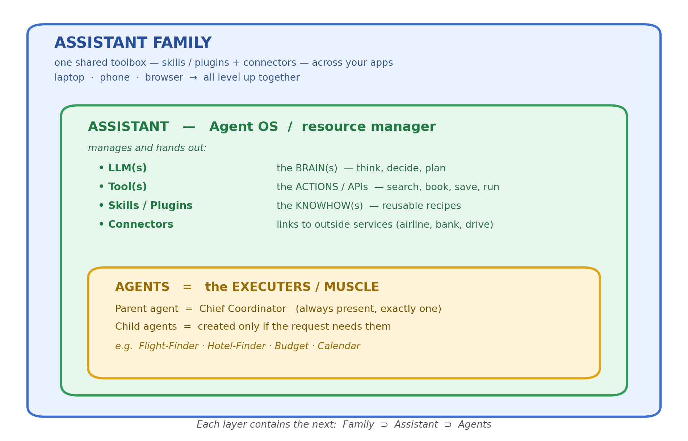

# Assistant Family, Assistant, and Agent

## 🎯 What you'll learn

Three words get thrown around a lot: **assistant family**, **assistant**, and **agent**. They sound abstract. So we'll explain all of them — and why this stuff is a big deal — using **one simple story**: four friends planning a weekend trip.

---

## 🗺️ The mental model at a glance

Each layer **contains** the next: a *family* holds *assistants*, an *assistant* holds *agents*.

 

<details><summary>Same picture as plain text (for notes / terminals)</summary>

```text
+------------------------------------------------------------+
| ASSISTANT FAMILY                                           |
| one shared toolbox: skills/plugins + connectors            |
| across your apps (laptop  -  phone  -  browser)            |
+------------------------------------------------------------+
                      contains  v
+------------------------------------------------------------+
| ASSISTANT   -   Agent OS / resource manager                |
|    LLM(s)          = the BRAIN(s)                          |
|    Tool(s)         = the ACTIONS / APIs                    |
|    Skills/Plugins  = the KNOWHOW(s)                        |
|    Connectors      = links to outside services             |
+------------------------------------------------------------+
                      contains  v
+------------------------------------------------------------+
| AGENTS   =   the EXECUTERS / MUSCLE                        |
|    Parent = Chief Coordinator  (always 1)                  |
|    + child agents (only if the request needs them)         |
+------------------------------------------------------------+
```

</details>

---

## Part 1 — The Three Layers (built up one at a time)

Picture four friends — you, Sam, Maya, and Leo — trying to plan a cheap weekend getaway. Let's see what each layer does for you.

### 🔹 Layer 1: The **Agent** — does *one* job well

An **agent** is a small worker powered by an LLM (the "brain" behind ChatGPT-style tools). You give it **one job**, a few **tools**, and **permission** to use them. LLM thinks via the LLM, uses a tool on direction by the LLM, submits the result to the LLM to have a look, and tries again — looping until the job is done.

**In the trip:** the *Flight-Finder agent*. Its only job is "find 4 cheap flights for next month." You let it search an airline site and peek at everyone's calendars. It tries dates, checks prices, and keeps going until it has a good option.

> **Benefit of this layer:** a focused worker that figures things out on its own, instead of you clicking through a website by hand.

#### The agent loop — three nested layers of control

An agent cycles through a loop until the task is done. Inside
that loop, two more control layers are available:

```text
OUTER LOOP  (LLM-driven, dynamic)
  Task → LLM → pick action → run tool → observe → LLM → …
    │
    ├─ SKILL  (fixed sub-program, runs in parent context)
    │    └─ [tool A → script → tool B — no LLM between steps]
    │       Returns a single result to the parent LLM.
    │
    └─ SUBAGENT  (nested outer loop, own isolated context)
         └─ Task → LLM → tools → … → clean 200-token summary
            Parent sees only the clean summary; not the mess.
```

#### Subagent — context firewall

A **subagent** is a complete copy of the outer loop running in
its own **isolated context**. Its defining property:

- It can churn through 50 tool calls and 100 K tokens of noisy
  work, then return a clean 200-token summary to the parent.
  The parent never sees the mess — its context stays focused.
- The parent's **harness** spawns it, scopes its permissions
  (which may be *narrower* than the parent's), and manages its
  lifecycle (retries, failure isolation).
- It can run a *different model*, system prompt, or tighter
  tool allowlist — all enforced by the harness, not the LLM.

#### Skill — fixed sub-program

A **skill** is a procedure that runs *beneath one step* of the
agent loop, inside the **parent's context and permissions**:

- The LLM invokes a skill as a single action step.
- The harness executes the recipe (tool calls, scripts, branching
  logic) without returning to the LLM between sub-steps. When
  done, control returns to the LLM with one combined result.
- Because a skill runs in the parent's context, its intermediate
  outputs land in the same conversation the parent reasons over.

> **Rule of thumb:** "follow these steps" → skill.
> "Go figure it out, bring me the answer" → subagent.

### 🔹 Layer 2: The **Assistant** — the resource manager (an "Agent OS")

One agent can't plan a whole trip. An **assistant** is the full app you actually open and talk to. Think of it as an **operating system for agents** that manages **resources** and hands them out to agents as needed. There are four kinds of resources, namely:

- **Tools** (with permissions) — like searching flights or reading a calendar.
- **Skills / plugins** — reusable "recipes," like *split the bill fairly*.
- **Connectors** — links to outside services, like your airline or bank.
- **A set of agents** — the actual workers (more on this just below).

**Built in vs. added on.** Some of these come *for free, ready to use*. For example, the Claude command-line app ships with a **bash terminal already built in** — no setup. On top of the built-ins, **you add** your own connectors, skills, and permissions to give the assistant more reach.

**What a "tool" can actually do.** A tool is just an action an agent takes. They come in a few flavors:
- **Remote tool** — a call over the network to an outside service (Flight-Finder reaching the airline site; a Google Drive connector).
  - **MCP tool**, calls for which LLMs have the knowhow (semantics, schema, etc.) to call.
  - **Vanilla tool**, calls for which the LLMs does NOT have the knowhow - these are direct API calls (eg SaaS APIs not exposed via MCP) where the developer has to "hand craft" the knowledge in the agent code. 
- **Local tool** — runs right on your machine (over stdio):
  - **File I/O**, with READ / WRITE permission — e.g. saving the finished itinerary to a file.
  - **Execute code**, often inside a safe **sandbox** — the agent runs a small, fixed piece of code the brain hands it, like the Budget agent crunching who owes what.
- **Spawn a sub-agent** — creating a helper is itself an action (it's how the Chief Coordinator builds its team).

**One boss + helpers.** That "set of agents" always has **exactly one parent agent** — the **Chief Coordinator** — who is *always present*. It's the one you talk to. Whether it creates any **child agents** (subagent) at all depends on what you ask: a quick question it answers alone; a big project, it splits across a few helpers; the split depends on whether you ask it to create "as many subagents as appropriate" or create "subagents exactly per the direction in your prompt". Irrespective the lifecycle (spawn, respawn on failure) of the subagent and coordination (collect results from subagets, feed to others) is managed by the parent agent.

**In the trip:** you tell the *Trip-Planner assistant*, "Plan us a cheap weekend away." Its Chief Coordinator stays in charge and spins up a **team of child agents**:
- a Flight-Finder agent,
- a Hotel-Finder agent,
- a Budget agent (keeps everyone under $300),
- a Calendar agent (finds a weekend everyone's free).

The Chief Coordinator gives each child only the tools and permissions it needs, gathers their results, and brings back **one finished plan**.

> **Benefit of this layer:** turns a messy, many-step project into a single request. You talk to one boss; it manages every tool and every helper for you.

#### Agent Harness

The **harness** is the runtime machinery that sits between the
LLM and the outside world. It is distinct from the *assistant*
(the user-facing app) and from the *LLM* (the brain). It:

- **Spawns and manages subagent lifecycles** — starts, retries,
  and terminates child agent loops.
- **Dispatches tool calls** — takes the LLM's tool-call request,
  runs the actual API or script, and feeds the result back.
- **Enforces permissions** — the LLM requests actions; the
  harness decides what it is *allowed* to do. Subagents can be
  given a *narrower* permission set than the parent, enforced
  by the harness, not by the LLM.
- **Handles streaming** — buffers and routes incremental model
  output to the UI or caller.
- **Isolates failures** — a subagent crash stays within the
  harness boundary; users see a clean error, not a raw exception.

Claude Code, Claude Desktop, and cloud-hosted agent runners are
all examples of harnesses. The assistant is what the *user*
opens; the harness is what the *agent code* runs inside.

### 🔹 Layer 3: The **Assistant Family** — a shared toolbox across all your apps

You start planning on your **laptop**, finish on your **phone**, and Leo checks a detail in his **browser**. These are different apps — but they belong to the **same family**, so they share the same **connectors** (links to outside services like your airline or bank) and **skills/plugins** (reusable "recipes," like *split the bill fairly*).

**In the trip:** last week someone published a "split-the-bill" skill into the family. Nobody rebuilt anything — yet now *every* app in the family can split your trip costs automatically. And you can pick up planning on any device without starting over.

> **Benefit of this layer:** publish a skill or connector **once**, and **every** app in the family instantly gets smarter. Your superpowers follow you across devices.

### The whole picture

```text
Assistant Family — one shared toolbox (skills/plugins + connectors) across your apps
└── Assistant  ("Agent OS" / resource manager)  — e.g. your Trip-Planner app
    │
    │   Resources it manages:
    ├── LLM(s)            → the BRAIN(s)        — think, decide, plan
    ├── Tool(s)           → the ACTIONS / APIs  — do things (search, book, save, run)
    ├── Skills / Plugins  → the KNOWHOW(s)      — reusable recipes (split-the-bill)
    ├── Connectors        — links to outside services (airline, bank, calendar)
    └── A set of agents   → the EXECUTERS / MUSCLE — workers that carry the plan out
        ├── Parent agent  → the Chief Coordinator (always present, exactly one)
        └── Child agents  → may or may not be created, depending on the request
                            (e.g. Flight-Finder, Hotel-Finder, Budget, Calendar)
```

---

## Part 2 — Why this beats a normal app (same trip, two ways)

Here's the *old way* (a traditional app with buttons and menus) vs. the *new way* (an agentic app). Same goal: a cheap weekend for four friends.

### 😩 The old way

You open a flight site, search dates by hand, copy prices into a spreadsheet. Open a hotel site, repeat. Paste everything into the group chat, collect votes, re-search when plans change. The app *shows* you options — but **you** do every click, every comparison, every decision. And if a flight sells out while you're deciding? The app just flashes an error. Start over.

### 😎 The new way

You type one sentence: *"Plan a cheap weekend trip for the four of us next month, $300 each."* Then watch what the agentic app does — each move is one of the four reasons these apps are special:

**1. It actually does the work (not just shows it).**
The assistant sends its agents to check calendars, compare flights, and hold a hotel — real legwork, start to finish. A normal app hands you a list and says "good luck." This one hands you a *finished plan*.

**2. It handles "oops" moments gracefully.**
You never said *which* city. Instead of erroring out, it simply asks: *"Beach or mountains?"* And when a flight sells out mid-plan, it quietly grabs the next-best one and tells you — no crash, no starting over.

**3. It fits your group with zero setup.**
It already remembers Sam is vegetarian and Maya gets carsick on long drives. So it picks a closer destination and books a veggie-friendly place — **without** anyone digging through a settings menu. A traditional app would need a programmer to build a "carsick-friendly" feature.

**4. It keeps getting smarter — for free.**
Because a "split-the-bill" skill and a Venmo connector were added to the family, your planner can now divide costs fairly and send requests — even though no one rewrote the app. Every new tool added to the ecosystem makes **all** the apps better at once.

---

## 📌 One-glance summary

| Layer | Plain meaning | In the trip | Why you'd want it |
|---|---|---|---|
| **Agent** | One LLM-powered worker | Flight-Finder | Does one job on its own |
| **Assistant** | The app / resource manager: owns tools, skills, connectors + a Chief Coordinator who spawns child agents | Trip-Planner | Handles the whole project from one request |
| **Assistant Family** | Apps sharing one toolbox of skills + connectors | Laptop, phone, browser all linked | Add a skill once → every app levels up |

| Why agentic > traditional | The trip moment |
|---|---|
| Does the work, not just shows it | Agents actually book the trip |
| Handles surprises gracefully | Asks "beach or mountains?"; reroutes a sold-out flight |
| Fits you with no setup | Remembers veggie Sam and carsick Maya |
| Gets smarter for free | New "split-the-bill" skill helps every app |

---

## Account Types

Claude tools support two authentication paths. Choose based on
whether the agent is tied to a specific user.

### Subscription vs PAYG

| Aspect | Subscription (claude.ai) | PAYG (platform.claude.com) |
|---|---|---|
| Auth flow | OAuth via `claude auth login` | API key from dashboard |
| Storage | `~/.claude/.credentials.json` or env var | Secrets vault |
| Resources | claude.ai skills + connectors synced | Manual per agent |
| Cost | Flat monthly fee; high limits | Pay-per-token; ~7x cheaper |

> **Lab default:** Subscription mode (OAuth, `credentials.json`)
> for interactive work. Switch to PAYG only when subscription
> limits are exhausted.

### Managed Agents

**Managed Agents** run non-interactively and are not tied to a
specific user. Use cases:

- **CI/CD pipelines** — automated code review, test generation,
  or deploy gates triggered by a push or PR.
- **Slack / webhook tasks** — an agent spawned by a channel
  message, shared among team members who hand off work.
- **Scheduled jobs** — nightly summaries, batch data processing.

Because Managed Agents are not tied to one user, they:

- Run on the provider's infrastructure, not a personal device.
- Require **PAYG** (API key) — no personal subscription applies.
- Need **manual credential submission** (cannot inherit a user's
  `credentials.json`).
- Need **manual connector configuration** — personal skills from
  a user's claude.ai account are not automatically available.

---

## References

- [Assistants and Agents - Mohit Aron](
  https://drive.google.com/file/d/1hucHQ0QpD3mWeIofVjgvl2m4Nnej52Nm/view)
- [Assistant Family, Assistant, and Agent- Mohit Aron](
  https://drive.google.com/file/d/1BUnt-rTb0X1Nc93z6by6B5ndFViPu8IH/view)
