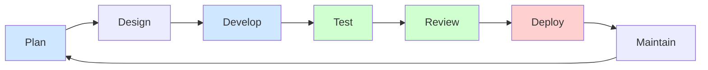

# Concept & Exercise: AI Across the SDLC

## 🎯 Objective
Writing code is only about 30% of software engineering. The rest of the 
Software Development Life Cycle (SDLC) involves testing, reviewing, 
deploying, and maintaining. This session explores how AI agents can 
automate the surrounding infrastructure.

## SDLC Phases



*AI agents operate across all phases — not just Develop.*

---

## 🔄 Beyond Code Generation

### 1. Advanced Testing Strategies
* **Unit Testing:** Agents can read a function and generate tests 
for edge cases (null inputs, boundary limits).
* **Smoke Tests:** Quick scripts to ping APIs after deployment to 
ensure nothing caught fire.

* **Data-Dependent Tests:** Real applications read from databases.
  Tests that copy production data create two problems: (1) the
  copy goes stale; (2) production records leave the privileged
  namespace. The solution is two read-only namespaces with tests
  parameterized by a `DATA_ENV` variable.

  | Namespace | Access | IAM control |
  |-----------|--------|-------------|
  | Production | Production jobs only | Strict — no developer read |
  | Dev / Test | Developer laptops + CI | Read-only from anywhere |

  **Techniques (no copy needed):**
  - **BigQuery:** Authorized View — grant the view to the dev
    project; the underlying prod table is never touched.
  - **S3:** Bucket policy with a read-only IAM role for dev ARN.
  - **Local / CI:** Public fixture dataset with identical schema.

  **Exercise:**
  ```bash
  # Extend test_monitor.py with a fixture that reads from a
  # public URL (use the raw GitHub URL for config.yaml in this
  # repo as a stand-in). Parameterize with DATA_ENV:
  #   DATA_ENV=dev  → read the fixture URL
  #   DATA_ENV=prod → skip with pytest.mark.skip("prod only")
  # Run with DATA_ENV=dev. Confirm fixture test passes and
  # prod test is skipped.
  DATA_ENV=dev pytest test_monitor.py -v
  ```

  *Reflection: What would you use instead of a URL for a real
  database? Why does skipping — not failing — for prod keep
  the dev test suite green?*

### 2. Code Review & Auditing
* **Automated PR Reviews:** Having an AI automatically scan 
Pull Requests for logic flaws and security vulnerabilities 
before a human ever looks at it.

### 3. CI/CD (Continuous Integration / Continuous Deployment)
* **Writing Pipelines:** You can ask an agent, 
*"Write a GitHub Actions YAML file that runs my Pytests."*
* **Debugging Pipelines:** Pasting failed Action logs to an 
agent often yields the exact line that needs fixing.

---

## ⚖️ The Great Debate: IDE vs. Desktop/CLI Agents

**The Intelligent IDE (e.g., Cursor, GitHub Copilot)**
* **Best for:** Micro-edits, inline code generation, writing 
functions within a single file.

**The CLI / Desktop Agent (e.g., Claude Code)**
* **Best for:** Macro-tasks, repo-wide refactoring, orchestration, 
and SDLC infrastructure.

---

## 🏃‍♂️ The Exercise: Full SDLC Automation

In this exercise, we will build a tiny application - 
a **Website Health Monitor**—and use the Claude CLI 
to walk through every stage of the SDLC.

### Phase 1: Planning & Coding (Development)
1. **The Spec:** Open your terminal and start Claude CLI (`claude`).
2. **The Prompt:** 
```bash
Create a python script called `monitor.py` that accepts a URL. 
It should ping the URL and print 'UP' if the status is 200, 
and 'DOWN' otherwise.
```
3. **Action:** Let Claude generate and save the file.

### Phase 2: Test Generation (QA)
1. **The Prompt:** 
```bash
Read `monitor.py`. Generate a `pytest` file named `test_monitor.py`. 
Include tests for a successful 200 response, a 404 response, and 
a server timeout.
```
2. **Action:** Run `pytest` to ensure the tests pass. 
Note Claude CLI can do this for you.

### Phase 3: The CI/CD Pipeline (DevOps)
1. **The Prompt:** 
```bash
Create a GitHub Actions workflow in `.github/workflows/test.yml`. 
It should trigger on every push, set up Python, install pytest, 
and run `test_monitor.py
```
2. **Action:** Claude will generate the YAML file to automate 
your testing.

### Phase 4: AI Code Review (Peer Review)
*Now we tie it into our GitHub workflow!*
1. **Commit:** Push code to a new branch `git checkout -b feat/monitor`
2. **PR:** Open a Pull Request on GitHub.
3. **Review:** Add a comment on your PR: `@claude review` 
4. **Action:** Watch as the AI assumes the role of a Senior Developer, 
providing inline feedback on your code based on the GitHub Action 
we set up in previous labs.

## Key Takeaway
You just acted as a Product Manager, QA Engineer, DevOps Engineer, and
Lead Reviewer, all orchestrated through an AI CLI.

---

## Legacy and Hybrid Enhancement

Most real software is not greenfield — it already exists, is in
production, and cannot be rewritten overnight. AI can enhance
legacy systems incrementally using the **Strangler Fig pattern**:
new behavior grows around the old system until the old code can
be safely retired, never requiring a risky big-bang rewrite.

**When to enhance vs. rewrite:**

| Situation | Approach |
|-----------|----------|
| Core logic is stable, interface is dated | Enhance — wrap with new API |
| Logic is brittle and undocumented | Rewrite with AI-generated tests first |
| Mixed: some modules good, some broken | Strangler Fig — migrate module by module |

**CLAUDE.md guardrails for legacy work:** Add a `CLAUDE.md` in
the legacy directory that explicitly fences AI access — list
which files Claude may edit and which are off-limits. This
prevents AI from "helpfully" refactoring code that is deliberately
left untouched for regulatory or stability reasons.

> **Supplemental reading:**
> [Software Enhancement](software_enhancement.md) — covers the
> Strangler Fig pattern and AI-assisted hybrid enhancement in
> depth. Not on the main agenda; read at your own pace.
